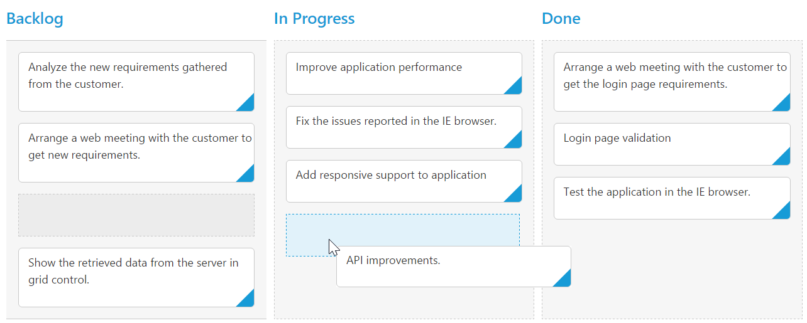

## Prioritization of cards

Prioritizing cards is easy with drag-and-drop re-ordering that helps you to categorize most important work at the top. Cards can be categorized with priority by mapping specific database field into `Priority` property.

`RankId` defined in the DataSource which is consist priority of cards. The `RankId` will be changed while card ordering changes through `DragAndDrop` and `Editing`.

The following code example describes the above behavior.





  	<ej:Kanban ID="Kanban" runat="server" KeyField="Status">
                <Columns>
                    <ej:KanbanColumn HeaderText="Backlog" Key="Open" />
                    <ej:KanbanColumn HeaderText="In Progress" Key="InProgress" />
                    <ej:KanbanColumn HeaderText="Done" Key="Close" />
                </Columns>
                <Fields Content="Summary" ImageUrl="ImgUrl" Priority="RankId" />
     </ej:Kanban>     





          List<Tasks> Task = new List<Tasks>();  
          protected void Page_Load(object sender, EventArgs e)
          {
            Task.Add(new Tasks(1, "Open", "Analyze the new requirements gathered from the customer.", "Story", "Low", "Analyze,Customer", 3.5, "Nancy", "../content/images/kanban/1.png", 1));
            Task.Add(new Tasks(2, "InProgress", "Improve application performance", "Improvement", "Normal", "Improvement", 6, "Andrew", "../content/images/kanban/2.png", 1));
            Task.Add(new Tasks(3, "Open", "Arrange a web meeting with the customer to get new requirements.", "Others", "Critical", "Meeting", 5.5, "Janet", "../content/images/kanban/3.png", 2));
            Task.Add(new Tasks(4, "InProgress", "Fix the issues reported in the IE browser.", "Bug", "Release Breaker", "IE", 2.5, "Janet", "../content/images/kanban/3.png", 2));
            Task.Add(new Tasks(5, "Testing", "Fix the issues reported by the customer.", "Bug", "Low", "Customer", 3.5, "Steven", "../content/images/kanban/5.png", 1));
            Task.Add(new Tasks(6, "Close", "Arrange a web meeting with the customer to get the login page requirements.", "Others", "Low", "Meeting", 2, "Michael", "../content/images/kanban/6.png", 1));
            Task.Add(new Tasks(7, "Validate", "Validate new requirements", "Improvement", "Low", "Validation", 1.5, "Robert", "../content/images/kanban/7.png", 4));
            Task.Add(new Tasks(8, "Close", "Login page validation", "Story", "Release Breaker", "Validation,Fix", 2.5, "Laura", "../content/images/kanban/8.png", 2));
            Task.Add(new Tasks(9, "Testing", "Fix the issues reported in Safari browser.", "Bug", "Release Breaker", "Fix,Safari", 1.5, "Nancy", "../content/images/kanban/1.png", 2));
            Task.Add(new Tasks(10, "Close", "Test the application in the IE browser.", "Story", "Low", "Testing,IE", 5.5, "Margaret", "../content/images/kanban/4.png", 3));
            Task.Add(new Tasks(11, "Validate", "Validate the issues reported by the customer.", "Story", "High", "Validation,Fix", 1, "Steven", "../content/images/kanban/5.png", 5));
            Task.Add(new Tasks(12, "Testing", "Check Login page validation.", "Story", "Release Breaker", "Testing", 0.5, "Michael", "../content/images/kanban/6.png", 3));
            Task.Add(new Tasks(13, "Open", "API improvements.", "Improvement", "High", "Grid,API", 3.5, "Robert", "../content/images/kanban/7.png", 3));
            Task.Add(new Tasks(14, "InProgress", "Add responsive support to application", "Epic", "Critical", "Responsive", 6, "Laura", "../content/images/kanban/8.png", 3));
            Task.Add(new Tasks(15, "Open", "Show the retrieved data from the server in grid control.", "Story", "High", "Database,SQL", 5.5, "Margaret", "../content/images/kanban/4.png", 4));
            this.Kanban.DataSource = Task;
            this.Kanban.DataBind();
           }
           


  

The following output is displayed as a result of the above code example.

N> For Drag and Drop event handling, please refer this [API](https://help.syncfusion.com/api/js/ejkanban#events:carddrag).

N> If the [`Priority`](https://help.syncfusion.com/api/js/ejkanban#members:fields-priority) property is not set in the Kanban fields, the cards are dropped based on the specifying JSON data orders in a particular column.  If not set, drop the card in a particular position based on the previous card `Priority` value and the next card’s `Priority` values will change dynamically.