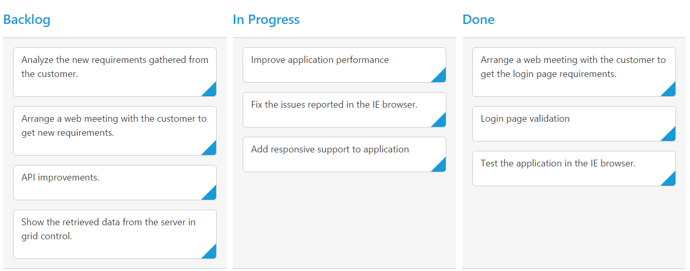
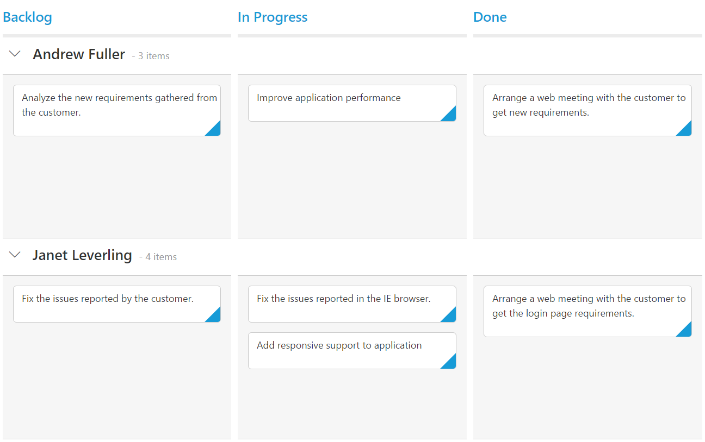

# Getting Started

This section explains briefly about how to create a Kanban in your application with ASP.NET.

## Create your first Kanban ASP.NET Web Forms Application

You can create a Kanban with a highly customizable look and feel. This section describes how you can customize, filter and group cards.

1. Create a Syncfusion ASP.NET Web Forms application.
2. Add a Kanban in the Index.aspx page. 

3. By Columns definition, the Is Collapsed property is used in the column collapse or expand state. The Width property is used to define the width of the columns. The Header text property is used to render the Kanban with specified columns header text. The Key property is used to render the Kanban with specified columns key.

4. Configure the Kanban control with SQL data source using smart tag.

   

  
	   <ej:Kanban ID="Kanban1" runat="server" DataSourceID="SqlDataSource1">
       </ej:Kanban>
       <asp:SqlDataSource runat="server" ID="SqlDataSource1" ConnectionString='<%$ ConnectionStrings:NORTHWNDConnectionString %>' SelectCommand="SELECT * FROM [Tasks]"></asp:SqlDataSource>
 
   
   N> Create a connection string in Web.config file using SQL database.

  
		<connectionStrings>
          <add name="NORTHWNDConnectionString" connectionString="Data Source=(LocalDB)\v11.0;AttachDbFilename=|DataDirectory|\NORTHWND.MDF;Integrated Security=True" providerName="System.Data.SqlClient" />
        </connectionStrings>
 
 
   For more information about SQL data source configuration refer the following link: [https://msdn.microsoft.com/en-us/library/dz12d98w.aspx](https://msdn.microsoft.com/en-us/library/dz12d98w.aspx)
   
    

## Data Binding

You can bind data to the Kanban control by either locally or remotely. Assign the local data to DataSource property of Kanban control to bind local data. 




  <ej:Kanban ID="Kanban" runat="server">
       <Columns>
           <ej:KanbanColumn HeaderText="Backlog" Key="Open"/>
           <ej:KanbanColumn HeaderText="In Progress" Key="InProgress"/>
           <ej:KanbanColumn HeaderText="Done" Key="Close" />
       </Columns>
  </ej:Kanban>





          List<Tasks> Task = new List<Tasks>();  
          protected void Page_Load(object sender, EventArgs e)
          {
            Task.Add(new Tasks(1, "Open", "Analyze the new requirements gathered from the customer.", "Story", "Low", "Analyze,Customer", 3.5, "Nancy", "../content/images/kanban/1.png", 1));
            Task.Add(new Tasks(2, "InProgress", "Improve application performance", "Improvement", "Normal", "Improvement", 6, "Andrew", "../content/images/kanban/2.png", 1));
            Task.Add(new Tasks(3, "Open", "Arrange a web meeting with the customer to get new requirements.", "Others", "Critical", "Meeting", 5.5, "Janet", "../content/images/kanban/3.png", 2));
            Task.Add(new Tasks(4, "InProgress", "Fix the issues reported in the IE browser.", "Bug", "Release Breaker", "IE", 2.5, "Janet", "../content/images/kanban/3.png", 2));
            Task.Add(new Tasks(5, "Testing", "Fix the issues reported by the customer.", "Bug", "Low", "Customer", 3.5, "Steven", "../content/images/kanban/5.png", 1));
            Task.Add(new Tasks(6, "Close", "Arrange a web meeting with the customer to get the login page requirements.", "Others", "Low", "Meeting", 2, "Michael", "../content/images/kanban/6.png", 1));
            Task.Add(new Tasks(7, "Validate", "Validate new requirements", "Improvement", "Low", "Validation", 1.5, "Robert", "../content/images/kanban/7.png", 4));
            Task.Add(new Tasks(8, "Close", "Login page validation", "Story", "Release Breaker", "Validation,Fix", 2.5, "Laura", "../content/images/kanban/8.png", 2));
            Task.Add(new Tasks(9, "Testing", "Fix the issues reported in Safari browser.", "Bug", "Release Breaker", "Fix,Safari", 1.5, "Nancy", "../content/images/kanban/1.png", 2));
            Task.Add(new Tasks(10, "Close", "Test the application in the IE browser.", "Story", "Low", "Testing,IE", 5.5, "Margaret", "../content/images/kanban/4.png", 3));
            Task.Add(new Tasks(11, "Validate", "Validate the issues reported by the customer.", "Story", "High", "Validation,Fix", 1, "Steven", "../content/images/kanban/5.png", 5));
            Task.Add(new Tasks(12, "Testing", "Check Login page validation.", "Story", "Release Breaker", "Testing", 0.5, "Michael", "../content/images/kanban/6.png", 3));
            Task.Add(new Tasks(13, "Open", "API improvements.", "Improvement", "High", "Grid,API", 3.5, "Robert", "../content/images/kanban/7.png", 3));
            Task.Add(new Tasks(14, "InProgress", "Add responsive support to application", "Epic", "Critical", "Responsive", 6, "Laura", "../content/images/kanban/8.png", 3));
            Task.Add(new Tasks(15, "Open", "Show the retrieved data from the server in grid control.", "Story", "High", "Database,SQL", 5.5, "Margaret", "../content/images/kanban/4.png", 4));
            this.Kanban.DataSource = Task;
            this.Kanban.DataBind();
           }



  

 

N> ODataAdaptor is the default adaptor used within DataManager. While binding to other web services, proper [data adaptor](http://help.syncfusion.com/aspnet/datamanager/data-adaptors) needs to be set for `adaptor` option of DataManager.

## Mapping Values

In order to display cards in Kanban control, you need to map the database fields to Kanban cards and columns. The required mapping field are listed as follows.

 * KeyField - Map the column name to use as `Key` values to columns.
 * Columns -  Map the corresponding `Key` values of `KeyField` column to each columns.
 * Content - Map the column name to use as content to cards.
 * PrimaryKey - Map the column name to use as primary Key.





  <ej:Kanban ID="Kanban" runat="server" KeyField="Status">
       <Columns>
           <ej:KanbanColumn HeaderText="Backlog" Key="Open"/>
           <ej:KanbanColumn HeaderText="In Progress" Key="InProgress"/>
           <ej:KanbanColumn HeaderText="Done" Key="Close" />
       </Columns>
       <Fields Content="Summary" PrimaryKey="Id" /> 
  </ej:Kanban>





          List<Tasks> Task = new List<Tasks>();  
          protected void Page_Load(object sender, EventArgs e)
          {
            Task.Add(new Tasks(1, "Open", "Analyze the new requirements gathered from the customer.", "Story", "Low", "Analyze,Customer", 3.5, "Nancy", "../content/images/kanban/1.png", 1));
            Task.Add(new Tasks(2, "InProgress", "Improve application performance", "Improvement", "Normal", "Improvement", 6, "Andrew", "../content/images/kanban/2.png", 1));
            Task.Add(new Tasks(3, "Open", "Arrange a web meeting with the customer to get new requirements.", "Others", "Critical", "Meeting", 5.5, "Janet", "../content/images/kanban/3.png", 2));
            Task.Add(new Tasks(4, "InProgress", "Fix the issues reported in the IE browser.", "Bug", "Release Breaker", "IE", 2.5, "Janet", "../content/images/kanban/3.png", 2));
            Task.Add(new Tasks(5, "Testing", "Fix the issues reported by the customer.", "Bug", "Low", "Customer", 3.5, "Steven", "../content/images/kanban/5.png", 1));
            Task.Add(new Tasks(6, "Close", "Arrange a web meeting with the customer to get the login page requirements.", "Others", "Low", "Meeting", 2, "Michael", "../content/images/kanban/6.png", 1));
            Task.Add(new Tasks(7, "Validate", "Validate new requirements", "Improvement", "Low", "Validation", 1.5, "Robert", "../content/images/kanban/7.png", 4));
            Task.Add(new Tasks(8, "Close", "Login page validation", "Story", "Release Breaker", "Validation,Fix", 2.5, "Laura", "../content/images/kanban/8.png", 2));
            Task.Add(new Tasks(9, "Testing", "Fix the issues reported in Safari browser.", "Bug", "Release Breaker", "Fix,Safari", 1.5, "Nancy", "../content/images/kanban/1.png", 2));
            Task.Add(new Tasks(10, "Close", "Test the application in the IE browser.", "Story", "Low", "Testing,IE", 5.5, "Margaret", "../content/images/kanban/4.png", 3));
            Task.Add(new Tasks(11, "Validate", "Validate the issues reported by the customer.", "Story", "High", "Validation,Fix", 1, "Steven", "../content/images/kanban/5.png", 5));
            Task.Add(new Tasks(12, "Testing", "Check Login page validation.", "Story", "Release Breaker", "Testing", 0.5, "Michael", "../content/images/kanban/6.png", 3));
            Task.Add(new Tasks(13, "Open", "API improvements.", "Improvement", "High", "Grid,API", 3.5, "Robert", "../content/images/kanban/7.png", 3));
            Task.Add(new Tasks(14, "InProgress", "Add responsive support to application", "Epic", "Critical", "Responsive", 6, "Laura", "../content/images/kanban/8.png", 3));
            Task.Add(new Tasks(15, "Open", "Show the retrieved data from the server in grid control.", "Story", "High", "Database,SQL", 5.5, "Margaret", "../content/images/kanban/4.png", 4));
            this.Kanban.DataSource = Task;
            this.Kanban.DataBind();
           }



  

 

N> `PrimaryKey` field is mandatory for “Drag and Drop”, ”Selection” and “Editing” Features.

## SwimlaneKey

`SwimlaneKey` can be enabled by mapping the `SwimlaneKey` to appropriate column name in `DataSource`. This enables the grouping of the cards based on the mapped column values.





  <ej:Kanban ID="Kanban" runat="server" KeyField="Status">
       <Columns>
           <ej:KanbanColumn HeaderText="Backlog" Key="Open"/>
           <ej:KanbanColumn HeaderText="In Progress" Key="InProgress"/>
           <ej:KanbanColumn HeaderText="Done" Key="Close" />
       </Columns>
       <Fields Content="Summary" PrimaryKey="Id" SwimlaneKey="Assignee" /> 
  </ej:Kanban>





          List<Tasks> Task = new List<Tasks>();  
          protected void Page_Load(object sender, EventArgs e)
          {
            Task.Add(new Tasks(1, "Open", "Analyze the new requirements gathered from the customer.", "Story", "Low", "Analyze,Customer", 3.5, "Nancy", "../content/images/kanban/1.png", 1));
            Task.Add(new Tasks(2, "InProgress", "Improve application performance", "Improvement", "Normal", "Improvement", 6, "Andrew", "../content/images/kanban/2.png", 1));
            Task.Add(new Tasks(3, "Open", "Arrange a web meeting with the customer to get new requirements.", "Others", "Critical", "Meeting", 5.5, "Janet", "../content/images/kanban/3.png", 2));
            Task.Add(new Tasks(4, "InProgress", "Fix the issues reported in the IE browser.", "Bug", "Release Breaker", "IE", 2.5, "Janet", "../content/images/kanban/3.png", 2));
            Task.Add(new Tasks(5, "Testing", "Fix the issues reported by the customer.", "Bug", "Low", "Customer", 3.5, "Steven", "../content/images/kanban/5.png", 1));
            Task.Add(new Tasks(6, "Close", "Arrange a web meeting with the customer to get the login page requirements.", "Others", "Low", "Meeting", 2, "Michael", "../content/images/kanban/6.png", 1));
            Task.Add(new Tasks(7, "Validate", "Validate new requirements", "Improvement", "Low", "Validation", 1.5, "Robert", "../content/images/kanban/7.png", 4));
            Task.Add(new Tasks(8, "Close", "Login page validation", "Story", "Release Breaker", "Validation,Fix", 2.5, "Laura", "../content/images/kanban/8.png", 2));
            Task.Add(new Tasks(9, "Testing", "Fix the issues reported in Safari browser.", "Bug", "Release Breaker", "Fix,Safari", 1.5, "Nancy", "../content/images/kanban/1.png", 2));
            Task.Add(new Tasks(10, "Close", "Test the application in the IE browser.", "Story", "Low", "Testing,IE", 5.5, "Margaret", "../content/images/kanban/4.png", 3));
            Task.Add(new Tasks(11, "Validate", "Validate the issues reported by the customer.", "Story", "High", "Validation,Fix", 1, "Steven", "../content/images/kanban/5.png", 5));
            Task.Add(new Tasks(12, "Testing", "Check Login page validation.", "Story", "Release Breaker", "Testing", 0.5, "Michael", "../content/images/kanban/6.png", 3));
            Task.Add(new Tasks(13, "Open", "API improvements.", "Improvement", "High", "Grid,API", 3.5, "Robert", "../content/images/kanban/7.png", 3));
            Task.Add(new Tasks(14, "InProgress", "Add responsive support to application", "Epic", "Critical", "Responsive", 6, "Laura", "../content/images/kanban/8.png", 3));
            Task.Add(new Tasks(15, "Open", "Show the retrieved data from the server in grid control.", "Story", "High", "Database,SQL", 5.5, "Margaret", "../content/images/kanban/4.png", 4));
            this.Kanban.DataSource = Task;
            this.Kanban.DataBind();
           }



  

 

## Adding Filters

Filters allows to filter the collection of cards from `DataSource` which meets the predefined `Query` in the filters collection. To enable filtering, define `FilterSettings` collection with display `Text` and [ej.Query](http://help.syncfusion.com/aspnet/datamanager/query).





  <ej:Kanban ID="Kanban" runat="server" KeyField="Status">
       <Columns>
           <ej:KanbanColumn HeaderText="Backlog" Key="Open"/>
           <ej:KanbanColumn HeaderText="In Progress" Key="InProgress"/>
           <ej:KanbanColumn HeaderText="Done" Key="Close" />
       </Columns>
       <Fields Content="Summary" PrimaryKey="Id" SwimlaneKey="Assignee"/> 
       <FilterSettings>
             <ej:KanbanFilterSetting Text="Janet Issues" Query="new ej.Query().where('Assignee', 'equal', 'Janet Leverling')" Description="Displays issues which matches the assignee as 'Janet Leverling" />
             <ej:KanbanFilterSetting Text="Testing Issues" Query="new ej.Query().where('Status', 'equal', 'Testing')" Description="Display the issues of 'Testing'" />
        </FilterSettings>
 </ej:Kanban>





          List<Tasks> Task = new List<Tasks>();  
          protected void Page_Load(object sender, EventArgs e)
          {
            Task.Add(new Tasks(1, "Open", "Analyze the new requirements gathered from the customer.", "Story", "Low", "Analyze,Customer", 3.5, "Nancy", "../content/images/kanban/1.png", 1));
            Task.Add(new Tasks(2, "InProgress", "Improve application performance", "Improvement", "Normal", "Improvement", 6, "Andrew", "../content/images/kanban/2.png", 1));
            Task.Add(new Tasks(3, "Open", "Arrange a web meeting with the customer to get new requirements.", "Others", "Critical", "Meeting", 5.5, "Janet", "../content/images/kanban/3.png", 2));
            Task.Add(new Tasks(4, "InProgress", "Fix the issues reported in the IE browser.", "Bug", "Release Breaker", "IE", 2.5, "Janet", "../content/images/kanban/3.png", 2));
            Task.Add(new Tasks(5, "Testing", "Fix the issues reported by the customer.", "Bug", "Low", "Customer", 3.5, "Steven", "../content/images/kanban/5.png", 1));
            Task.Add(new Tasks(6, "Close", "Arrange a web meeting with the customer to get the login page requirements.", "Others", "Low", "Meeting", 2, "Michael", "../content/images/kanban/6.png", 1));
            Task.Add(new Tasks(7, "Validate", "Validate new requirements", "Improvement", "Low", "Validation", 1.5, "Robert", "../content/images/kanban/7.png", 4));
            Task.Add(new Tasks(8, "Close", "Login page validation", "Story", "Release Breaker", "Validation,Fix", 2.5, "Laura", "../content/images/kanban/8.png", 2));
            Task.Add(new Tasks(9, "Testing", "Fix the issues reported in Safari browser.", "Bug", "Release Breaker", "Fix,Safari", 1.5, "Nancy", "../content/images/kanban/1.png", 2));
            Task.Add(new Tasks(10, "Close", "Test the application in the IE browser.", "Story", "Low", "Testing,IE", 5.5, "Margaret", "../content/images/kanban/4.png", 3));
            Task.Add(new Tasks(11, "Validate", "Validate the issues reported by the customer.", "Story", "High", "Validation,Fix", 1, "Steven", "../content/images/kanban/5.png", 5));
            Task.Add(new Tasks(12, "Testing", "Check Login page validation.", "Story", "Release Breaker", "Testing", 0.5, "Michael", "../content/images/kanban/6.png", 3));
            Task.Add(new Tasks(13, "Open", "API improvements.", "Improvement", "High", "Grid,API", 3.5, "Robert", "../content/images/kanban/7.png", 3));
            Task.Add(new Tasks(14, "InProgress", "Add responsive support to application", "Epic", "Critical", "Responsive", 6, "Laura", "../content/images/kanban/8.png", 3));
            Task.Add(new Tasks(15, "Open", "Show the retrieved data from the server in grid control.", "Story", "High", "Database,SQL", 5.5, "Margaret", "../content/images/kanban/4.png", 4));
            this.Kanban.DataSource = Task;
            this.Kanban.DataBind();
           }



  

  