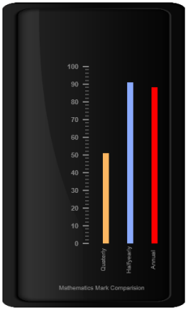

# Bar Pointers

Bar Pointer value points out the actual value set in the Linear Gauge as marker pointer. You can set the values of the various bar pointer attributes such as value, width, border and color in bar pointer collection.  You can also customize the pointers to improve the appearance of gauge.__

## Adding bar pointer collection

You can add Bar Pointer collection directly to the scale object. Refer the following code example.

[ASP]

&lt;%-- Render Linear Gauge-- %&gt;

&lt;ej:LinearGauge runat="server" ID="PointerGauge" value="78" EnableAnimation="false"&gt;

&lt;Scales&gt;

&lt;ej:Scales  BackgroundColor="transparent" ShowMarkerPointers="false" ShowBarPointers="true"&gt;

&lt;Border Color="transparent" Width="0" /&gt;

&lt;%-- For setting bar pointer-- %&gt;

&lt;BarPointerCollection&gt;

&lt;ej:BarPointers Width="5" BarPointerBackgroundColor="grey"&gt;&lt;/ej:BarPointers&gt;

&lt;/BarPointerCollection&gt;

&lt;%-- For setting Ticks-- %&gt;

&lt;TickCollection &gt;

&lt;ej:LinearTicks Type="MajorInterval" Width="2" Color="#8c8c8c" &gt;

&lt;DistanceFromScale X="7" Y="0" /&gt;

&lt;/ej:LinearTicks&gt;

&lt;ej:LinearTicks Type="MinorInterval" Width="1" height="6" Color="#8c8c8c" &gt;

&lt;DistanceFromScale X="7" Y="0" /&gt;

&lt;/ej:LinearTicks&gt;

&lt;/TickCollection&gt;

&lt;/ej:Scales&gt;

&lt;/Scales&gt;

&lt;%-- For setting Frame object-- %&gt;

<Frame InnerWidth="8" OuterWidth="10"

BackgroundImageUrl="../Content/images/gauge/Gauge_linear_light.png" />

&lt;/ej:LinearGauge&gt;

Execute the above code to render the following output.

{:.image }

## Adding bar pointer value

Bar pointer value is also important element in the Linear Gauge as it indicates the gauge value. Real purpose of the Linear Gauge is based on the pointer value. You can set the bar pointer value either directly during rendering the control or it can be achieved by public method.

[ASP]

&lt;%-- Render Linear Gauge-- %&gt;

&lt;ej:LinearGauge runat="server" ID="PointerGauge"  EnableAnimation="false"&gt;

&lt;Scales&gt;

&lt;ej:Scales  BackgroundColor="transparent" ShowMarkerPointers="false" ShowBarPointers="true"&gt;

&lt;Border Color="transparent" Width="0" /&gt;

&lt;%-- For setting Bar Pointer Collection-- %&gt;

&lt;%-- For setting bar pointer value-- %&gt;

&lt;BarPointerCollection&gt;

&lt;ej:BarPointers Width="5" BarPointerValue="91" BarPointerBackgroundColor="grey"&gt;&lt;/ej:BarPointers&gt;

&lt;/BarPointerCollection&gt;

&lt;%-- For setting Tick Collection-- %&gt;

&lt;TickCollection &gt;

&lt;ej:LinearTicks Type="MajorInterval" Width="2" Color="#8c8c8c" &gt;

&lt;DistanceFromScale X="7" Y="0" /&gt;

&lt;/ej:LinearTicks&gt;

&lt;ej:LinearTicks Type="MinorInterval" Width="1" height="6" Color="#8c8c8c" &gt;

&lt;DistanceFromScale X="7" Y="0" /&gt;

&lt;/ej:LinearTicks&gt;

&lt;/TickCollection&gt;

&lt;/ej:Scales&gt;

&lt;/Scales&gt;

&lt;%-- For Adding Frame Object-- %&gt;

&lt;Frame InnerWidth="8" OuterWidth="10"                   BackgroundImageUrl="../Content/images/gauge/Gauge_linear_light.png" /&gt;

&lt;/ej:LinearGauge&gt;

Execute the above code to render the following output.

{:.image }

## Pointer Styles

Appearance

* Based on the value, the bar pointer points out the label value. You can set the bar pointer width using width property and you can also adjust the opacity of the pointer using opacity property that holds the value between 0 and 1. You can add the gradient effects to the pointer using gradient object. 
* The marker pointer border is modified with the object border. It has two border property, color and width which are used to customize the border color of the scale and border width of the marker pointer. The background color can be customized with attribute backgroundColor.

[ASP]

&lt;%-- Render Linear Gauge-- %&gt;

&lt;ej:LinearGauge runat="server" ID="PointerGauge"  EnableAnimation="false"&gt;

&lt;Scales&gt;

&lt;ej:Scales  BackgroundColor="transparent" ShowMarkerPointers="false" ShowBarPointers="true"&gt;

&lt;Border Color="transparent" Width="0" /&gt;

&lt;%-- For setting bar pointer width and opacity -- %&gt;

&lt;BarPointerCollection&gt;

&lt;ej:BarPointers Width="10" BarPointerValue="91" BarPointerBackgroundColor="red" BarPointerOpacity="0.7"&gt;

&lt;Border Color="#860201" Width="2" /&gt;

&lt;/ej:BarPointers&gt;

&lt;/BarPointerCollection&gt;

&lt;%-- For Adding Tick Collection-- %&gt;

&lt;TickCollection &gt;

&lt;ej:LinearTicks Type="MajorInterval" Width="2" Color="#8c8c8c" &gt;

&lt;DistanceFromScale X="7" Y="0" /&gt;

&lt;/ej:LinearTicks&gt;

&lt;ej:LinearTicks Type="MinorInterval" Width="1" height="6" Color="#8c8c8c" &gt;

&lt;DistanceFromScale X="7" Y="0" /&gt;

&lt;/ej:LinearTicks&gt;

&lt;/TickCollection&gt;

&lt;/ej:Scales&gt;

&lt;/Scales&gt;

&lt;%-- For Adding Frame Object-- %&gt;

<Frame InnerWidth="8" OuterWidth="10"

BackgroundImageUrl="../Content/images/gauge/Gauge_linear_light.png" />

&lt;/ej:LinearGauge&gt;

Execute the above code to render the following output.

{:.image }

## Positioning the pointer

* Bar pointer can be positioned with two properties such as distanceFromScale and placement. The distanceFromScale property defines the distance between the scale and pointer element. 
* The placement property is used to locate the pointer with respect to scale either inside or outside the scale or along the scale. It is an enumerable data type.

[ASP]

&lt;%-- For Linear Gauge rendering-- %&gt;

&lt;ej:LinearGauge runat="server" ID="PointerGauge"  EnableAnimation="false"&gt;

&lt;Scales&gt;

&lt;ej:Scales  BackgroundColor="transparent" ShowMarkerPointers="false" ShowBarPointers="true"&gt;

&lt;Border Color="transparent" Width="0" /&gt;

&lt;%--Setting bar pointer-- %&gt;

&lt;%--Setting distanceFromScale-- %&gt;

&lt;BarPointerCollection&gt;

&lt;ej:BarPointers Width="10" BarPointerValue="91" BarPointerdistanceFromScale="20" BarPointerBackgroundColor="#8BABFF" &gt;

&lt;Border Color="#860201" Width="2" /&gt;

&lt;/ej:BarPointers&gt;

&lt;/BarPointerCollection&gt;

&lt;%-- For setting Tick Collection-- %&gt;

&lt;TickCollection &gt;

&lt;ej:LinearTicks Type="MajorInterval" Width="2" Color="#8c8c8c" &gt;

&lt;DistanceFromScale X="7" Y="0" /&gt;

&lt;/ej:LinearTicks&gt;

&lt;ej:LinearTicks Type="MinorInterval" Width="1" height="6" Color="#8c8c8c" &gt;

&lt;DistanceFromScale X="7" Y="0" /&gt;

&lt;/ej:LinearTicks&gt;

&lt;/TickCollection&gt;

&lt;/ej:Scales&gt;

&lt;/Scales&gt;

&lt;%-- For adding frame Object-- %&gt;

<Frame InnerWidth="8" OuterWidth="10"

BackgroundImageUrl="../Content/images/gauge/Gauge_linear_light.png" />

&lt;/ej:LinearGauge&gt;

Execute the above code to render the following output.

{:.image }

## Multiple Bar Pointers

Linear Gauge can contain multiple bar pointers on it. You can use any combination and any number of pointers in a gauge. That is, a Gauge can contain any number of marker pointer and any number of bar pointers. Refer the following code example containing multiple bar pointers.

[ASP]

&lt;%--For Setting Linear gauge-- %&gt;

&lt;ej:LinearGauge runat="server" ID="PointerGauge" height="500" Width="300" LabelColor="grey" EnableAnimation="false"&gt;

&lt;Scales&gt;

&lt;ej:Scales  BackgroundColor="transparent" ShowMarkerPointers="false" ShowCustomLabels="true" ShowBarPointers="true"&gt;

&lt;Border Color="transparent" Width="0" /&gt;

&lt;BarPointerCollection&gt;

&lt;%--Setting bar pointer1-- %&gt;

&lt;ej:BarPointers Width="10" BarPointerValue="91" BarPointerdistanceFromScale="60" BarPointerBackgroundColor="#8BABFF" &gt;&lt;/ej:BarPointers&gt;

&lt;%--Setting bar pointer2-- %&gt;

&lt;ej:BarPointers Width="10" BarPointerValue="51" BarPointerdistanceFromScale="20" BarPointerBackgroundColor="#FDB761" &gt;&lt;/ej:BarPointers&gt;

&lt;%--Setting bar pointer3-- %&gt;

&lt;%--Setting bar pointer width, pointer value, backgroundcolor and distancefrom scale-- %&gt;

&lt;ej:BarPointers Width="10" BarPointerValue="88" BarPointerdistanceFromScale="100" BarPointerBackgroundColor="red" &gt;

&lt;/ej:BarPointers&gt;

&lt;/BarPointerCollection&gt;

&lt;TickCollection &gt;

&lt;ej:LinearTicks Type="MajorInterval" Width="2" Color="#8c8c8c" &gt;

&lt;DistanceFromScale X="7" Y="0" /&gt;

&lt;/ej:LinearTicks&gt;

&lt;ej:LinearTicks Type="MinorInterval" Width="1" height="6" Color="#8c8c8c" &gt;

&lt;DistanceFromScale X="7" Y="0" /&gt;

&lt;/ej:LinearTicks&gt;

&lt;/TickCollection&gt;

&lt;%-- For setting Custom label Collection-- %&gt;

&lt;CustomLabelCollection&gt;

&lt;ej:CustomLabel Value="Mathematics Mark Comparision"&gt;

&lt;Position X="55" Y="97" /&gt;

&lt;/ej:CustomLabel&gt;

&lt;ej:CustomLabel Value="Halfyearly" TextAngle="90"&gt;

&lt;Position X="72" Y="87" /&gt;

&lt;/ej:CustomLabel&gt;

&lt;ej:CustomLabel Value="Quaterly" TextAngle="90"&gt;

&lt;Position X="56" Y="87" /&gt;

&lt;/ej:CustomLabel&gt;

&lt;ej:CustomLabel Value="Annual" TextAngle="90"&gt;

&lt;Position X="87" Y="87" /&gt;

&lt;/ej:CustomLabel&gt;

&lt;/CustomLabelCollection&gt;

&lt;/ej:Scales&gt;

&lt;/Scales&gt;

&lt;%-- For adding frame object-- %&gt;

<Frame InnerWidth="8" OuterWidth="10"

BackgroundImageUrl="../Content/images/gauge/Gauge_linear_dark1.png" />

&lt;/ej:LinearGauge&gt;

Execute the above code to render the following output.

{:.image }

