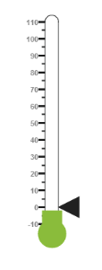
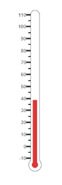
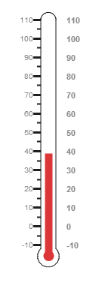
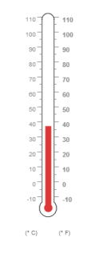
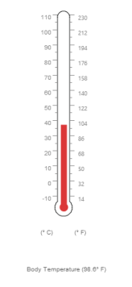

# Getting Started

This section briefly explains on how to create a Linear Gauge control for your application.

* The ASP.NET Linear Gauge provides support to display the Linear Gauge within your web page and allows you to customize it. This section encompasses the details on how to configure Linear Gauge. 
* You will learn how to provide data for a Linear Gauge and display that data in the required way. In addition, you will learn how to customize the default Linear Gauge appearance for your requirements. 

{:.image }

Analog thermometer

Create a Linear Gauge

ASP.NET Linear Gauge widget basically renders with flexible API’s. You can easily create the Linear Gauge widget by using simple code example as follows.

1. First create an ASP Project and add necessary Dll’s and Scripts with the help of the given ASP-Getting Started Documentation.
2. Add the mentioned code example to the corresponding designer page to render the Linear Gauge.

[ASPX]

&lt;ej:LinearGauge runat="server" ID="thermoLinear"&gt;

&lt;/ej:LinearGauge&gt;

Run the above code to get a default Linear Gauge with default values as follows.

{:.image }

Set Height and Width values

Basic attributes of each canvas elements are height and width. You can set the height and width of the gauge using the following code example.It sets the height and width of the canvas image where the thermometer is to be rendered.

[ASPX]

&lt;ej:LinearGauge ID="LinearGauge1" runat="server" Height="550" Width="500"&gt;

&lt;/ej:LinearGauge&gt;

Run the above code to get a gauge that is similar to default. Here height and width of the canvas are set for given values.

{:.image }

Set Animation option and Label Color

* You can draw the Thermometer with some Label color and Animation.
* Intially set EnableAnimation property to ‘false’ to avoid unwanted script loads.

[ASPX]

&lt;ej:LinearGauge ID="LinearGauge1" runat="server" Height="550" Width="500" LabelColor="#8c8c8c" EnableAnimation="false"&gt;

&lt;/ej:LinearGauge&gt;

Run the above code to get the following output.

{:.image }

Provide scale values

* The scale must have the appearance of a thermometer. By giving ScaleType as Thermometer, you can render a thermometer design.
* Minimum temperature can go up to -10 and maximum body temperature can rise up to 110, so you can give minimum scale value as -10 and maximum value as 110.
* Set the location values such as vertical and horizontal position of the thermometer and give the thermometer height as Length.
* You can give the Minor Interval value as 5 to get the exact temperature on the patient.

[ASPX]

&lt;ej:LinearGauge ID="LinearGauge1" runat="server" Height="550" Width="500" LabelColor="#8c8c8c" EnableAnimation="false"&gt;

&lt;Scales&gt;

&lt;ej:Scales Type="Thermometer" BackgroundColor="transparent" Minimum="-10" Maximum="110" MinorIntervalValue="5" Width="20" Length="355"&gt;

&lt;Border Width="0.5"/&gt;

&lt;/ej:Scales&gt;

&lt;/Scales&gt;

&lt;/ej:LinearGauge&gt;

Run the above code to get the following output.

{:.image }

Add pointers data

In Linear Gauge the two types pointer available are: Marker pointer and Bar pointer.

* Marker pointer is displayed as a pointer device that shows the actual values. But for your thermometer there is no need of marker pointer. So you can hide the marker pointer by giving opacity as 0. 
* Bar pointer acts as a mercury metal that shows the exact temperature of the patient. Set some of the basic properties of the Bar pointer such as Width, BarPointerDistanceFromScale, BarPointerValue and BarPointerBackgroundColor.

[ASPX]

&lt;ej:LinearGauge ID="LinearGauge1" runat="server" Height="550" Width="500" LabelColor="#8c8c8c" EnableAnimation="false"&gt;

&lt;Scales&gt;

&lt;ej:Scales Type="Thermometer" BackgroundColor="transparent" Minimum="-10" Maximum="110" MinorIntervalValue="5" Width="20" Length="355"&gt;

&lt;Border Width="0.5"/&gt;

&lt;Position x="50" Y="18"/&gt;

&lt;%--Add the pointers customization code here-- %&gt;

&lt;MarkerPointerCollection&gt;

&lt;ej:MarkerPointers MarkerOpacity="0"&gt;

&lt;/ej:MarkerPointers&gt;

&lt;/MarkerPointerCollection&gt;

&lt;BarPointerCollection&gt;

<ej:BarPointers BarPointerdistanceFromScale="-0.5"

BarPointerValue="37" Width="10"

BarPointerBackgroundColor="#DB3738">

&lt;/ej:BarPointers&gt;

&lt;/BarPointerCollection&gt;

&lt;%--Add the labels customization code here-- %&gt;

&lt;%--Add the ticks customization code here-- %&gt;

&lt;%--Add the custom labels customization code here-- %&gt;

&lt;/ej:Scales&gt;

&lt;/Scales&gt;

&lt;/ej:LinearGauge&gt;

{:.image }
Run the above code to get the following output.

_Linear gauge with pointers_

Add Label Customization

* For thermometer, you can display the label value in two sides, to get temperature in different scales. For that you can add two label values in an array.
* To display the value around the scales, labels are used. You can customize the label placement, font (including its style and family) and distance from scale.

[ASPX]

&lt;ej:LinearGauge ID="LinearGauge1" runat="server" Height="550" Width="500" LabelColor="#8c8c8c" EnableAnimation="false"&gt;

&lt;Scales&gt;

&lt;ej:Scales Type="Thermometer" BackgroundColor="transparent" Minimum="-10" Maximum="110" MinorIntervalValue="5" Width="20" Length="355"&gt;

&lt;Border Width="0.5"/&gt;

&lt;Position x="50" Y="18"/&gt;

&lt;%--Add the pointers customization code here-- %&gt;

&lt;%--Add the labels customization code here-- %&gt;

&lt;LabelCollection&gt;

&lt;ej:Labels&gt;

&lt;DistanceFromScale X="-13"&gt;&lt;/DistanceFromScale&gt;

&lt;/Font&gt;

&lt;/ej:Labels&gt;

&lt;ej:Labels Placement="Far"&gt;

&lt;DistanceFromScale X="10"&gt;&lt;/DistanceFromScale&gt;

&lt;/ej:Labels&gt;

&lt;/LabelCollection&gt;

&lt;%--Add the ticks customization code here-- %&gt;

&lt;%--Add the custom labels customization code here-- %&gt;

&lt;/ej:Scales&gt;

&lt;/Scales&gt;

&lt;/ej:LinearGauge&gt;

Run the above code to get the following output.

{:.image }

Add Ticks Details

* Tick style has two values called major interval and minor interval. You can set major ticks with width and height greater than Minor ticks and you can give TickColor for better visibility in light backgrounds.
* Here four tick details are used for both sides having minor and major ticks.To display the tick value add the following code example. 

[ASPX]

&lt;ej:LinearGauge ID="LinearGauge1" runat="server" Height="550" Width="500" LabelColor="#8c8c8c" EnableAnimation="false"&gt;

&lt;Scales&gt;

&lt;ej:Scales Type="Thermometer" BackgroundColor="transparent" Minimum="-10" Maximum="110" MinorIntervalValue="5" Width="20" Length="355"&gt;

&lt;Border Width="0.5"/&gt;

&lt;Position x="50" Y="18"/&gt;

&lt;%--Add the pointers customization code here-- %&gt;

&lt;%--Add the labels customization code here-- %&gt;

&lt;%--Add the ticks customization code here-- %&gt;

&lt;TickCollection&gt;

<ej:LinearTicks Type="MajorInterval" Height="8"

Width="1" Color="#8c8c8c">

&lt;DistanceFromScale Y="-4"&gt;&lt;/DistanceFromScale&gt;

&lt;/ej:LinearTicks&gt;

<ej:LinearTicks Type="MinorInterval" Height="4"

Width="1" Color="#8c8c8c">

&lt;DistanceFromScale Y="-4"&gt;&lt;/DistanceFromScale&gt;

&lt;/ej:LinearTicks&gt;

<ej:LinearTicks Placement="Far" Type="MajorInterval"

Height="8" Width="1" Color="#8c8c8c">

&lt;DistanceFromScale Y="-4"&gt;&lt;/DistanceFromScale&gt;

&lt;/ej:LinearTicks&gt;

<ej:LinearTicks Placement="Far" Type="MinorInterval"

Height="4" Width="1" Color="#8c8c8c">

&lt;DistanceFromScale Y="-4"&gt;&lt;/DistanceFromScale&gt;

&lt;/ej:LinearTicks&gt;

&lt;/TickCollection&gt;

&lt;%--Add the custom labels customization code here-- %&gt;

&lt;/ej:Scales&gt;

&lt;/Scales&gt;

&lt;/ej:LinearGauge&gt;

Run the above code to get the following output.

{:.image }

Add Custom Label Details

* Custom labels are used to specify the texts in the gauge .It can be customized through various properties.
* In order to show the custom labels, change the showIndicators property to ‘true’.Here you can use custom text to display three range descriptions

[View]

[ASPX]

&lt;ej:LinearGauge ID="LinearGauge1" runat="server" Height="550" Width="500" LabelColor="#8c8c8c" EnableAnimation="false"&gt;

&lt;Scales&gt;

&lt;ej:Scales Type="Thermometer" BackgroundColor="transparent"  ShowCustomLabels="true" Minimum="-10" Maximum="110" MinorIntervalValue="5" Width="20" Length="355"&gt;

&lt;Border Width="0.5"/&gt;

&lt;Position x="50" Y="18"/&gt;

&lt;%--Add the pointers customization code here-- %&gt;

&lt;%--Add the labels customization code here-- %&gt;

&lt;%--Add the ticks customization code here-- %&gt;

&lt;%--Add the custom labels customization code here-- %&gt;

&lt;CustomLabelCollection&gt;

&lt;ej:CustomLabel Value="(° C)" Color="#666666" &gt;

&lt;Position X="44" Y="78"/&gt;

&lt;/Font&gt;

&lt;/ej:CustomLabel&gt;

&lt;ej:CustomLabel Value="(° F)" Color="#666666" &gt;

&lt;Position X="56" Y="78"/&gt;

&lt;/Font&gt;

&lt;/ej:CustomLabel&gt;

&lt;ej:CustomLabel Color="#666666" &gt;

&lt;Position X="51" Y="90"/&gt;

&lt;/Font&gt;

&lt;/ej:CustomLabel&gt;

&lt;/CustomLabelCollection&gt;

&lt;/ej:Scales&gt;

&lt;/Scales&gt;

&lt;/ej:LinearGauge&gt;

Run the above code to get the following output.

{:.image }

Change scale Degree to Fahrenheit

Add the function that convert the temperature in degree to Fahrenheit in the label, with an index value of 1.

[ASPX]

&lt;ej:LinearGauge ID="LinearGauge1" runat="server" Height="550" Width="500" LabelColor="#8c8c8c" EnableAnimation="false" DrawLabels="DrawLabel" &gt;

&lt;Scales&gt;

&lt;ej:Scales Type="Thermometer" BackgroundColor="transparent" Minimum="-10" Maximum="110" MinorIntervalValue="5" Width="20" Length="355"&gt;

&lt;Border Width="0.5"/&gt;

&lt;Position x="50" Y="18"/&gt;

&lt;%--Add the pointers customization code here-- %&gt;

&lt;%--Add the labels customization code here-- %&gt;

&lt;%--Add the ticks customization code here-- %&gt;

&lt;%--Add the custom labels customization code here-- %&gt;

&lt;/ej:Scales&gt;

&lt;/Scales&gt;

&lt;/ej:LinearGauge&gt;

&lt;script&gt;

function DrawLabel(args) {

if (args.label.index == 1) {

args.style.textValue = (args.label.value * (9 / 5)) + 32;

args.style.font = "Normal 10px Segoe UI";

}

}

&lt;/script&gt;

Run the above code to get the following output.

{:.image }

Add Custom label for Current Value

Add the function that displays the current temperature value in the custom label.

[ASPX]

&lt;ej:LinearGauge ID="LinearGauge1" runat="server" Height="550" Width="500" LabelColor="#8c8c8c" EnableAnimation="false" DrawCustomLabel="DrawCustomLabel" &gt;

&lt;Scales&gt;

&lt;ej:Scales Type="Thermometer" BackgroundColor="transparent" Minimum="-10" Maximum="110" MinorIntervalValue="5" Width="20" Length="355"&gt;

&lt;Border Width="0.5"/&gt;

&lt;Position x="50" Y="18"/&gt;

&lt;%--Add the pointers customization code here-- %&gt;

&lt;%--Add the labels customization code here-- %&gt;

&lt;%--Add the ticks customization code here-- %&gt;

&lt;%--Add the custom labels customization code here-- %&gt;

&lt;/ej:Scales&gt;

&lt;/Scales&gt;

&lt;/ej:LinearGauge&gt;

&lt;script&gt;

function DrawCustomLabel(args) {

if (args.customLabelIndex == 2) {

var temp = args.scaleElement.barPointers[0].value;

var fahValue = (temp * (9 / 5)) + 32;

if (temp == -10) {

args.style.textValue = "Very Cold Weather" + "(" + fahValue.toFixed(1) + "° F)";

}

else if ((temp > -10 && temp &lt; 0) || (temp &gt; 0 && temp < 15)) {

args.style.textValue = "Cool Weather" + " (" + fahValue.toFixed(1) + "° F)";

}

else if (temp == 0) {

args.style.textValue = "Freezing point of Water" + " (" + fahValue.toFixed(1) + "° F)";

}

else if (temp >= 15 && temp < 30) {

args.style.textValue = "Room Temperature" + " (" + fahValue.toFixed(1) + "° F)";

}

else if (temp == 30) {

args.style.textValue = "Beach Weather" + " (" + fahValue.toFixed(1) + "° F)";

}

else if (temp == 37) {

args.style.textValue = "Body Temperature" + " (" + fahValue.toFixed(1) + "° F)";

}

else if (temp == 40) {

args.style.textValue = "Hot Bath Temperature" + " (" + fahValue.toFixed(1) + "° F)";

}

else if (temp > 40 && temp < 100) {

args.style.textValue = "Very Hot Temperature" + " (" + fahValue.toFixed(1) + "° F)";

}

else if (temp == 100) {

args.style.textValue = "Boiling point of Water" + " (" + fahValue.toFixed(1) + "° F)";

}

}

}

&lt;/script&gt;

The final output is as follows

{:.image }

