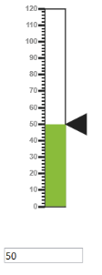
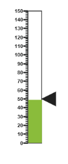

# MVVM

AngularJS

Linear Gauge contains AngularJS support. It is possible to add object as well as array object in the Linear Gauge. The two way binding support is given to the pointer value, minimum scale value and maximum scale value. 

## Rendering the Linear gauge

ej-LinearGauge is the control tag, where ej is tag prefix and LinearGauge is the control name.

Linear Gauge is rendered with the following code example. 



<asp:Content ID="ControlContent" runat="server" ContentPlaceHolderID="ControlsSection">

<ej-LinearGauge id="linearCore" e-readOnly="false" e-load="loadGaugeTheme"

e-enableAnimation="false" e-labelColor="#8c8c8c">

</ej-LinearGauge>

</asp:Content>



Execute the above code to render the following output.

## Adding Scale collection

Scale is an array object and the inner tag is used for it. You can extend the Object in the array collection such as, position with hyphen in the same tag.

Example: e-position-x and e-position-y. 



<!--To Render the Linear gauge-->

<ej-LinearGauge id="linearCore">

<!--Adding Scale collection to the Linear gauge-->

<e-scales>

<e-scale e-width="4" e-border-color="transparent" e-border-width="0"

e-showBarPointers="false" e-showRanges="true" e-length="310"

e-position-x="52" e-position-y="50" e-maximum="120">

</e-scale>

</e-scales>

</ej-LinearGauge>



Execute the above code to render the following output.

## Adding Marker Pointer collection

Marker Pointer is an array object and the inner tag is used for it. You can extend the Object in the array collection such as, border with hyphen in the same tag.

Example: e-border-color.



<!--To Render the Linear gauge-->

<ej-LinearGauge id="linearCore">

<!--Adding Scale collection to the Linear gauge-->

<e-scales>

<e-scale>

<!--Adding marker pointer collection to the Scale collection-->

<e-markerPointers>

<e-markerPointer e-length="10" e-width="10" e-value="50"

e-backgrouundColor="#4D4D4D"

e-border-color="#4D4D4D">

</e-markerPointer>

</e-markerPointers>

</e-scale>

</e-scales>

</ej-LinearGauge>

 

Execute the above code to render the following output.

## Adding label collection

Label is also an array object and the inner tag is used for it. You can extend the Object in the array collection such as, font with hyphen in the same tag.

Example: e-font-size. 



<!--To Render the Linear gauge-->

<ej-LinearGauge id="linearCore">

<!--Adding Scale collection to the Linear gauge-->

<e-scales>

<e-scale>

<!--Adding marker pointer collection to the Scale collection-->

<e-markerPointers>…</e-markerPointers>

<!--Adding label collection to the Scale collection-->

<e-labels>

<e-label  e-distanceFromScale-x="-10" e-distanceFromScale-y="0"

e-font-fontFamily="Segoe UI" e-font-fontStyle="bold"

e-font-size="11px">

</e-label>

</e-labels>

</e-scale>

</e-scales>

</ej-LinearGauge>



Execute the above code to render the following output.

## Adding Tick collection

Tick is an array object and the inner tag is used for it.



<!--To Render the Linear gauge-->

<ej-LinearGauge id="linearCore">

<!--Adding Scale collection to the Linear gauge-->

<e-scales>

<e-scale>

<!--Adding marker pointer collection to the Scale collection-->

<e-markerPointers>…</e-markerPointers>

<!--Adding label collection to the Scale collection-->

<e-labels>…</e-labels>

<!--Adding tick collection to the Scale collection-->

<e-ticks>

<e-tick e-type="majorinterval" e-width="2" e-color="#8c8c8c">

</e-tick>

</e-ticks>

</e-scale>

</e-scales>

</ej-LinearGauge>



Execute the above code to render the following output.

## Adding Range collection

Range is an array object and the inner tag is used for it. You can extend the Object in the array collection such as, border with hyphen in the same tag.

Example: e-border-color. 



<!--To Render the Linear gauge-->

<ej-LinearGauge id="linearCore">

<!--Adding Scale collection to the Linear gauge-->

<e-scales>

<e-scale>

<!--Adding marker pointer collection to the Scale collection-->

<e-markerPointers>…</e-markerPointers>

<!--Adding label collection to the Scale collection-->

<e-labels>…</e-labels>

<!--Adding tick collection to the Scale collection-->

<e-ticks>…</e-ticks>

<!--Adding range collection to the Scale collection-->

<e-ranges>

<e-range e-startValue="0" e-endValue="60" e-startWidth="4"

e-endWidth="4" e-backgroundColor="#F6B53F"

e-border-color="#F6B53F">

</e-range>

<e-range e-startValue="60" e-endValue="120" e-startWidth="4"

e-endWidth="4" e-backgroundColor="#E94649"

e-border-color="#E94649">

</e-range>

</e-ranges>

</e-scale>

</e-scales>

</ej-LinearGauge>



Finally while running the above codes, the resultant gauge appears as follows.

## Two Way Binding 

Linear Gauge support the two way binding for the property value, minimum and maximum as mentioned earlier. Following code example explains how to achieve the two way binding to the Linear Gauge.



<asp:Content ID="ControlContent" runat="server" ContentPlaceHolderID="ControlsSection">

<ej-LinearGauge id="linearCore" e-value="nvalue" e-readOnly="false" e-load="loadGaugeTheme" e-enableAnimation="false" e-labelColor="#8c8c8c">

</ej-LinearGauge>

<input type="text" id="txtMax" e-value="nvalue" ej-numerictextbox ng-model="nvalue"  e-decimalplaces="2" e-showspinbutton="false" Style="width:110px"/>

</asp:Content>



Execute the above code to render the following output.

## KnockoutJS

* KnockoutJS support allows you to bind the HTML elements against any of the available data models.Two types of KnockoutJS binding is supported as of AngularJS,
* one-way binding
* two-way binding
* One way binding refers to the process of applying observable values to all the available properties of the Linear Gauge control, but the changes made in it does not reflect and trigger in turn to the observable collection. This kind of binding applies to all the properties of the Linear Gauge control.
* Two-way binding supports both the processes – it applies the observable values to the Linear Gauge properties as well as the changes made in it is also reflected back and triggered within the observable collections. Only few of the schedule properties support two-way binding and they are as follows
* value
* maximum 
* minimum





<%--For Linear Gauge rendering-- %>

<asp:Content ID="ControlContent" runat="server" ContentPlaceHolderID="ControlsSection">

</asp:Content>









Execute the above code to render the following output.

