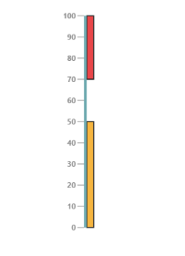

# Ranges 

Ranges are used to specify or group the scale values. You can describe the values in the pointers using ranges. 

## Adding range collection

Range collection can be directly added to the scale object. Refer the following code example to add range collection in a Linear Gauge control. 



<%--For Linear gauge rendering-- %>

<ej:LinearGauge runat="server" ID="PointerGauge"  Height="150" width="600" labelColor="black" Orientation="Horizontal" EnableResize="true" EnableAnimation="false">

<%-- For setting scale collection-- %>

<Scales>

<ej:Scales Direction="Clockwise" Width="0" Minimum="-20" Maximum="60" BackgroundColor="transparent" ShowRanges="true" ShowBarPointers="false">

<Border Color="transparent" Width="0" />

<%-- For setting bar pointer collection-- %>

<BarPointerCollection>

<ej:BarPointers Width="10" BarPointerBackgroundColor="#8BABFF" BarPointerValue="91" BarPointerdistanceFromScale="30">

</ej:BarPointers>

</BarPointerCollection>

<%-- For setting marker pointer collection-- %>

<MarkerPointerCollection>

<ej:MarkerPointers Width="3" Length="30" MarkerBackgroundColor="#FE5C09" Type="Star" MarkerdistanceFromScale="20" Value="55" Placement="near"></ej:MarkerPointers>

</MarkerPointerCollection>

<LabelCollection>

<ej:Labels Angle="90">

<DistanceFromScale X="0" Y="50" />

</ej:Labels>

</LabelCollection>

<%-- For setting ticks-- %>

<TickCollection >

<ej:LinearTicks Type="MajorInterval" Width="2" Color="#8c8c8c" >

<DistanceFromScale X="25" Y="0" />

</ej:LinearTicks>

<ej:LinearTicks Type="MinorInterval" Width="1" height="6" Color="#8c8c8c" >

<DistanceFromScale X="25" Y="0" />

</ej:LinearTicks>

</TickCollection>

<%--Setting range-- %>

<RangeCollection>

<ej:Ranges StartValue="-20" EndValue="60" StartWidth="0" EndWidth="20" RangeBackgroundColor="#FEBE48" Placement="Near" DistanceFromScale="20"></ej:Ranges>

</RangeCollection>

</ej:Scales>

</Scales>

</ej:LinearGauge>



Execute the above code to render the following output.

## Range Customization

### Appearance

The major attributes for ranges are startValue and endValue. The startValue defines the start position of the range and endValue defines the end position of the range. The startWidth and endWidth are used to specify the range width at the starting and ending position of the ranges.



<%--For Linear gauge rendering-- %>

<ej:LinearGauge runat="server" ID="PointerGauge"  width="500" labelColor="#8c8c8c" >

<Scales>

<ej:Scales  Width="4" Length="310" BackgroundColor="transparent"  ShowRanges="true"  ShowMarkerPointers="false">

<Position x="50" Y="50" />

<Border Color="transparent" Width="0" />

<LabelCollection>

<ej:Labels>

<DistanceFromScale X="-12" />

</ej:Labels>

</LabelCollection>

<BarPointerCollection>

<ej:BarPointers BarPointerValue="100" Width="4" BarPointerBackgroundColor="#6FAAB0"></ej:BarPointers>

</BarPointerCollection>

<TickCollection >

<ej:LinearTicks Type="MajorInterval" Width="1" Color="#8c8c8c" />

</TickCollection>

<%--Setting range start value, endvalue, backgroundcolor, startwidth, end width and distancefromscale-- %>

<RangeCollection>

<ej:Ranges DistanceFromScale="6" StartValue="0" EndValue="50" StartWidth="8" EndWidth="8" RangeBackgroundColor="#F6B53F"></ej:Ranges>

<ej:Ranges DistanceFromScale="6" StartValue="70" EndValue="100" StartWidth="8" EndWidth="8" RangeBackgroundColor="#E94649"></ej:Ranges>

</RangeCollection>

</ej:Scales>

</Scales>

</ej:LinearGauge>



Execute the above code to render the following output.

## Colors and Border

* You can customize the ranges to improve the appearance of the Gauge. The range border is modified with the object called border. It has two border property such as color and width which are used to customize the border color of the ranges and border width of the ranges. 
* You can set the background color to improve the look and feel of the Linear Gauge. For customizing the background color of the ranges, backgroundColor is used.You can add the gradient effects to the ranges by using gradient object.



<%--For Linear gauge rendering-- %>

<ej:LinearGauge runat="server" ID="PointerGauge" width="500" labelColor="#8c8c8c" Load="LoadGaugeTheme">

<Scales>

<ej:Scales  Width="4" Length="310" BackgroundColor="transparent"  ShowRanges="true"  ShowMarkerPointers="false">

<Position x="50" Y="50" />

<Border Color="transparent" Width="0" />

<LabelCollection>

<ej:Labels>

<DistanceFromScale X="-12" />

</ej:Labels>

</LabelCollection>

<TickCollection >

<ej:LinearTicks Type="MajorInterval" Width="1" Color="#8c8c8c" />

</TickCollection>

<%--Setting range backgroundcolor, bordercolor-- %>

<RangeCollection>

<ej:Ranges DistanceFromScale="10" StartValue="0" EndValue="50" StartWidth="3" EndWidth="18" RangeBackgroundColor="#F6B53F"><Border Color="black" /></ej:Ranges>

<ej:Ranges DistanceFromScale="10" StartValue="70" EndValue="100" StartWidth="18" EndWidth="3" RangeBackgroundColor="#E94649"><Border Color="black" /></ej:Ranges>

</RangeCollection>

</ej:Scales>

</Scales>

</ej:LinearGauge>



Execute the above code to render the following output.

## Positioning the ranges

* You can position ranges using two properties such as distanceFromScale and placement. The distanceFromScale property defines the distance between the scale and range. 
* Placement property is used to locate the pointer with respect to scale either inside the scale or outside the scale or along the scale. It is an enumerable data type. 



<%--For Linear gauge rendering-- %>

<ej:LinearGauge runat="server" ID="PointerGauge" width="500" labelColor="#8c8c8c" Load="LoadGaugeTheme">

<Scales>

<ej:Scales  Width="4" Length="310" BackgroundColor="transparent"  ShowRanges="true"  ShowMarkerPointers="false">

<Position x="50" Y="50" />

<Border Color="transparent" Width="0" />

<LabelCollection>

<ej:Labels>

<DistanceFromScale X="-12" />

</ej:Labels>

</LabelCollection>

<TickCollection >

<ej:LinearTicks Type="MajorInterval" Width="1" Color="#8c8c8c" />

</TickCollection>

<%--Setting range placement and distancefromscale-- %>

<RangeCollection>

<ej:Ranges DistanceFromScale="-30" Placement="near" StartValue="0" EndValue="50" StartWidth="3" EndWidth="18" RangeBackgroundColor="#F6B53F"><Border Color="black" /></ej:Ranges>

<ej:Ranges DistanceFromScale="-30" Placement="near" StartValue="70" EndValue="100" StartWidth="18" EndWidth="3" RangeBackgroundColor="#E94649"><Border Color="black" /></ej:Ranges>

</RangeCollection>

</ej:Scales>

</Scales>

</ej:LinearGauge>



Execute the above code to render the following output.

## Multiple Ranges

You can set multiple ranges by adding an array of range objects. Refer the following code example for multiple range functionality.



<%--For Linear gauge rendering-- %>

<ej:LinearGauge runat="server" ID="PointerGauge" Height="150" width="600" Orientation="Horizontal" labelColor="black" EnableResize="true" EnableAnimation="false">

<Scales>

<ej:Scales  Width="0" Length="310" BackgroundColor="#AEC75F" Direction="Clockwise" Minimum="-20" Maximum="60"  ShowRanges="true" ShowBarPointers="false">

<Position x="50" Y="50" />

<Border Color="transparent" Width="0" />

<MarkerPointerCollection>

<ej:MarkerPointers Width="3" length="30" MarkerBackgroundColor="#FE5C09" Type="Star" MarkerdistanceFromScale="20" Placement="Near" Value="55"></ej:MarkerPointers>

</MarkerPointerCollection>

<LabelCollection>

<ej:Labels Angle="90">

<DistanceFromScale X="0" Y="50" />

</ej:Labels>

</LabelCollection>

<TickCollection >

<ej:LinearTicks Type="MajorInterval" Width="2" Color="#8c8c8c">

<DistanceFromScale x="-1" Y="20" />

</ej:LinearTicks>

<ej:LinearTicks Type="MinorInterval" Width="1" Height="6" Color="#8c8c8c">

<DistanceFromScale x="-1" Y="20" />

</ej:LinearTicks>

</TickCollection>

<RangeCollection>

<%--Setting range1-- %>

<ej:Ranges DistanceFromScale="20" Placement="near" StartValue="-20" EndValue="0" StartWidth="5" EndWidth="10" RangeBackgroundColor="#2788B1"><Border Color="#2788B1" /></ej:Ranges>

<%--Setting range2-- %>

<ej:Ranges DistanceFromScale="20" Placement="near" StartValue="0" EndValue="20" StartWidth="10" EndWidth="15" RangeBackgroundColor="#A5BA28"><Border Color="#A5BA28" /></ej:Ranges>

<%--Setting range3-- %>

<ej:Ranges DistanceFromScale="20" Placement="near" StartValue="20" EndValue="40" StartWidth="15" EndWidth="20" RangeBackgroundColor="#FEBE48"><Border Color="#FEBE48" /></ej:Ranges>

<%--Setting range4-- %>

<ej:Ranges DistanceFromScale="20" Placement="near" StartValue="40" EndValue="60" StartWidth="20" EndWidth="25" RangeBackgroundColor="red"><Border Color="red" /></ej:Ranges>

</RangeCollection>

</ej:Scales>

</Scales>

</ej:LinearGauge>



Execute the above code to render the following output.

