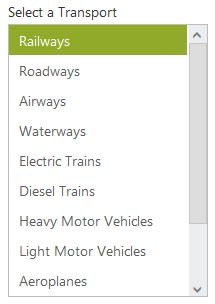
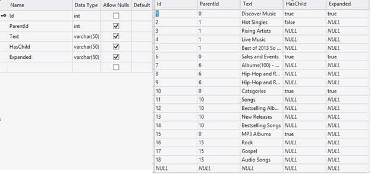
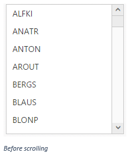
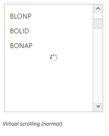
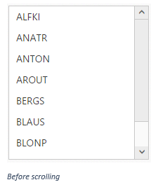
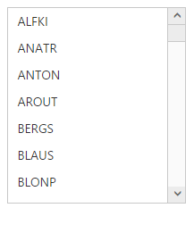

# Databinding 

The ListBox is populated with the node information taken from a data source. The ListBox supports binding data sources containing Object data, Remote data, XML Data, SQL Data and LinqToSql Data.

## Data fields and configuration

The following sub-properties provide you a way to bind either the local or remote data to the ListBox control.

<table>
<tr>
<td>
<b>Name</b></td><td>
<b>Description</b></td></tr>
<tr>
<td>
DataSource</td><td>
The data source contains the list of data for generating the ListBox items</td></tr>
<tr>
<td>
Query</td><td>
It specifies the query to retrieve the data from online server</td></tr>
<tr>
<td>
DataIdField</td><td>
It specifies the name of the column value that binds the item’s id.</td></tr>
<tr>
<td>
DataTextField</td><td>
It specifies the name of the column value that binds the item’s text.</td></tr>
<tr>
<td>
DataValueField</td><td>
It specifies the name of the column value that binds the item’s value.</td></tr>
<tr>
<td>
DataImageUrlField</td><td>
It specifies the name of the column value that binds the image URL.</td></tr>
<tr>
<td>
DataImageAttributesField</td><td>
It specifies the name of the column value that binds the image attributes such as height, width, styles and so on</td></tr>
<tr>
<td>
DataSpriteCSSField</td><td>
It specifies the name of the column value that binds the sprite CSS class name.</td></tr>
<tr>
<td>
DataHtmlAttributesField</td><td>
It specifies the name of the column value that binds the html attributes such as id, class, styles for the item</td></tr>
<tr>
<td>
DataSelectedField</td><td>
It specifies the name of the column value that binds the boolean value to select the item initially.</td></tr>
<tr>
<td>
TooltipText</td><td>
It specifies the name of the column value that binds the tooltip text.</td></tr>
<tr>
<td>
DataTableNameField</td><td>
It specifies the specific table from the remote data source to render data.</td></tr>
</table>

## Object Data

In the ASPX page, add a ListBox element from ToolBox and map the DataTextField and DataValueField properties with specific column names of the local data source. 

And in code behind, create the data source and assign it as below.




    

        Select a skill

    <ej:listbox id="listboxsample" runat="server" DataTextField="Name" DataValueField="Name"  Width="240"></ej:listbox>





        protected void Page_Load(object sender, EventArgs e)

        {

listboxsample.DataSource = GetData();

        }

        private List<Languages> GetData()

        {

            List<Languages> data = new List<Languages>();

            data.Add(new Languages() { Name = "ASP.NET" });

            data.Add(new Languages() { Name = "ActionScript" });

            data.Add(new Languages() { Name = "Basic" });

            data.Add(new Languages() { Name = "C++" });

            data.Add(new Languages() { Name = "C#" });

            data.Add(new Languages() { Name = "dBase" });

            data.Add(new Languages() { Name = "Delphi" });

            data.Add(new Languages() { Name = "ESPOL" });

            data.Add(new Languages() { Name = "F#" });

            data.Add(new Languages() { Name = "FoxPro" });

            data.Add(new Languages() { Name = "Java" });

            data.Add(new Languages() { Name = "J#" });

            data.Add(new Languages() { Name = "Lisp" });

            data.Add(new Languages() { Name = "Logo" });

            data.Add(new Languages() { Name = "PHP" });

            return data;

        }

        public class Languages

        {

            public string Name;

        }




 

## Remote data

We can bind the data for the ListBox from any server that is located as a remote web service. By using Query options, you can pass the query string to filter the data that helps to avoid rendering the excessive data. 

Refer to the below example.

In the ASPX page, add a ListBox element from ToolBox and map the DataTextField and DataValueField properties with the specific column names of the remote data source.

And in code behind, assign the DataSource property with corresponding web service URL. By using Query property, extract the corresponding data table.

N> Use [ejQuery](http://help.syncfusion.com/js/api/ejquery) to set the Query property.





    <ej:ListBox ID="listbox1" runat="server" DataTextField="CustomerID" DataValueField="CustomerID">
</ej:ListBox>





        protected void Page_Load(object sender, EventArgs e)

        {

listboxsample.DataSource = "http://mvc.syncfusion.com/Services/Northwnd.svc/";

            listboxsample.Query = "ej.Query().from('Customers').take(14)";

        }





## SQL Data

ListBox provides extensive data binding support to populate ListBox nodes. Therefore the values can be mapped to the ListBox fields from an existing SQL data source by using DataSourceID property.

Define an SQL data source in the web page and configure the data source as per your requirement. The following screenshot illustrates the sample database used.

In the Design page, assign the values for DataTextField, DataValueField. In DataSourceID field assign the ID of the existing SQL data source.



        
Select a Transport 

        <ej:ListBox ID="listbox" runat="server" DataTextField="Text" DataValueField="id" DataSourceID="SqlDataSource1"></ej:ListBox>

<asp:SqlDataSource ID="SqlDataSource1" runat="server" SelectCommand="SELECT * FROM [Vehicle]" ConnectionString='<%$ ConnectionStrings:Linq_To_SQLConnectionString %>' ProviderName='<%$ ConnectionStrings:Linq_To_SQLConnectionString.ProviderName %>'>
</asp:SqlDataSource>



## LinqToSQL Data

LinqDataSource is designed to work with DataContext. It uses internally, the data model (dbml) file. Data model contains list of tables from specific database. 

Define a Linq-to-SQL data source in the web page and configure the data source as per your requirement by using the database. In the following example, an SQL table is used to create a DBML class.

The following screenshot illustrates the sample database used.

In the Design page, assign values for DataTextField, DataValueField. In DataSourceID field assign the ID of the existing Linq-to-SQL data source.



        
Select an Album

        <ej:ListBox ID="listbox" runat="server" DataTextField="Text" DataValueField="Id" DataSourceID="LinqDataSource1"></ej:ListBox>
    

    <asp:LinqDataSource ID="LinqDataSource1" runat="server" ContextTypeName="WebSampleBrowser.database.Linq_Common_DataDataContext" EntityTypeName="" TableName="Databindings">
    </asp:LinqDataSource>



Output of the above steps

## XML Data

ListBox provides XML data binding support to populate ListBox content. Therefore, the values can be mapped to the ListBox fields from an existing XML data by using DataSourceID property.

In the Design page, assign the values for DataTextField, DataValueField. In DataSourceID field assign the ID of the existing XML datasource.
 


        
Select a Product

        <ej:ListBox ID="DrpDwnxml" DataMember="RootItem" DataTextField="Text" DataValueField="Text" runat="server" DataSourceID="XmlDataSource1"></ej:ListBox>
    

    <asp:XmlDataSource ID="XmlDataSource1" runat="server" DataFile="~/App_Data/ListBoxXml.xml"></asp:XmlDataSource>



Create a new xml file in App_Data folder as ‘ListBoxXml.xml’ and add the following data.



<?xml version="1.0" encoding="utf-8" ?>

<items>

  <RootItem Text="Essential Grid Web" Expanded="True" Url="#">

    <Item Text="Binary Price : $595.00" Url="#"></Item>

    <Item Text="Source Price : $995.00" Url="#"></Item>

  </RootItem>

  <RootItem Text="Essential Tools Web" Expanded="True" Url="#">

    <Item Text="Binary Price : $495.00" Url="#"></Item>

    <Item Text="Source Price : $895.00" Url="#"></Item>

  </RootItem>

  <RootItem Text="Essential Chart Web" Url="#">

    <Item Text="Binary Price : $495.00" Url="#"></Item>

    <Item Text="Source Price : $895.00" Url="#"></Item>

  </RootItem>

  <RootItem Text="Essential Diagram Web" Url="#">

    <Item Text="Binary Price : $495.00" Url="#"></Item>

    <Item Text="Source Price : $895.00" Url="#"></Item>

  </RootItem>

  <RootItem Text="Essential Tools MVC" Url="#">

    <Item Text="Binary Price : $495.00" Url="#"></Item>

    <Item Text="Source Price : $895.00" Url="#"></Item>

  </RootItem>

  <RootItem Text="Essential Grid MVC" Url="#">

    <Item Text="Binary Price : $495.00" Url="#"></Item>

    <Item Text="Source Price : $895.00" Url="#"></Item>

  </RootItem>

  <RootItem Text="Essential Chart MVC" Url="#">

    <Item Text="Binary Price : $495.00" Url="#"></Item>

    <Item Text="Source Price : $895.00" Url="#"></Item>

  </RootItem>

  <RootItem Text="Essential Diagram MVC" Url="#">

    <Item Text="Binary Price : $495.00" Url="#"></Item>

    <Item Text="Source Price : $895.00" Url="#"></Item>

  </RootItem>

  <RootItem Text="Essential Tools JS" Url="#">

    <Item Text="Binary Price : $495.00" Url="#"></Item>

    <Item Text="Source Price : $895.00" Url="#"></Item>

  </RootItem>

  <RootItem Text="Essential Grid JS" Url="#">

    <Item Text="Binary Price : $495.00" Url="#"></Item>

    <Item Text="Source Price : $895.00" Url="#"></Item>

  </RootItem>

  <RootItem Text="Essential Chart JS" Url="#">

    <Item Text="Binary Price : $495.00" Url="#"></Item>

    <Item Text="Source Price : $895.00" Url="#"></Item>

  </RootItem>

  <RootItem Text="Essential Diagram JS" Url="#">

    <Item Text="Binary Price : $495.00" Url="#"></Item>

    <Item Text="Source Price : $895.00" Url="#"></Item>

  </RootItem>

</items>



## Virtual Scrolling

The ListBox widget provides support to load its data on demand via scrolling behavior to improve the application’s performance. This can be achieved using “AllowVirtualScrolling” property. There are two ways to load data based on the scrolling type.

1. Normal Scrolling

2. Continuous Scrolling

The scrolling type can be defined via VirtualScrollMode` property.

### Normal Scrolling

This mode allows you to load the list box data while scrolling i.e. each time the scroll bar is scrolled, it will send request to the server to load the data.

N> By default, the value of “VirtualScrollMode” property is normal.

In the Design page, map the values for DataTextField and DataValueField. In the code behind page, assign the data source as below.




        <ej:ListBox ID="listbox1" runat="server" DataTextField="CustomerID" DataValueField="CustomerID">
        </ej:ListBox>
    





protected void Page_Load(object sender, EventArgs e)
        {
            listboxsample.DataSource = "http://mvc.syncfusion.com/Services/Northwnd.svc/";
            listboxsample.Query = "ej.Query().from('Customers')";
            listboxsample.AllowVirtualScrolling = true;
        }
        



### Continuous Scrolling

This mode allows you to load the list box data when the scrollbar reaches the end point. In this mode, we can specify the number of items to be loaded per request.

The number of items to be loaded per request can be specified using the “ItemRequestCount” property.

In the Design page, map the values for DataTextField and DataValueField. In the code behind page, assign the data source and set virtual scrolling mode as “Continuous”.




        <ej:ListBox ID="listbox1" runat="server" DataTextField="CustomerID" DataValueField="CustomerID">
        </ej:ListBox>
    





protected void Page_Load(object sender, EventArgs e)
        {
            listboxsample.DataSource = "http://mvc.syncfusion.com/Services/Northwnd.svc/";
            listboxsample.Query = "ej.Query().from('Customers')";
            listboxsample.AllowVirtualScrolling = true;
            listboxsample.VirtualScrollMode = Syncfusion.JavaScript.VirtualScrollMode.Continuous;
            listboxsample.ItemRequestCount = 10;
        }
        



N> The “ItemRequestCount” property will work only when “VirtualScrollMode” is “Continuous”.

### Handling errors

In remote binding, the server might not return data sometimes due to various reasons. In such cases we need to handle the error properly. We can handle it using the ClientSideOnActionFailure event.




        

        <ej:ListBox ID="ListBox" runat="server" DataTextField="CustomerID" ClientSideOnActionFailure="fail">
        </ej:ListBox>
    

    





    protected void Page_Load(object sender, EventArgs e)
        {
            listboxsample.DataSource = "http://mvc.syncfusion.com/Services/Northwnd.svc/";
            listboxsample.Query = "ej.Query().from('Customers')";
        }




