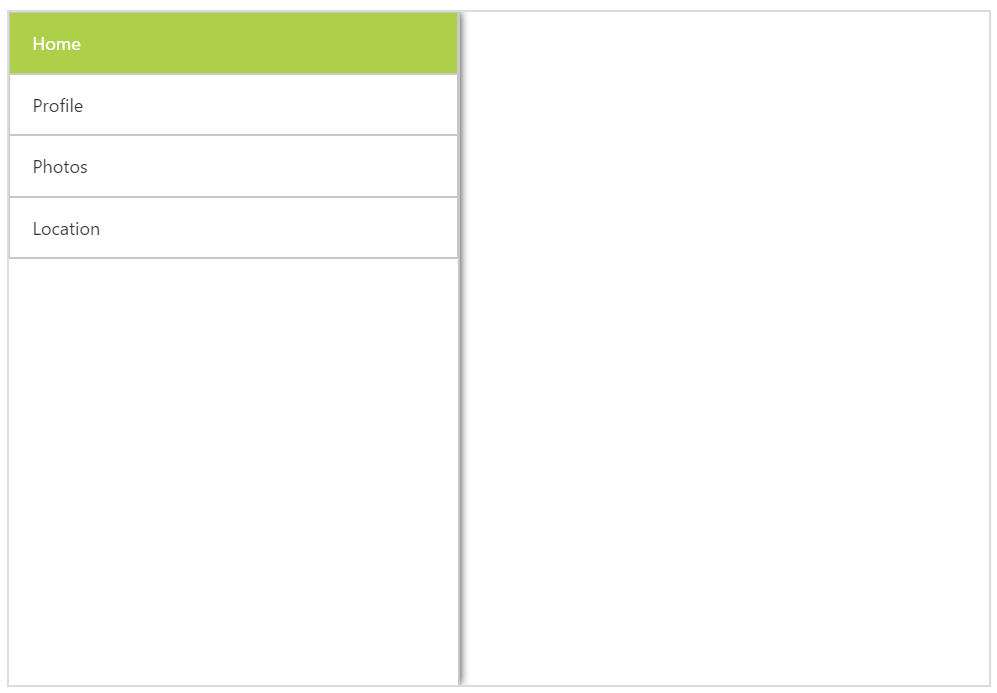

# Customize Position

Position property is used to specify the position whether it is in fixed or relative to the page. When you set a normal value to position property, it appears within the container. Otherwise, it appears in the whole body .The possible position values are fixed and normal. The Default value is normal.


        
    

         

              <ej:NavigationDrawer runat="server"  ID="navpane" Position="Fixed" Type="Slide" EnableListView="true" TargetId="butdrawer" >
                      <ListViewSettings Width="300" SelectedItemIndex="0" />
                       <Items>
                            <ej:NavigationDrawerItems  Text="Home"  />
                            <ej:NavigationDrawerItems  Text="Profile" />
                            <ej:NavigationDrawerItems  Text="Photos" />
                            <ej:NavigationDrawerItems  Text="Location" />
                        </Items>
                    </ej:NavigationDrawer>
             



Add following code in style section,



    



The following screenshot illustrates the output by swiping from left to right at the left end of the screen.

 

