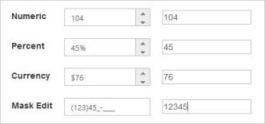

# Integration

## Angular Support

The NumericTextbox control supports two types of Angular JS support namely,

* One-way binding
* Two-way binding

One-way binding refers to the process of applying scope values to all the available properties of the NumericTextbox control, but the changes made in the NumericTextbox control are not reflected or triggered in turn to the scope collection. This kind of binding applies to all the properties of the NumericTextbox control.

Two-way binding supports both the processes; it applies the scope values to the Numeric Textbox properties as well as the changes made in the NumericTextbox control also get reflected back and triggered within the Angular scope change function.

Apply the plugin and property assigning to the NumericTextbox control element through the directive that starts with the letter “e-“.

To know more details about the Angular binding, refer to the following link location,

<http://help.syncfusion.com/js/angularjs>

The following example explains how to bind data to the NumericTextbox widget through Angular Support.



<!DOCTYPE html>

<html xmlns="http://www.w3.org/1999/xhtml" ng-app="TextCtrl">

<head>

    <title></title>

    <link href="Content/bootstrap.min.css" rel="stylesheet" />

    <link href=" http://cdn.syncfusion.com/ {{site.releaseversion}}/js/web/flat-azure/ej.web.all.min.css" rel="stylesheet" />

    

    

    

      

    

    

    

</head>

<body ng-controller="TextboxCtrl">

    

        <table cellpadding="10">

            <tbody>

                <tr>

                    <td>

                        <label for="numeric">Numeric</label>

                    </td>

                    <td>

                        <input id="numeric" type="text" ej-numerictextbox e-value="nvalue" />

                    </td>

                    <td>

                        <input type="text" class="input ejinputtext" ng-model="nvalue" />

                    </td>

                </tr>

            </tbody>

        </table>

    

    

</body>

</html>



The following screenshot displays the output of the NumericTextbox controls with two-way angular bindingis as follows.

 

## Knockout Support

Knockout support allows you to bind the HTML elements against any of the available data models. It is of two types.

* One-way binding
* Two-way binding

One-way binding refers to the process of applying observable values to all the available properties of the NumericTextbox control, but the changes made in the NumericTextbox control are not reflected and triggered in turn to the observable collection. This kind of binding applies to all the properties of the NumericTextboxcontrol.

Two-way binding supports both the processes; it applies the observable values to the NumericTextbox control properties as well as the changes made in the NumericTextbox control are also reflected back and triggered within the observable collections.

For more information about the Knockout Binding, refer to the following online documentation in the given link location,

<http://help.syncfusion.com/js/knockoutjs>

The following example explains how to bind data to the NumericTextbox control through Knockout Support that enables and populates data to the NumericTextbox control based on the value set to the other NumericTextbox control.



 <!DOCTYPE html>

<html xmlns="http://www.w3.org/1999/xhtml">

<head>

    <title></title>

    <link href="Content/bootstrap.min.css" rel="stylesheet" />

    <link href=" http://cdn.syncfusion.com/ {{site.releaseversion}}/js/web/flat-azure/ej.web.all.min.css" rel="stylesheet" />

    

    

    

    

    

    

    

</head>

<body>

    

        <table cellpadding="10">

            <tbody>

                <tr>

                    <td>

                        <label for="numeric">Numeric</label>

                    </td>

                    <td>

                        <input id="numeric" type="text" data-bind="ejNumericTextbox: { value: nvalue }" />

                    </td>

                    <td>

                        <input type="text" class="input ejinputtext" data-bind="value: nvalue" />

                    </td>

                </tr>

            </tbody>

        </table>

    

    

</body>

</html> 



The following screenshot displays the output of the Knockout binding in the NumericTextbox .

 

