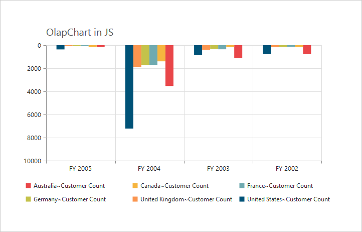
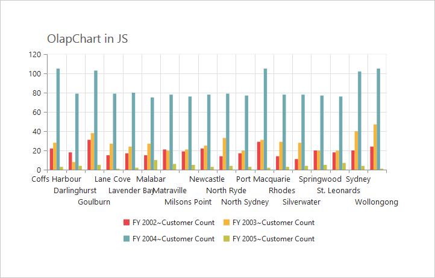

#Axes 

##Label Format

###Format Numeric labels
By using the `LabelFormat` property, you can format the numeric labels. Numeric values can be formatted with n (number with decimal points), c (currency) and p (percentage) commands.



<ej:OlapChart ID="OlapChart1" runat="server" Url="../wcf/OlapChartService.svc" ClientIDMode="Static">
    //Applying currency format to axis labels
    <PrimaryYAxis LabelFormat="c"></PrimaryYAxis>
    <Size Width="950px" Height="460px"></Size>
</ej:OlapChart>



Following table describes the result on applying some commonly used label formats on numeric values.

<table>
<tr>
<th>
Label Value</th><th>
Label Format Property Value</th><th>
Result</th><th>
Description</th>
</tr>
<tr><td>
1000</td><td>
n1</td><td>    
1000.0</td><td>
The Number is rounded to 1 decimal place</td>
</tr>
<tr><td>
1000</td><td>
n2</td><td>    
1000.00</td><td>
The Number is rounded to 2 decimal place</td>
</tr>
<tr><td>
1000</td><td>
n3</td><td>    
1000.000</td><td>
The Number is rounded to 3 decimal place</td>
</tr>
<tr><td>
0.01</td><td>
p1</td><td>    
1.0%</td><td>
The Number is converted to percentage with 1 decimal place</td>
</tr>
<tr><td>
0.01</td><td>
p2</td><td>    
1.00%</td><td>
The Number is converted to percentage with 2 decimal place</td>
</tr>
<tr><td>
0.01</td><td>
p3</td><td>    
1.000%</td><td>
The Number is converted to percentage with 3 decimal place</td>
</tr>
<tr><td>
1000</td><td>
c1</td><td>    
$1,000.0</td><td>
The Currency symbol is appended to number and number is rounded to 1 decimal place</td>
</tr>
<tr><td>
1000</td><td>
c2</td><td>    
$1,000.00</td><td>
The Currency symbol is appended to number and number is rounded to 2 decimal place</td>
</tr>
</table>

###Label Format Customization 
By using the `LabelFormat` property of `PrimaryYAxis`, you can add the category labels with prefix and/or suffix. 



<ej:OlapChart ID="OlapChart1" runat="server" Url="../wcf/OlapChartService.svc" ClientIDMode="Static">
    //Adding prefix and suffix to axis labels
    <PrimaryYAxis LabelFormat="${value} K"></PrimaryYAxis>
    <Size Width="950px" Height="460px"></Size>
</ej:OlapChart>



##Common Axis Features

###Axis Visibility
Axis visibility can be set by using the `Visible` property of the respective axis. The default value of the `Visible` property is true.



<ej:OlapChart ID="OlapChart1" runat="server" Url="../wcf/OlapChartService.svc" ClientIDMode="Static">
    //Disabling visibility of Y-axis
    <PrimaryYAxis Visible="false"></PrimaryYAxis>
    <Size Width="950px" Height="460px"></Size>
</ej:OlapChart>



###Label Customization
By using the `Font` property of the axis, we can customize the labels – font family, color, opacity, size and font-weight.



<ej:OlapChart ID="OlapChart1" runat="server" Url="../wcf/OlapChartService.svc" ClientIDMode="Static">
    //Customizing label appearance
    <PrimaryXAxis Font-Color="Blue" Font-FontSize="14px" Font-FontFamily="Segoe UI" Font-FontWeight="Bold">
    </PrimaryXAxis>
    <Size Width="950px" Height="460px"></Size>
</ej:OlapChart>



###Label and Tick Positioning
Axis labels and ticks can be positioned inside or outside the Chart area by using the `AxislabelPosition` and `TickLinesPosition` properties. The labels and ticks are positioned outside the Chart area, by default.



<ej:OlapChart ID="OlapChart1" runat="server" Url="../wcf/OlapChartService.svc" ClientIDMode="Static">
    //Customizing label and tick positions
    <PrimaryXAxis AxislabelPosition="Inside" TickLinesPosition="Inside">
    </PrimaryXAxis>
    <Size Width="950px" Height="460px"></Size>
</ej:OlapChart>



###Grid Lines Customization
By using the `MajorGridLines` and `MinorGridLines` properties of the axis, you can customize the width, color, visibility and opacity of the grid lines. The minor grid lines are not visible by default.



<ej:OlapChart ID="OlapChart1" runat="server" Url="../wcf/OlapChartService.svc" ClientIDMode="Static">
    // Customizing grid lines
    <PrimaryXAxis MajorGridLines-Width="5" MajorGridLines-Visible="true" MajorGridLines-Color="Blue" MinorTicksPerInterval="1" MinorGridLines-Width="25" MinorGridLines-Visible="true" MinorGridLines-Color="Red">
    </PrimaryXAxis>
     <Size Width="950px" Height="460px"></Size>
</ej:OlapChart>



###Tick Line Customization
By using the `MajorTickLines` and `MinorTickLines` properties of the axis, you can customize the width, color, visibility, size and opacity of the tick lines. The minor tick lines are not visible by default.



<ej:OlapChart ID="OlapChart1" runat="server" Url="../wcf/OlapChartService.svc" ClientIDMode="Static">
    // Customizing tick lines
    <PrimaryXAxis MajorTickLines-Width="10" MajorTickLines-Visible="true" MajorTickLines-Size="15" MajorTickLines-Color="Blue" MinorTicksPerInterval="1" MinorTickLines-Width="15" MinorTickLines-Size="25" MinorTickLines-Visible="true" MinorTickLines-Color="Red">
    </PrimaryXAxis>
     <Size Width="950px" Height="460px"></Size>
</ej:OlapChart>



###Inversing Axis
Axis can be inversed by using the `IsInversed` property of the axis. By default, the value of the `IsInversed` property is false.



<ej:OlapChart ID="OlapChart1" runat="server" Url="../wcf/OlapChartService.svc" ClientIDMode="Static">
    //Inversing the X-axis
    <PrimaryXAxis IsInversed="true"></PrimaryXAxis>
    //Inversing the Y-axis
    <PrimaryYAxis IsInversed="true"></PrimaryYAxis>
     <Size Width="950px" Height="460px"></Size>
</ej:OlapChart>



###Placing Axes at Opposite Side
The `OpposedPosition` property of Chart axis can be used to place the axis at the opposite direction from its default position. By default, the value of `OpposedPosition` property is false.



<ej:OlapChart ID="OlapChart1" runat="server" Url="../wcf/OlapChartService.svc" ClientIDMode="Static">
    //Placing axis at the opposite side of its normal position
    <PrimaryXAxis OpposedPosition="true"></PrimaryXAxis>
    //Placing axis at the opposite side of its normal position
    <PrimaryYAxis OpposedPosition="true"></PrimaryYAxis>
     <Size Width="950px" Height="460px"></Size>
</ej:OlapChart>



## Smart Axis Labels

When the axis labels overlap with each other based on the Chart dimensions and label size, you can use `LabelIntersection` property of the axis to avoid overlapping. The default value of the `LabelIntersection` property is none. The other options available are rotate45, rotate90, trim, multiplerows, wrap and hide.



<ej:OlapChart ID="OlapChart1" runat="server" Url="../wcf/OlapChartService.svc" ClientIDMode="Static">
    // Avoid overlapping of x-axis labels
    <PrimaryXAxis LabelIntersectAction="MultipleRows"></PrimaryXAxis>
     <Size Width="950px" Height="460px"></Size>
</ej:OlapChart>

 

