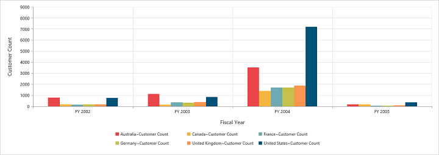

#Dimensions

##Set size in percentage

You can customize the OlapChart dimension by setting the width and height of the widget in percentage.



<ej:OlapChart ID="OlapChart1" runat="server" Url="../wcf/OlapChartService.svc" ClientIDMode="Static">
    //Set size to Chart container
    <Size Width="80%" Height="80%"></Size>
</ej:OlapChart>



##Set size in pixels

You can customize the OlapChart dimension by setting the width and height of the widget in pixels.



<ej:OlapChart ID="OlapChart1" runat="server" Url="../wcf/OlapChartService.svc"  ClientIDMode="Static">
    //Set size to Chart container
    <Size Width="950px" Height="460px"></Size>
 </ej:OlapChart>


 
 

##Responsive

OlapChart widget supports responsive rendering based on the target device (desktop & tablet) resolution. It supports resolution upto 1024x600. You can enable responsiveness in OlapChart by setting `IsResponsive` property to true.



//Enable responsiveness to change the Chart size dynamically.
<ej:OlapChart ID="OlapChart1" runat="server" Url="../wcf/OlapChartService.svc"  ClientIDMode="Static" IsResponsive="true">
    <Size Width="950px" Height="460px"></Size>
 </ej:OlapChart>



_Normal View_

_ResponsiveView_

