#User Interactions

##Tooltip

###Enable Tooltip for Data Points
Tooltip for the data points can be enabled using the **"Visible"** option of the `Tooltip` property under **"commonSeriesOptions"** of the OlapChart.



<ej:OlapChart ID="OlapChart1" runat="server" Url="../wcf/OlapChartService.svc" ClientIDMode="Static">
    //Enabling tooltip of data point
    <CommonSeriesOptions Tooltip-Visible="True" />
    <Size Width="950px" Height="460px"></Size>
</ej:OlapChart>



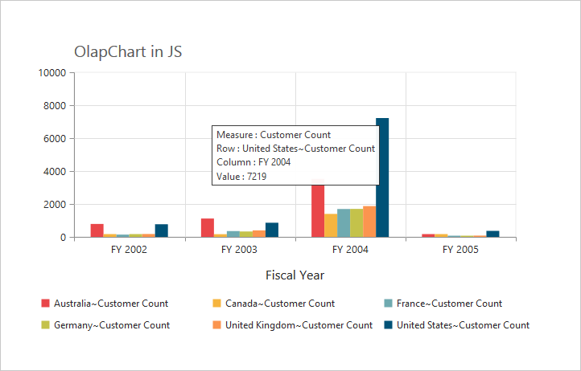 

###Tooltip Template
HTML elements can be displayed inside the tooltip by using the `Template` option. The template option takes the value of the "id" attribute from the HTML element. You can use the **#point.x#** and **#point.y#** as place holders in the HTML element to display the X and Y values of the corresponding data points.



    

        
 

    

    

        

            <label id="ccvalue">&nbsp;#point.y# </label>
            <label id="cc">Customer Count </label>
        

    

<ej:OlapChart ID="OlapChart1" runat="server" Url="../wcf/OlapChartService.svc" ClientIDMode="Static">
    //Enabling tooltip of data point
    <CommonSeriesOptions Tooltip-Visible="True" Tooltip-Template="Tooltip" />
    <Size Width="950px" Height="460px"></Size>
</ej:OlapChart>



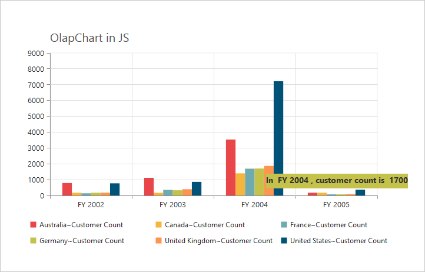 

###Tooltip Customization
By using `Fill` and `Border` properties of tooltip, you can customize its background color, border color and border width.



<ej:OlapChart ID="OlapChart1" runat="server" Url="../wcf/OlapChartService.svc" ClientIDMode="Static">
    //Change tooltip color and border
    <CommonSeriesOptions Tooltip-Visible="True" Tooltip-Fill="#FF9933" Tooltip-Border-Width="1" Tooltip-Border-Color="#993300" />
    <Size Width="950px" Height="460px"></Size>
</ej:OlapChart>

   

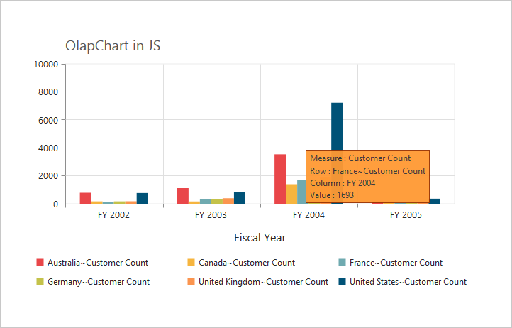 

###Tooltip with Rounded Corners
The tooltip properties, `Rx` and `Ry` are used to customize its corner radius.



<ej:OlapChart ID="OlapChart1" runat="server" Url="../wcf/OlapChartService.svc" ClientIDMode="Static">
    //Customize the corner radius of the tooltip rectangle.
    <CommonSeriesOptions Tooltip-Visible="True" Tooltip-RX="50" Tooltip-RY="50" />
    <Size Width="950px" Height="460px"></Size>
</ej:OlapChart>

 

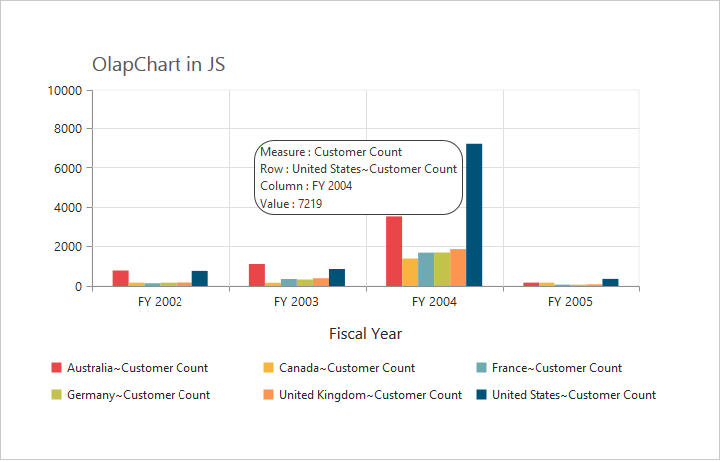 

##Zooming and Panning

###Enable Zooming

There are two ways to zoom the Chart:

* When `Zooming.Enable` option is set to true, you can zoom the Chart by using rubber band selection.
* When `Zooming.EnableMouseWheel` option is set to true, you can zoom the Chart on mouse wheel scrolling.



//Enable zooming in chart
<ej:OlapChart ID="OlapChart1" runat="server" Url="../wcf/OlapChartService.svc" Zooming-Enable="true" ClientIDMode="Static">
<Size Width="950px" Height="460px"></Size>
</ej:OlapChart>

 

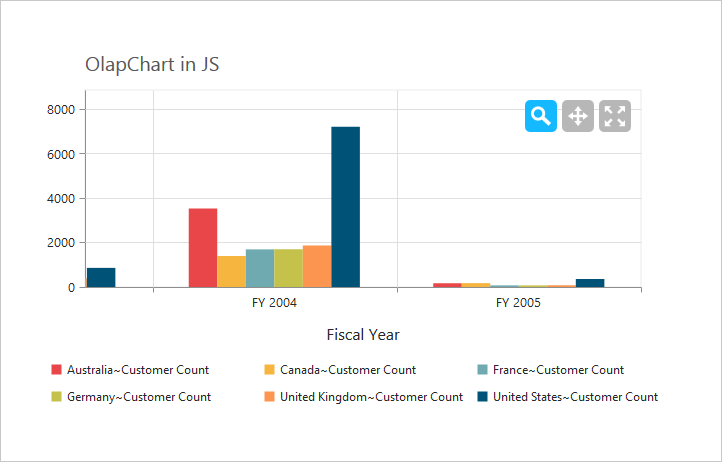 

After zooming the Chart, a zooming toolbar will appear with options to *zoom, pan and reset*. Selecting the **“Pan”** option will allow to view the Chart and selecting the **“Reset”** option will reset the zoomed Chart.

 

###Types of Zooming
You can zoom the particular axis like horizontal axis or vertical axis or both axis using `Type` option in zooming. The default value is “x,y” (indicating both axis).



//Enable horizontal zooming 
<ej:OlapChart ID="OlapChart1" runat="server" Url="../wcf/OlapChartService.svc" Zooming-Enable="true" Zooming-Type="x" ClientIDMode="Static">
<Size Width="950px" Height="460px"></Size>
</ej:OlapChart>



##Marker and Crosshair

###Marker Shape Customization
In OlapChart, you can customize the marker `Shape` with different symbols like rectangle, circle, cross, diamond, pentagon, hexagon, star, ellipse, triangle etc.



<html xmlns="http://www.w3.org/1999/xhtml">
//...

<body>
    <ej:OlapChart ID="OlapChart1" runat="server" Url="../wcf/OlapChartService.svc" ClientIDMode="Static">
        <CommonSeriesOptions Type="Line" />
        <ClientSideEvents Load="loadTheme" SeriesRendering="onSeriesRenders" />
        <Size Width="950px" Height="460px"></Size>
    </ej:OlapChart>
    
</body>

</html>                                           



 

###Enable Crosshair and Crosshair Label
Crosshair helps you to view the value at mouse position or touch contact point. Crosshair can be enabled by using the `Visible` option in `Crosshair` property. Crosshair label can be enabled by using the **“Visible”** option in `CrosshairLabel` property within its corresponding axis.



<ej:OlapChart ID="OlapChart1" runat="server" Url="../wcf/OlapChartService.svc" ClientIDMode="Static">
    //Initializing Crosshair
    <CrossHair Visible="true"></CrossHair>
    //Enable crosshairLabel to X-Axis
    <PrimaryXAxis CrosshairLabel-Visible="true"></PrimaryXAxis>
    //Enable crosshairLabel to Y-Axis
    <PrimaryYAxis CrosshairLabel-Visible="true"></PrimaryYAxis>
    <Size Width="950px" Height="460px"></Size>
</ej:OlapChart>



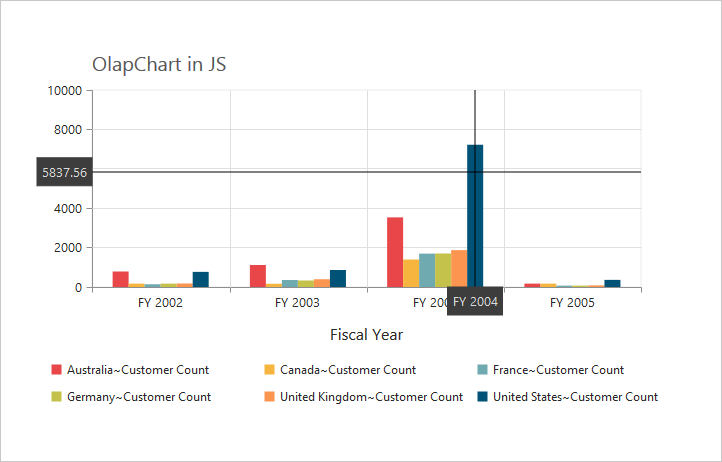 

###Crosshair Line and Label Customization
By using `Line` property of crosshair, you can customize its line color and width. Also by using `Fill` and `Border` properties of crosshair label, you can customize its background color, border color and border width.



<ej:OlapChart ID="OlapChart1" runat="server" Url="../wcf/OlapChartService.svc" ClientIDMode="Static">
    //Customizing the crosshair line
    <CrossHair Visible="true" Line-Width="2" Line-Color="Gray"></CrossHair>
    //Customizing the crosshair label background color and border
    <PrimaryXAxis CrosshairLabel-Visible="true" CrosshairLabel-Fill="Red" CrosshairLabel-Border-Color="Green" CrosshairLabel-Border-Width="2">
    </PrimaryXAxis>
    <PrimaryYAxis CrosshairLabel-Visible="true"></PrimaryYAxis>
    <Size Width="950px" Height="460px"></Size>
</ej:OlapChart>



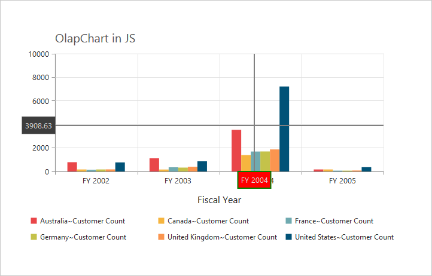 

##Trackball

###Enable trackball
Trackball can be enabled by setting both - 'Visible' option of the crosshair to true and `Type` option of the crosshair to **“Trackball”.** The default value of type is **“Crosshair”.**



<ej:OlapChart ID="OlapChart1" runat="server" Url="../wcf/OlapChartService.svc" ClientIDMode="Static">
    //Change crosshair type to track ball
    <CrossHair Visible="true" Type="TrackBall"></CrossHair>
    <Size Width="950px" Height="460px"></Size>
</ej:OlapChart>



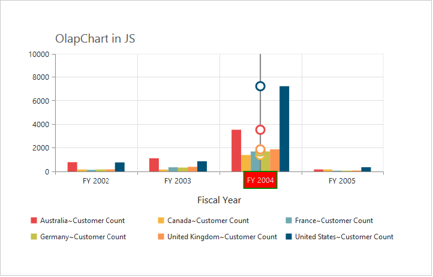 

###Trackball Marker and Line Customization
Shape and size of the trackball marker can be customized using the `Shape` and `Size` options of the crosshair marker. Color and width of the trackball line can be customized using the **“Line”** option in the crosshair.



<ej:OlapChart ID="OlapChart1" runat="server" Url="../wcf/OlapChartService.svc" ClientIDMode="Static">
    //Customize the trackball line color and width, marker shape and visibility
    <CrossHair Visible="true" Line-Width="2" Line-Color="#800000'" Type="TrackBall" Marker-Shape="Pentagon" Marker-Visible="true"></CrossHair>
    <Size Width="950px" Height="460px"></Size>
</ej:OlapChart>

 

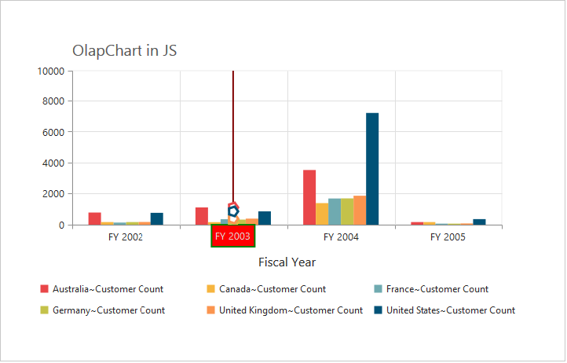 

##Highlight
OlapChart provides highlighting support for the series and data points on mouse hover. To enable highlighting, set the **“enable”** property to true in the `highlightsettings` option of the series.



<html xmlns="http://www.w3.org/1999/xhtml">
//...

<body>
    <ej:OlapChart ID="OlapChart1" runat="server" Url="../wcf/OlapChartService.svc" ClientIDMode="Static">
        <CommonSeriesOptions Type="Column" />
        <ClientSideEvents SeriesRendering="onSeriesRenders" />
        <Size Width="950px" Height="460px"></Size>
    </ej:OlapChart>
    
</body>

</html>                                           

 

###Highlight Mode
You can set three different modes for highlighting data points and series by using the `mode` property of the `highlightsettings`.
 
* series
* points
* cluster



<html xmlns="http://www.w3.org/1999/xhtml">
//...

<body>
    <ej:OlapChart ID="OlapChart1" runat="server" Url="../wcf/OlapChartService.svc" ClientIDMode="Static">
        <CommonSeriesOptions Type="Column" />
        <ClientSideEvents SeriesRendering="onSeriesRenders" />
        <Size Width="950px" Height="460px"></Size>
    </ej:OlapChart>
    
</body>

</html>                                           

 

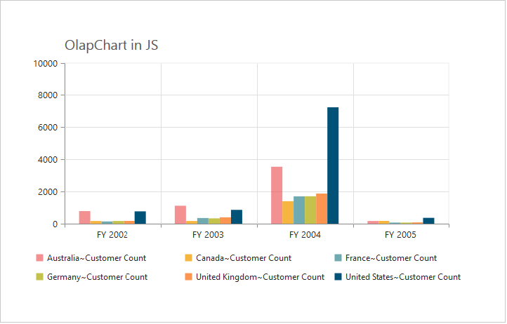 

###Customize the Highlight Styles
To customize the highlighted series, use `border.color`, `border.width` and `opacity`
 options in the `highlightSettings` property.



<html xmlns="http://www.w3.org/1999/xhtml">
//...

<body>
    <ej:OlapChart ID="OlapChart1" runat="server" Url="../wcf/OlapChartService.svc" ClientIDMode="Static">
        <CommonSeriesOptions Type="Column" />
        <ClientSideEvents SeriesRendering="onSeriesRenders" />
        <Size Width="950px" Height="460px"></Size>
    </ej:OlapChart>
    
</body>

</html>                                            

 

 

###Patterns to Highlight
OlapChart provides pattern support for highlighting the data by setting an appropriate value to the `pattern` property of the `highlightSettings`. The different types of highlight patterns are as follows.

* chessboard
* crosshatch
* dots
* packman
* grid
* turquoise
* star
* triangle
* circle
* tile
* horizontalDash
* verticalDash
* rectangle
* box
* verticalStripe
* horizontalStripe
* bubble
* diagonalBackward
* diagonalForward



<html xmlns="http://www.w3.org/1999/xhtml">
//...

<body>
    <ej:OlapChart ID="OlapChart1" runat="server" Url="../wcf/OlapChartService.svc" ClientIDMode="Static">
        <CommonSeriesOptions Type="Column" />
        <ClientSideEvents SeriesRendering="onSeriesRenders" />
        <Size Width="950px" Height="460px"></Size>
    </ej:OlapChart>
    
</body>

</html>                                            

 

 

##Selection
OlapChart provides selection support for the series and data points on mouse click. To enable selection, set the **“enable”** property to true in the `selectionSettings` option of the series.



<html xmlns="http://www.w3.org/1999/xhtml">
//...

<body>
    <ej:OlapChart ID="OlapChart1" runat="server" Url="../wcf/OlapChartService.svc" ClientIDMode="Static">
        <CommonSeriesOptions Type="Column" />
        <ClientSideEvents SeriesRendering="onSeriesRenders" />
        <Size Width="950px" Height="460px"></Size>
    </ej:OlapChart>
    
</body>

</html>                                           



###Selection Mode

You can set three different selection mode for highlighting the data points and series by using the `mode` property of the `selectionSettings`.

* series
* points
* cluster



<html xmlns="http://www.w3.org/1999/xhtml">
//...

<body>
    <ej:OlapChart ID="OlapChart1" runat="server" Url="../wcf/OlapChartService.svc" ClientIDMode="Static">
        <CommonSeriesOptions Type="Column" />
        <ClientSideEvents SeriesRendering="onSeriesRenders" />
        <Size Width="950px" Height="460px"></Size>
    </ej:OlapChart>
    
</body>

</html>                                           



 

###Customize the Selection Styles
To customize the selection styles, use the `border.color`, `border.width` and `opacity` options in the `selectionSettings`.



<html xmlns="http://www.w3.org/1999/xhtml">
//...

<body>
    <ej:OlapChart ID="OlapChart1" runat="server" Url="../wcf/OlapChartService.svc" ClientIDMode="Static">
        <CommonSeriesOptions Type="Column" />
        <ClientSideEvents SeriesRendering="onSeriesRenders" />
        <Size Width="950px" Height="460px"></Size>
    </ej:OlapChart>
    
</body>

</html>                                          



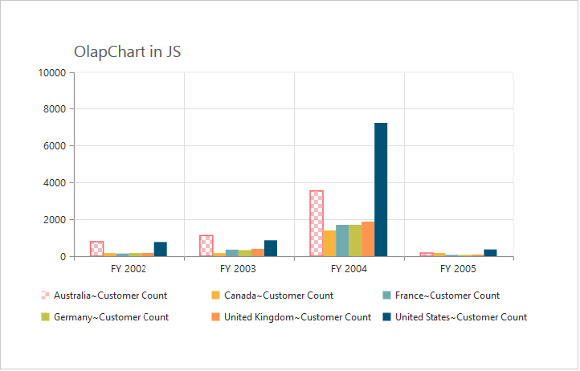 

###Patterns for Selection
OlapChart provides pattern support for the selecting the data by setting an appropriate value to the `pattern` property of the `selectionSettings` option. The different types of selection patterns are as follows.

* chessboard
* crosshatch
* dots
* packman
* grid
* turquoise
* star
* triangle
* circle
* tile
* horizontalDash
* verticalDash
* rectangle
* box
* verticalStripe
* horizontalStripe
* bubble
* diagonalBackward
* diagonalForward



<html xmlns="http://www.w3.org/1999/xhtml">
//...

<body>
    <ej:OlapChart ID="OlapChart1" runat="server" Url="../wcf/OlapChartService.svc" ClientIDMode="Static">
        <CommonSeriesOptions Type="Column" />
        <ClientSideEvents SeriesRendering="onSeriesRenders" />
        <Size Width="950px" Height="460px"></Size>
    </ej:OlapChart>
    
</body>

</html>                                           



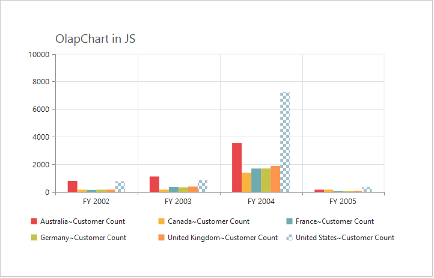 
