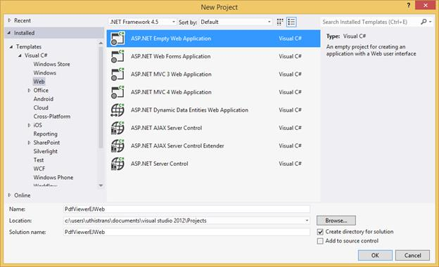
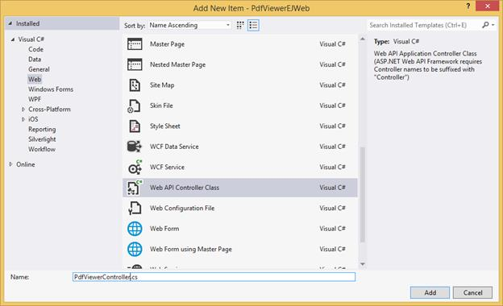

# Getting Started

This section explains briefly about how to include PDF viewer in ASP.NET Web Forms.

##Create your first PDF viewer application in ASP.NET

Create a new project in the visual studio by selecting the ASP.NET Empty Web Application template. The following screenshot displays the Project Creation Wizard in Visual Studio 2012.

###Adding Web Form

Add a new Web Form to the project and name it as **Defaut.aspx**

Add below references to the project and set the Copy Local property to **True**

* Syncfusion.Compression.Base
* Syncfusion.Pdf.Base
* Syncfusion.EJ
* Syncfusion.EJ.PdfViewer
* Sycnfusion.EJ.Web

###i) PDF viewer using remote service

Add below code snippet to Default.aspx. Here, PDF viewer uses the hosted service in the remote machine to display the PDF.



<%@ Page Language="C#" AutoEventWireup="true" CodeBehind="Default.aspx.cs" Inherits="PdfViewerEJWeb.Default" %>
<%@ Register assembly="Syncfusion.EJ.Web" namespace="Syncfusion.JavaScript.Web" tagprefix="ej" %>
<!DOCTYPE html>
<html xmlns="http://www.w3.org/1999/xhtml">
<head runat="server">
    <title>PDF viewer</title>
    <link href="assets/css/web/default-theme/ej.web.all.min.css" rel="stylesheet" />
    
    
    
</head>
<body>
    <form id="form1" runat="server">
    

        <ej:pdfviewer id="PdfViewer1" Height="800"  
            ServiceUrl="http://mvc.syncfusion.com/PDFViewer/pdfviewer.asmx/PostViewerAction"
            PdfService="Remote"
            runat="server">
        </ej:pdfviewer>
    

    </form>
</body>
</html>


N> For adding scripts and styles, please refer **Add Scripts and Styles** section of [ejPdfViewer](http://help.syncfusion.com/js/pdfviewer/getting-started)

###ii) PDF viewer using Web API

Add new folder **webapi** in the solution and create new Web API Controller Class to it. Name it as **PdfViewerController** and click Add.

Replace the below code in the PdfViewerController.cs


using Newtonsoft.Json;
using Syncfusion.EJ.PdfViewer;
using System.Collections.Generic;
using System.IO;
using System.Web;
using System.Web.Http;
namespace PdfViewerEJWeb.WebApi
{
    public class PdfViewerController : ApiController
    {
        PdfViewerHelper helper = new PdfViewerHelper();
        public object PostViewerAction(Dictionary<string, string> jsonResult)
        {
            if (jsonResult.ContainsKey("isInitialLoading"))
                helper.Load(Helper.GetFilePath("HTTP Succinctly.pdf"));
            string output = JsonConvert.SerializeObject(helper.ProcessPdf(jsonResult));
            return output;
        }
    }
    public class Helper
    {
        public static string GetFilePath(string path)
        {
            string _dataPath = GetCommonFolder(new DirectoryInfo(HttpContext.Current.Request.PhysicalApplicationPath));
            _dataPath += @"\" + path;
            return _dataPath;
        }
        static string GetCommonFolder(DirectoryInfo dtInfo)
        {
            var _folderNames = dtInfo.GetDirectories("Data");
            if (_folderNames.Length > 0)
            {
                return _folderNames[0].FullName;
            }
            return dtInfo.Parent != null ? GetCommonFolder(dtInfo.Parent) : string.Empty;
        }
    }
}



N> Please, create a folder named **Data** in the project location and add the PDF document to be viewed in PDF viewer.

###Web API Routing

Right-Click the Project, select Add and select Global.asax file from the listed templates.

You can route the Web API in Application_Start event in the Global.asax file as follows.



using System;
using System.Web.Http;
namespace PdfViewerEJWeb
{
    public class Global : System.Web.HttpApplication
    {
        protected void Application_Start(object sender, EventArgs e)
        {
            System.Web.Http.GlobalConfiguration.Configuration.Routes.MapHttpRoute(
           name: "DefaultApi",
           routeTemplate: "api/{controller}/{action}/{id}",
           defaults: new { id = RouteParameter.Optional });
        }
    }
}



Add below code snippet to Default.aspx. Here, PDF viewer uses the Web API to process the PDF.



<%@ Page Language="C#" AutoEventWireup="true" CodeBehind="Default.aspx.cs" Inherits="PdfViewerEJWeb.Default" %>
<%@ Register assembly="Syncfusion.EJ.Web" namespace="Syncfusion.JavaScript.Web" tagprefix="ej" %>
<!DOCTYPE html>
<html xmlns="http://www.w3.org/1999/xhtml">
<head runat="server">
    <title>PDF viewer</title>
    <link href="assets/css/web/default-theme/ej.web.all.min.css" rel="stylesheet" />
    
    
    
</head>
<body>
    <form id="form1" runat="server">
    

        <ej:pdfviewer id="PdfViewer1" Height="800"  
            ServiceUrl="api/PdfViewer"
            PdfService="Local"
            runat="server">
        </ej:pdfviewer>
    

    </form>
</body>
</html>



N> For adding scripts and styles, please refer **Add Scripts and Styles** section of [ejPdfViewer](http://help.syncfusion.com/js/pdfviewer/getting-started)

###Output

Run the sample and you will see the PDF viewer control as in the below screenshot.

