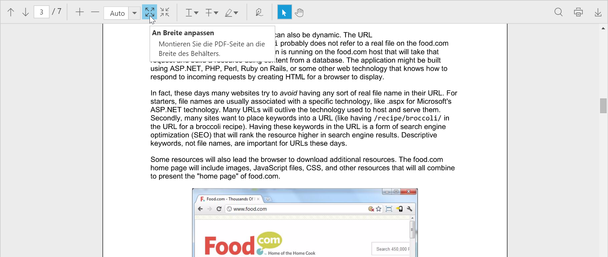

## Localization

We can localize the tooltip of the default toolbar in the PDF viewer control with the collection of localized strings using ej.PdfViewer.Locale for different cultures. By default, ejPdfViewer is localized in “**en-US**” culture.

Following table shows the default tooltip values in ‘en-US’ culture

<table>
<tr>
<td>
{{'**Function**'| markdownify }}
</td>
<td>
{{'**Keywords**'| markdownify }}
</td>
<td>
{{'**Values**'| markdownify }}
</td>
</tr>
<tr>
<td colspan="1" rowspan="2">
first
</td>
<td>
headerText
</td>
<td>
First
</td>
</tr>
<tr>
<td>
contentText
</td>
<td>
Go to the first page of the PDF document.
</td>
</tr>
<tr>
<td colspan="1" rowspan="2">
previous
</td>
<td>
headerText
</td>
<td>
Previous
</td>
</tr>
<tr>
<td>
contentText
</td>
<td>
Go to the previous page of the PDF document.
</td>
</tr>
<tr>
<td colspan="1" rowspan="2">
next
</td>
<td>
headerText
</td>
<td>
Next
</td>
</tr>
<tr>
<td>
contentText
</td>
<td>
Go to the next page of the PDF document.
</td>
</tr>
<tr>
<td colspan="1" rowspan="2">
last
</td>
<td>
headerText
</td>
<td>
Last
</td>
</tr>
<tr>
<td>
contentText
</td>
<td>
Go to the last page of the PDF document.
</td>
</tr>
<tr>
<td colspan="1" rowspan="2">
zoomIn
</td>
<td>
headerText
</td>
<td>
Zoom-In
</td>
</tr>
<tr>
<td>
contentText
</td>
<td>
Zoom in to the PDF document.
</td>
</tr>
<tr>
<td colspan="1" rowspan="2">
zoomOut
</td>
<td>
headerText
</td>
<td>
Zoom-Out
</td>
</tr>
<tr>
<td>
contentText
</td>
<td>
Zoom out of the PDF document.
</td>
</tr>
<tr>
<td colspan="1" rowspan="2">
pageIndex
</td>
<td>
headerText
</td>
<td>
Page Number
</td>
</tr>
<tr>
<td>
contentText
</td>
<td>
Current page number in view.
</td>
</tr>
<tr>
<td colspan="1" rowspan="2">
zoom
</td>
<td>
headerText
</td>
<td>
Zoom
</td>
</tr>
<tr>
<td>
contentText
</td>
<td>
Zoom in or out on the PDF document.
</td>
</tr>
<tr>
<td colspan="1" rowspan="2">
fitToWidth
</td>
<td>
headerText
</td>
<td>
Fit to Width
</td>
</tr>
<tr>
<td>
contentText
</td>
<td>
Fit the PDF page to the width of the container.
</td>
</tr>
<tr>
<td colspan="1" rowspan="2">
fitToPage
</td>
<td>
headerText
</td>
<td>
Fit to Page
</td>
</tr>
<tr>
<td>
contentText
</td>
<td>
Fit the PDF page to the container.
</td>
</tr>
<tr>
<td colspan="1" rowspan="2">
print 
</td>
<td>
headerText
</td>
<td>
Print
</td>
</tr>
<tr>
<td>
contentText
</td>
<td>
Print the PDF document.
</td>
</tr>
<tr>
<td colspan="1" rowspan="2">
download
</td>
<td>
headerText
</td>
<td>
Download
</td>
</tr>
<tr>
<td>
contentText
</td>
<td>
Download the PDF document.
</td>
</tr>
<tr>
<td colspan="1" rowspan="2">
search
</td>
<td>
headerText
</td>
<td>
Search Text
</td>
</tr>
<tr>
<td>
contentText
</td>
<td>
Search Text in the PDF pages.
</td>
</tr>
</table>

The following code snippet illustrates you to change the localization to German culture “**de-DE**”


<!DOCTYPE html>
<html xmlns="http://www.w3.org/1999/xhtml">
//--
<body>
    
                  
        <ej:PdfViewer ID="PdfViewer2" runat="server" ServiceUrl="../api/PdfViewer">
        </ej:PdfViewer>
    
   
    
    
</body>
</html>


The following screenshot shows the PDF viewer with tooltip in German language.

