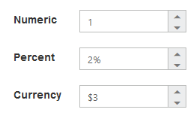

# Appearance and Styling 

## Theme

The PercentageTextbox control’s style and appearance can be controlled based on CSS classes. In order to apply styles to the PercentageTextbox control, refer to two files namely, ej.widgets.core.min.css and ej.theme.min.css. When you refer to the file ej.widgets.all.min.css, then it is not necessary to include the files ej.widgets.core.min.css and ej.theme.min.css in your project, as ej.widgets.all.min.css is the combination of these two. 

By default, there are 13 themes support available for PercentageTextbox control namely,

* default-theme
* bootstrap
* flat-azure-dark
* fat-lime
* flat-lime-dark
* flat-saffron
* flat-saffron-dark
* gradient-azure
* gradient-azure-dark
* gradient-lime
* gradient-lime-dark
* gradient-saffron
* gradient-saffron-dark

## CSS Class

The CSS properties can be customized by using CssClass in the PercentageTextbox. You can customize the PercentageTextbox with various CSS properties to appear like your likable control.

### Configure CSS Class

The following steps explain the implementation of CssClass in PercentageTextbox.

Add the following code example in your ASPX page to render PercentageTextbox control.



<ej:PercentageTextBox ID="percentage" cssClass="customCss" runat="server"> </ej:PercentageTextBox>



Customize the CSS properties in custom CSS class.



.customCss .e-box
    {
        border-color: #9d241b;
    }
    
    .customCss .e-input
    {
        background-color: #f6db8d;
    }
    
    .customCss .e-select
    {
        background-color: #ecf6ac;
        border-color: #3c36e7;
    }



The output for PercentageTextbox after applying CssClass.

## Rounded Corner Support

The PercentageTextbox provides you with rounded corner support, where the appearance differs from normal PercentageTextbox control. The default value for ShowRoundedCorner property is false in Textboxes.

### Configure Rounded Corner Support

Add the following code example in your ASPX page to render PercentageTextbox control with rounded corner



<ej:PercentageTextBox ID="percentage" Value="2" ShowRoundedCorner="true" runat="server"> </ej:PercentageTextBox>



The output for PercentageTextbox when showRoundedCorner is true.

 

## Spin Button Support

The PercentageTextbox provides the option, whether to display the split button in the control or remove it from the control by using ShowSpinButton property. The default value for ShowSpinButton property is true in PercentageTextbox.

### Configure Spin Button

Add the following code example in your ASPX page to render PercentageTextbox control with spin button.



<ej:PercentageTextBox ID="percentage" Value="2" ShowSpinButton="true" runat="server"> </ej:PercentageTextBox>



The output for PercentageTextbox when ShowSpinButton is true.

_PercentageTextbox with ShowSpinButton is true_

_PercentageTextbox with ShowSpinButton is false_

## Water Mark Text Support

The PercentageTextbox provides water mark text support, where you can display the initial value in the control by water mark. The default value for WatermarkText property is empty string (“”) in PercentageTextbox.

### Configure Water Mark Text

Add the following code example in your ASPX page to render PercentageTextbox control with water mark text.



<ej:PercentageTextBox ID="percentage" WaterMarkText="2222" runat="server"> </ej:PercentageTextBox>



The output for PercentageTextbox after applying WatermarkText.

 