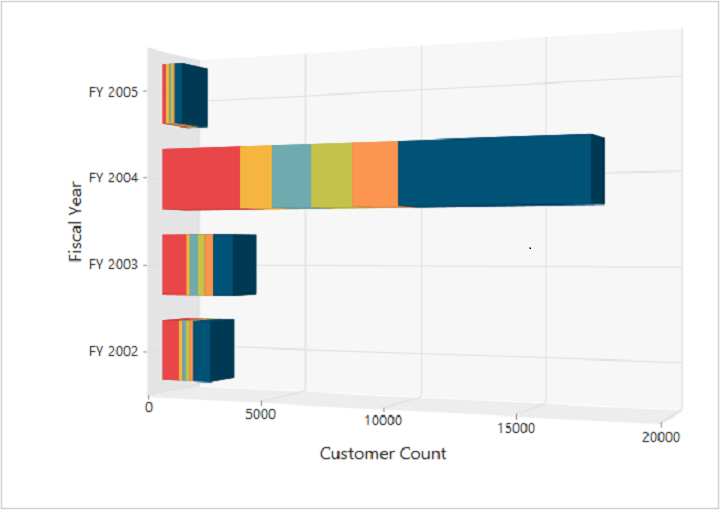
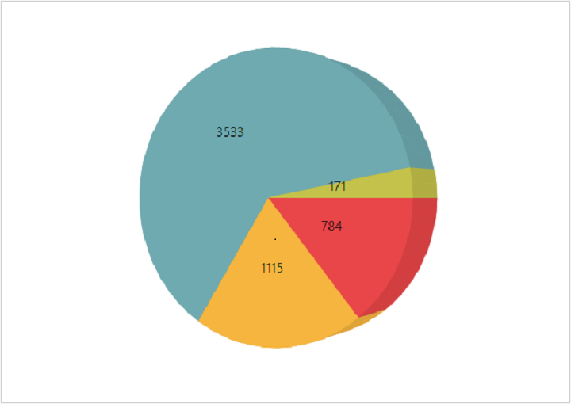

# 3D visualization

The pivot chart control allows you to view the data in a 3D view. Following are the chart types that are supported:

* Bar
* Column
* Stacking bar
* Stacking column 
* Pie

## 3D column chart

The 3D column chart is rendered by specifying the chart type as **“Column”** in the **“CommonSeriesOptions”** enumeration property and setting the `Enable3D` property to **true.**



<ej:PivotChart ID="MyPivotChart1" runat="server" Url="/RelationalChartService.svc" Enable3D="true" Rotation="24" ClientIDMode="Static">
    //Set chart type as Column to series
    <CommonSeriesOptions Type="Column" />
    <Size Width="100%" Height="460px"></Size>
</ej:PivotChart>



## 3D bar chart

The 3D bar chart is rendered by specifying the chart type as **“Bar”** in the **“CommonSeriesOptions”** enumeration property and setting the `Enable3D` property to **true.**



<ej:PivotChart ID="MyPivotChart1" runat="server" Url="/RelationalChartService.svc" Enable3D="true" Rotation="24" ClientIDMode="Static">
    //Set chart type as Bar to series
    <CommonSeriesOptions Type="Bar" />
    <Size Width="100%" Height="460px"></Size>
</ej:PivotChart>



## 3D stacking bar chart

3D stacking bar chart is rendered by specifying the chart type as **“Stacking Bar”** in the **“CommonSeriesOptions”** enumeration property and setting the `Enable3D` property to **true.**



<ej:PivotChart ID="MyPivotChart1" runat="server" Url="/RelationalChartService.svc" Enable3D="true" Rotation="24" ClientIDMode="Static">
    //Set chart type as StackingBar to series
    <CommonSeriesOptions Type="StackingBar" />
    <Size Width="100%" Height="460px"></Size>
</ej:PivotChart>



## 3D stacking column chart

The 3D stacking column chart is rendered by specifying the chart type as **“Stacking Column”** in the **“CommonSeriesOptions”** enumeration property and setting the `Enable3D` property to **true.**



<ej:PivotChart ID="MyPivotChart1" runat="server" Url="/RelationalChartService.svc" Enable3D="true" Rotation="24" ClientIDMode="Static">
    //Set chart type as StackingColumn to series
    <CommonSeriesOptions Type="StackingColumn" />
    <Size Width="100%" Height="460px"></Size>
</ej:PivotChart>



## 3D pie chart

The 3D pie chart is rendered by specifying the chart type as **"Pie"** in the **"CommonSeriesOptions"** enumeration property and setting the `Enable3D` property to **true.**



<ej:PivotChart ID="MyPivotChart1" runat="server" Url="/RelationalChartService.svc" Enable3D="true" Rotation="24" ClientIDMode="Static">
    //Set chart type as pie to series
    <CommonSeriesOptions Type="Pie" />
    <Size Width="100%" Height="460px"></Size>
</ej:PivotChart>

   

## Rotating 3D chart

You can rotate the 3D chart towards left or right by setting an appropriate angle value to the `Rotation` property. The direction of the chart display depends on the positive or negative angle value.



//Rotates the 3D Chart 
<ej:PivotChart ID="MyPivotChart1" runat="server" Url="/RelationalChartService.svc"  Enable3D="true" Rotation="40" ClientIDMode="Static">
    //Set chart type as Column to series
    <CommonSeriesOptions Type="Column" />
    <Size Width="100%" Height="460px"></Size>
 </ej:PivotChart>

 

 
 