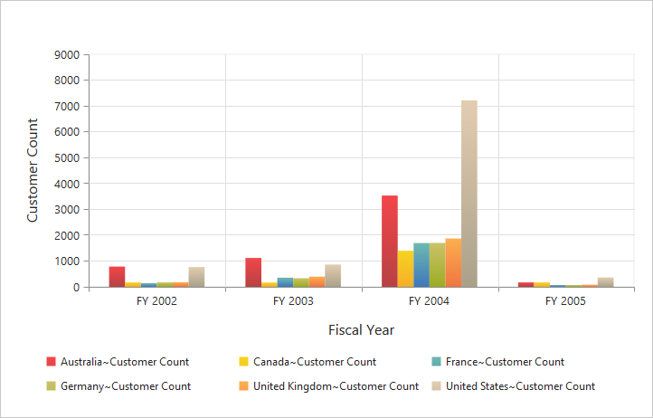

#Appearance

##Built-in Themes

Following are the built-in themes available in the PivotChart.

* flatlight
* gradientlight
* gradientdark
* azure
* azuredark
* lime
* limedark
* saffron
* saffrondark
* gradientlight
* gradientdark
* highcontrast01
* highcontrast02
* material
* office365
* bootstrap

By using the `Theme` property, you can set the desired theme in PivotChart. By default, **"Flat Light"** theme is applied to PivotChart.



//Using gradient theme
<ej:PivotChart ID="MyPivotChart1" runat="server" Url="/RelationalChartService.svc"  Theme="GradientLight" ClientIDMode="Static">
  <Size Width="950px" Height="460px"></Size>
</ej:PivotChart>



##PivotChart - Area Customization

###Border Customization
To customize the PivotChart border, use `Border` property in PivotChart.



//Customize the chart border and opacity
<ej:PivotChart ID="MyPivotChart1" runat="server" Url="/RelationalChartService.svc"  Border-Width="2" Border-Color="#FF0000" ClientIDMode="Static">
<Size Width="950px" Height="460px"></Size>
</ej:PivotChart>



###Background Customization
The PivotChart control background can be customized by using the `Background` property in the Chart area.



<ej:PivotChart ID="MyPivotChart1" runat="server" Url="/RelationalChartService.svc" ClientIDMode="Static">
    //Setting background for Chart area
    <ChartArea Background="skyblue"></ChartArea>
    <Size Width="950px" Height="460px"></Size>
</ej:PivotChart>



###Grid Bands Customization
By using the `AlternateGridBand` property of the axis, you can provide different color for grid rows and columns formed by the grid lines in the Chart area. The properties `Odd` and `Even` are used to customize the grid bands at odd and even positions respectively.



<ej:PivotChart ID="MyPivotChart1" runat="server" Url="/RelationalChartService.svc" ClientIDMode="Static">
    //Customizing horizontal grid bands at even position
    <primaryYaxis>
        <AlternateGridBand Even-Fill="#A7A9AB" Even-Opacity="0.1" />
    </primaryYaxis>
    <Size Width="950px" Height="460px"></Size>
</ej:PivotChart>



###Animation
You can enable animation by using the `EnableAnimation` property under `CommonSeriesOptions` of the PivotChart control. This animates the Chart series on two occasions - when the Chart is loaded for the first time and when you change the series type by using the `Type` property.



<ej:PivotChart ID="MyPivotChart1" runat="server" Url="/RelationalChartService.svc" ClientIDMode="Static">
    //Enabling animation in series
    <CommonSeriesOptions EnableAnimation="True" />
    <Size Width="950px" Height="460px"></Size>
</ej:PivotChart>

   
