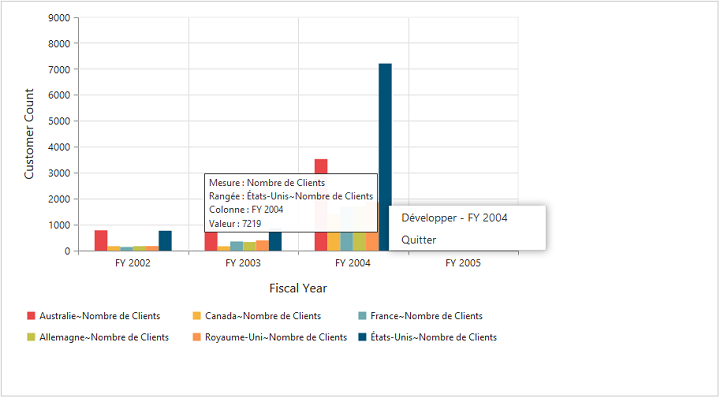

# Localization

## Localization in pivot chart

You can localize the pivot chart controls text with a collection of localized strings by using the **"ej.PivotChart.Locale"** for different cultures. By default, the pivot chart control is localized in **“en-US”.**

Following code example illustrates how to localize the pivot chart based on **“French”** culture:



<html>
//...

<body>
    <ej:PivotChart ID="MyPivotChart1" runat="server" Url="/RelationalChartService.svc" Locale="fr-FR" ClientIDMode="Static">
    <Size Width="950px" Height="460px"></Size>
    </ej:PivotChart>
    
</body>

</html>



Following table localizes the in-built keywords to **“French”** culture for the pivot chart:

<table>
<tr>
<th>
KEYWORDS</th><th>
VALUES</th></tr>
<tr>
<td>
Measure</td><td>
“Mesure”</td></tr>
<tr>
<td>
Row</td><td>
"Rangée "</td></tr>
<tr>
<td>
Column</td><td>
"Colonne”</td></tr>
<tr>
<td>
Value</td><td>
" Valeur "</td></tr>
<tr>
<td>
Expand</td><td>
" Développer "</td></tr>
<tr>
<td>
Collapse</td><td>
" Effondrement "</td></tr>
<tr>
<td>
Exit</td><td>
“Quitter "</td></tr>
</table>

## Localization and globalization of cube info (client mode)

The content displayed within the pivot chart control is obtained from the OLAP cube.

* To get localized data from OLAP cube, set the **"Locale Identifier"** in the connection string to a specific culture of the **"Data"** property present in the **"DataSource"**.
* To bind the globalized content in the pivot chart control, set the **"Locale"** property to a specific culture and refer to the specific culture file in the sample.

N> Culture files are present under **"[installed drive]:\Users\ [user name]\AppData\Local\Syncfusion\EssentialStudio\X.X.X.X\Web\Samples\Web\Scripts\cultures".**



//1036 refers to “fr-FR” culture.
    <ej:PivotChart ID="MyPivotChart1" runat="server" IsResponsive="true" Locale="fr-FR" ClientIDMode="Static">
            <DataSource Catalog="Adventure Works DW 2008 SE" Cube="Adventure Works" Data="http://bi.syncfusion.com/olap/msmdpump.dll;Locale Identifier=1036;">
                .....
            </DataSource
            ....
    </ej:PivotChart>



## Localization and globalization of cube info (server mode)

The content displayed within the pivot chart control is obtained from the OLAP cube.

* To get the localized string based on different cultures, set the **"Locale Identifier"** in the connection string to a specific culture of the OLAP cube.
* To bind the globalized content in pivot grid control, set the **"Culture"** and **"OverrideDefaultFormatStrings"** properties in the OlapDataManager class to a specific culture.

 

<%--1036 refers to “fr-FR” culture.--%>
string connectionString = "Data Source=localhost; Initial Catalog=Adventure Works DW; Locale Identifier=1036;";
DataManager = new OlapDataManager(connectionString);
DataManager.Culture = new System.Globalization.CultureInfo(1036);
DataManager.OverrideDefaultFormatStrings = true;



