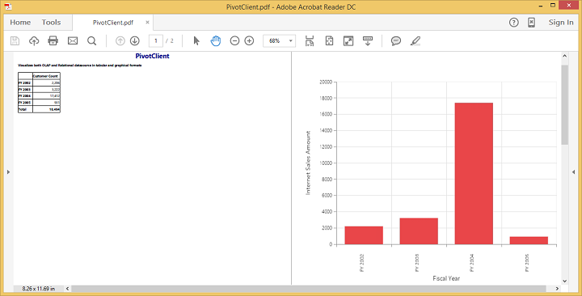

# Exporting

PivotChart and PivotGrid in the PivotClient widget can be exported to Excel, Word and PDF documents by clicking the respective toolbar icons.

 

Exporting feature provides an option that allows you to export either PivotChart or PivotGrid or both with the use of the property `ClientExportMode`.  The following code example illustrates the same. 

The property `ClientExportMode` takes any one of the following value:

* **ChartAndGrid** – Exports both PivotChart and PivotGrid controls. This is the default mode.
* **ChartOnly** – Exports PivotChart control alone.
* **GridOnly** – Exports PivotGrid control alone.

## JSON Export
    
I>By default, exporting is done with the use of JSON Records maintained in client-side for both client and server modes.

In order to make use of exporting with client side JSON data. The control can be exported by invoking “beforeExport” event, with an appropriate export option as parameter.

 
    
    <ej:PivotClient ID="PivotClient1" Url="/OlapClient" runat="server" ClientExportMode="ChartAndGrid">
    <ClientSideEvents BeforeExport="export"/>
    </ej:PivotClient>

    
    
 
    
  When PivotClient is rendered in Client Mode, a server side event method needs to be added in code behind file of the application
    
  
    
    protected void PivotClient1_ServerExporting(object sender, Syncfusion.JavaScript.Web.PivotClientEventArgs e)
    {
        PivotClientExport olapClient = new PivotClientExport();
        dynamic args = e.Arguments;
        olapClient.ExportPivotClient(string.Empty, args["args"].ToString(), HttpContext.Current.Response);
    }
    
  
    
### Customize the export document name

The document name could be customized. Following code sample illustrates the same.



    <ej:PivotClient ID="PivotClient1" Url="/OlapService" runat="server" ClientExportMode="ChartAndGrid">
    <ClientSideEvents BeforeExport="export"/>
    </ej:PivotClient>
        
        function Export(args) {
            args.url = "http://js.syncfusion.com/demos/ejservices/api/JSPivotClientExport/ExportPivotClient";
            args.fileName="File name is customized here";
        }
        


## PivotEngine Export

I> This feature is applicable only at server mode operation.
 
In order to perform exporting with the use of PivotEngine available in server-side, the 'exportMode' property obtained in the “BeforeExport” event is set to "ej.PivotClient.ExportMode.PivotEngine" as shown below.



    <ej:PivotClient ID="PivotClient1" Url="/OlapService" runat="server" ClientExportMode="ChartAndGrid">
    <ClientSideEvents BeforeExport="export"/>
    </ej:PivotClient>

    
    


For WebAPI controller, the below method needs to be added to perform exporting.



        [System.Web.Http.ActionName("Export")]
        [System.Web.Http.HttpPost]
        public void Export()
        {
            string args = HttpContext.Current.Request.Form.GetValues(0)[0];
            OlapDataManager DataManager = new OlapDataManager(connectionString);
            string fileName = "Sample";
            olapClientHelper.ExportPivotClient(DataManager, args, fileName, System.Web.HttpContext.Current.Response);
        }
    


For WCF service, the below service method needs to be added to perform exporting.



       public void Export(Stream stream)
        {
            System.IO.StreamReader sReader = new System.IO.StreamReader(stream);
            string args = System.Web.HttpContext.Current.Server.UrlDecode(sReader.ReadToEnd()).Remove(0, 5);
            OlapDataManager DataManager = new OlapDataManager(connectionString);
            string fileName = "Sample";
            olapClientHelper.ExportPivotClient(DataManager, args, fileName, System.Web.HttpContext.Current.Response);
        }
    


### Customize the export document name

The document name could be customized inside the method in WebAPI Controller. Following code sample illustrates the same.



        [System.Web.Http.ActionName("Export")]
        [System.Web.Http.HttpPost]
        public void Export()
        {
            string args = HttpContext.Current.Request.Form.GetValues(0)[0];
            OlapDataManager DataManager = new OlapDataManager(connectionString);
            string fileName = " File name is customized here ";
            olapClientHelper.ExportPivotClient(DataManager, args, fileName, System.Web.HttpContext.Current.Response);
        }



For customizing name in WCF Service, below code snippet is used.



    public void Export(Stream stream)
    {
         System.IO.StreamReader sReader = new System.IO.StreamReader(stream);
         string args = System.Web.HttpContext.Current.Server.UrlDecode(sReader.ReadToEnd()).Remove(0, 5);
         OlapDataManager DataManager = new OlapDataManager(connectionString);
         string fileName = " File name is customized here ";
         olapClientHelper.ExportPivotClient(DataManager, args, fileName, System.Web.HttpContext.Current.Response);
    }



## Exporting Customization

You can add title and description to the exporting document by using title and description property obtained in the "beforeExport" event.



    <ej:PivotClient ID="PivotClient1" runat="server" OnServerExporting="PivotClient1_ServerExporting" ClientExportMode="ChartAndGrid">
    <ClientSideEvents BeforeExport="Exporting"/>
    </ej:PivotClient>

    
    


You can also edit the exporting document with the use of a server side event for required exporting option.



//...
using Syncfusion.EJ.Export;
using Syncfusion.Compression.Base;
using Syncfusion.XlsIO;
using Syncfusion.DocIO.Base;
using Syncfusion.Pdf.Base;

//Following server side event method needs to be added in code behind file of the application for JSON Export

protected void PivotClient1_ServerExporting(object sender, Syncfusion.JavaScript.Web.PivotClientEventArgs e)
{
    PivotClientExport pivotClient = new PivotClientExport();
    dynamic args = e.Arguments;
    pivotClient.ExcelExport += pivotClient_ExcelExport;
    pivotClient.WordExport += pivotClient_WordExport;
    pivotClient.AddPDFHeaderFooter += pivotClient_AddPDFHeaderFooter;
    pivotClient.PDFExport += pivotClient_PDFExport;
    pivotClient.ExportPivotClient(string.Empty, args["args"].ToString(), HttpContext.Current.Response);
}

void pivotClient_PDFExport(object sender, Syncfusion.Pdf.PdfDocument pdfDoc)
{
    //You can customize exporting document here.
}

void pivotClient_AddPDFHeaderFooter(object sender, Syncfusion.Pdf.PdfDocument pdfDoc)
{
    //You can add header/footer information to the pdf document.
}

void pivotClient_WordExport(object sender, Syncfusion.DocIO.DLS.WordDocument document)
{
    //You can customize exporting document here.
}

void pivotClient_ExcelExport(object sender, Syncfusion.XlsIO.IWorkbook workBook)
{
    //You can customize exporting document here.
}

//Following service method needs to be added in WCF/WebAPI controller for PivotEngine Export

[System.Web.Http.ActionName("ExportOlapClient")]
[System.Web.Http.HttpPost]
public void ExportOlapClient()
{
    string args = HttpContext.Current.Request.Form.GetValues(0)[0];
    OlapDataManager DataManager = new OlapDataManager(connectionString);
    olapClientHelper.ExcelExport += olapClientHelper_ExcelExport;
    olapClientHelper.WordExport += olapClientHelper_WordExport;
    olapClientHelper.AddPDFHeaderFooter += olapClientHelper_AddPDFHeaderFooter;
    olapClientHelper.PDFExport += olapClientHelper_PDFExport;
    string fileName = "Sample";
    olapClientHelper.ExportPivotClient(DataManager, args, fileName, System.Web.HttpContext.Current.Response);
}

void olapClientHelper_PDFExport(object sender, Syncfusion.Pdf.PdfDocument pdfDoc)
{
    //You can customize exporting document here.
}

void olapClientHelper_AddPDFHeaderFooter(object sender, Syncfusion.Pdf.PdfDocument pdfDoc)
{
    //You can add header/footer information to the pdf document.
}

void olapClientHelper_WordExport(object sender, Syncfusion.DocIO.DLS.WordDocument document)
{
    //You can customize exporting document here.
}

void olapClientHelper_ExcelExport(object sender, Syncfusion.XlsIO.IWorkbook workBook)
{
    //You can customize exporting document here.
}



The below screenshot shows the PivotGrid and PivotChart controls exported to Excel document.

 

The below screenshot shows the PivotGrid and PivotChart controls exported to Word document.

 

The below screenshot shows the PivotGrid and PivotChart controls exported to PDF document.

 