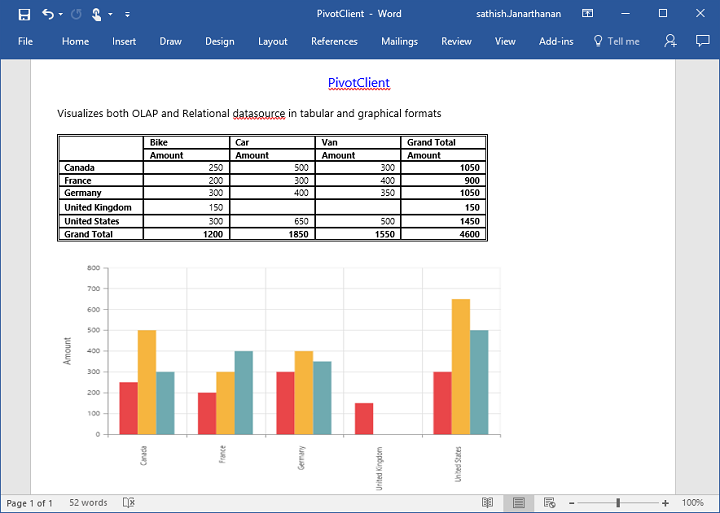
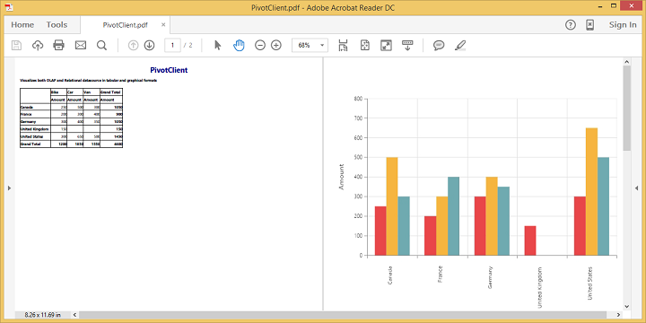

# Exporting

Chart and Grid in the PivotClient widget can be exported to Excel, Word and PDF documents by clicking the respective toolbar icons.

 

Exporting feature provides an option that allows you to export either PivotChart or PivotGrid or both with the use of the property `ClientExportMode`.  The following code example illustrates the same. 

The property `ClientExportMode` takes any one of the following value:

* **ChartAndGrid** – Exports both PivotChart and PivotGrid controls. This is the default mode.
* **ChartOnly** – Exports PivotChart control alone.
* **GridOnly** – Exports PivotGrid control alone.

## JSON Export
    
I>By default JSON Export mode will be applied for server and client mode.

In order to make use of exporting with client side JSON data. The control can be exported by invoking “beforeExport” event, with an appropriate export option as parameter.

 
    
    <ej:PivotClient ID="PivotClient1" runat="server" ClientExportMode="ChartAndGrid">
        <DataSource>
            <Rows>
                <ej:Field FieldName="Country" FieldCaption="Country"></ej:Field>
            </Rows>
            <Columns>
                <ej:Field FieldName="Product" FieldCaption="Product"></ej:Field>
            </Columns>
            <Values>
                <ej:Field FieldName="Amount" FieldCaption="Amount" Format="currency"></ej:Field>
            </Values>
        </DataSource>
     <ClientSideEvents Load="onLoad"/>
    </ej:PivotClient>

    
    
 
    
  When PivotClient is exported in JSON Export Mode, a server side event method needs to be added in code behind file of the application
    
  
    
    protected void PivotClient1_ServerExporting(object sender, Syncfusion.JavaScript.Web.PivotClientEventArgs e)
    {
        PivotClientExport PivotClient = new PivotClientExport();
        dynamic args = e.Arguments;
        PivotClient.ExportPivotClient(string.Empty, args["args"].ToString(), HttpContext.Current.Response);
    }
    
  

### Customize the export document name

The document name could be customized. Following code sample illustrates the same.

 
    
    <ej:PivotClient ID="PivotClient1" runat="server" ClientExportMode="ChartAndGrid">
        <DataSource>
            <Rows>
                <ej:Field FieldName="Country" FieldCaption="Country"></ej:Field>
            </Rows>
            <Columns>
                <ej:Field FieldName="Product" FieldCaption="Product"></ej:Field>
            </Columns>
            <Values>
                <ej:Field FieldName="Amount" FieldCaption="Amount" Format="currency"></ej:Field>
            </Values>
        </DataSource>
     <ClientSideEvents Load="onLoad"/>
    </ej:PivotClient>

    
    
 
    
## PivotEngine Export

I> This feature is applicable only at server mode operation.
 
In order to perform exporting with the use of PivotEngine available in server-side, the 'url' property obtained in the “beforeExport” event is set to empty as shown below.



    <ej:PivotClient ID="PivotClient1" Url="/RelationalClient" runat="server" ClientExportMode="ChartAndGrid">
        <ClientSideEvents Load="onLoad"/>
    </ej:PivotClient>

    
    


For WebAPI controller, the below method needs to be added to perform exporting with PivotEngine.



        [System.Web.Http.ActionName("Export")]
        [System.Web.Http.HttpPost]
        public void Export()
        {
            string args = HttpContext.Current.Request.Form.GetValues(0)[0];
            Dictionary<string, string> gridParams = serializer.Deserialize<Dictionary<string, string>>(args);
            pivotClient.PopulateData(gridParams["currentReport"]);
            string fileName = "Sample";
            pivotClient.ExportPivotClient(ProductSales.GetSalesData(), args, fileName, System.Web.HttpContext.Current.Response);
        }
    


For WCF service, the below service method needs to be added to perform exporting with PivotEngine.



        public void Export(System.IO.Stream stream)
        {
            System.IO.StreamReader sReader = new System.IO.StreamReader(stream);
            string args = System.Web.HttpContext.Current.Server.UrlDecode(sReader.ReadToEnd()).Remove(0, 5);
            Dictionary<string, string> gridParams = serializer.Deserialize<Dictionary<string, string>>(args);
            pivotClient.PopulateData(gridParams["currentReport"]);
            string fileName = "Sample";
            pivotClient.ExportPivotClient(ProductSales.GetSalesData(), args, fileName, System.Web.HttpContext.Current.Response);
        }
    


The below screenshot shows the PivotGrid and PivotChart controls exported to Excel document.

 

The below screenshot shows the PivotGrid and PivotChart controls exported to Word document.

 

The below screenshot shows the PivotGrid and PivotChart controls exported to PDF document.

 

### Customize the export document name

The document name could be customized inside the method in WebAPI Controller. Following code sample illustrates the same.



        [System.Web.Http.ActionName("Export")]
        [System.Web.Http.HttpPost]
        public void Export()
        {
            string args = HttpContext.Current.Request.Form.GetValues(0)[0];
            Dictionary<string, string> gridParams = serializer.Deserialize<Dictionary<string, string>>(args);
            pivotClient.PopulateData(gridParams["currentReport"]);
            string fileName = " File name is customized here ";
            pivotClient.ExportPivotClient(ProductSales.GetSalesData(), args, fileName, System.Web.HttpContext.Current.Response);
        }



For customizing name in WCF Service, below code snippet is used.



        public void Export(System.IO.Stream stream)
        {
            System.IO.StreamReader sReader = new System.IO.StreamReader(stream);
            string args = System.Web.HttpContext.Current.Server.UrlDecode(sReader.ReadToEnd()).Remove(0, 5);
            Dictionary<string, string> gridParams = serializer.Deserialize<Dictionary<string, string>>(args);
            pivotClient.PopulateData(gridParams["currentReport"]);
            string fileName = " File name is customized here ";
            pivotClient.ExportPivotClient(ProductSales.GetSalesData(), args, fileName, System.Web.HttpContext.Current.Response);
        }


