# Getting Started

This section explains briefly about how to create a PivotGrid in your application with ASP.NET.

## Create your first PivotGrid in ASP.NET

### Control Structure

The following screenshot displays the PivotGrid Control.

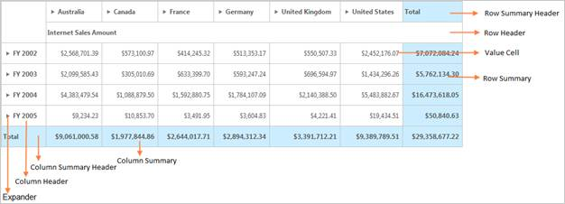

### Create an application

This section encompasses on how to configure the PivotGrid component in an application.

You can also pass the required data to PivotGrid and customize it according to your requirements.

In this example you can see how PivotGrid component tabulates the Internet Sales Amount over a period of fiscal years across different Customer Geographic locations. 

 

Open Visual Studio and create a new project by clicking New Project. You can select the Web category. Select the ASP.NET Empty Web Application template and then click OK.  

The following screenshot displays project creation wizard.

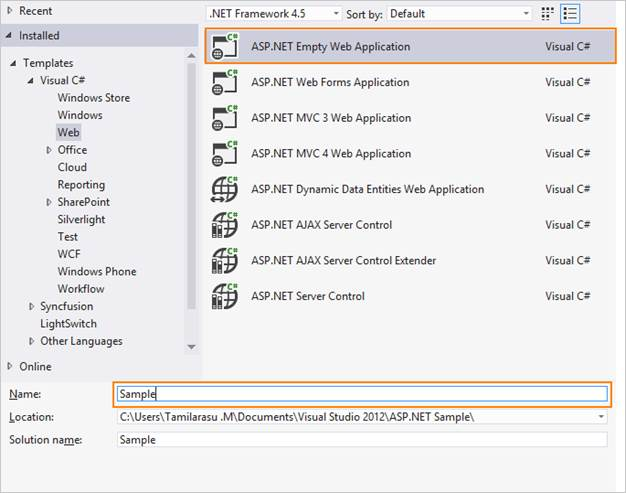

### Add Control in Application

1. Right click the project and select Add > New Folder.  Name the folder as olapgrid.

   

2. Now right-click on the pivotgrid folder that is newly created and select Add > New Item.

   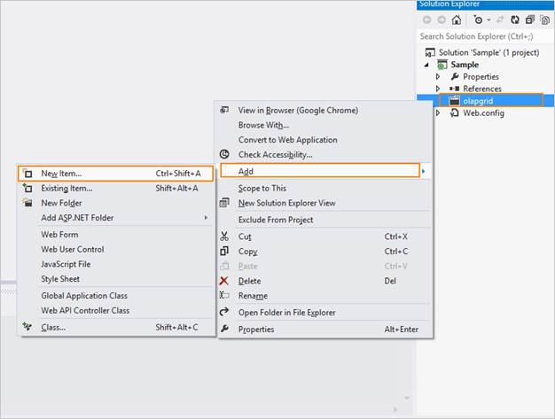 

3. Select Web Form and name it as Default.aspx.

   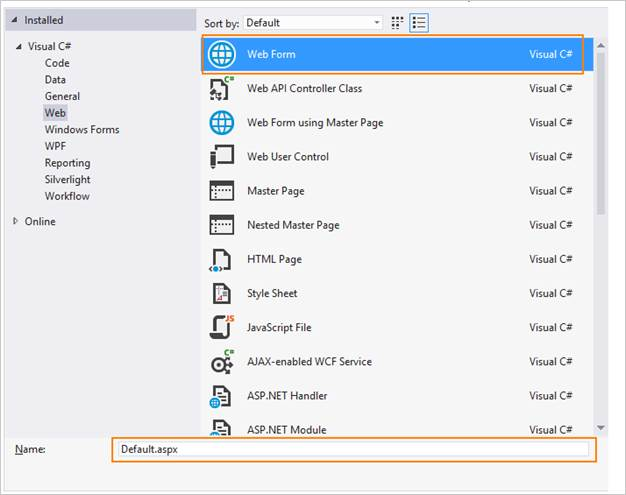 

4. Drag the PivotGrid control from the Syncfusion BI Web Toolbox into the Design page.

   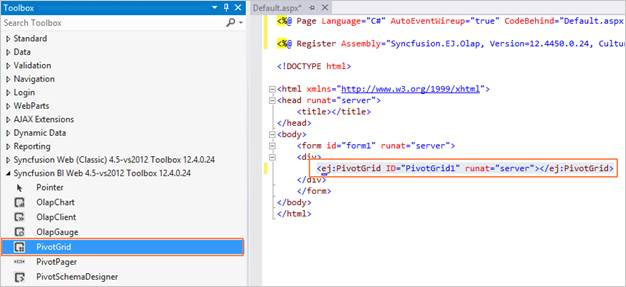 

   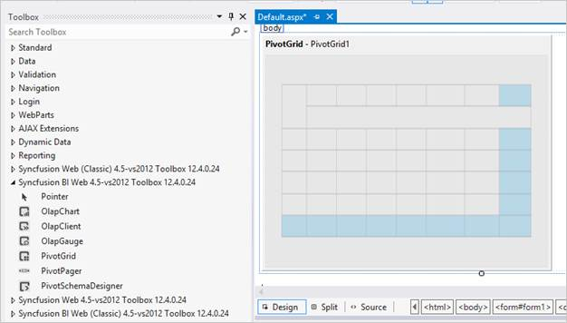 

5. Enter the service URL value after dragging and dropping the control.

   > Note: Instructions to create a service is explained briefly in the upcoming sections.

    

6. Initialize the control using below code snippet.

   > Note: URL value needs to be defined in order to fetch the data from the service. Default properties values need to be initialized as follows to render the control appropriately.

  

<body>

    <form id="form1" runat="server">

    
   

      <ej:PivotGrid ID="PivotGrid1" Url="../wcf/PivotGridService.svc" runat="server">

	  </ej:PivotGrid>

    

    </form>

</body>



### Add References, Scripts, Styles 

### Add References

1. In the Solution Explorer, right-click the References folder and then click Add Reference.

    

   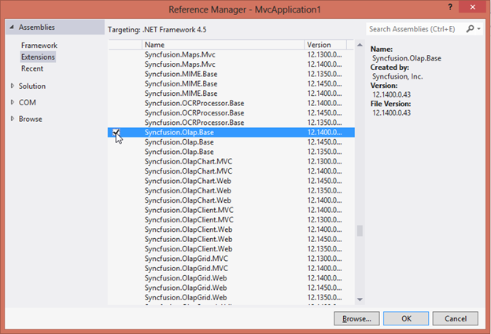 

2. Select the following assemblies: 
   
   1. Microsoft.AnalysisServices.AdomdClient.dll,
   2. Syncfusion.Core.dll,
   3. Syncfusion.Compression.Base.dll,
   4. Syncfusion.Linq.Base.dll,
   5. Syncfusion.EJ.dll,
   6. Syncfusion.EJ.Olap.dll,
   7. Syncfusion.PivotAnalysis.Base.dll,
   8. Syncfusion.Olap.Base.dll,
   9. Syncfusion.XlsIO.Base.dll.

3. Click OK.

### Add Scripts and Styles

1. Add the script files and CSS files in the <head> tag of the Default.aspx page. 

   > Note:
   >
   > 1. Use the following code example while adding scripts and styles             
   > 2. Same files can also be acquired from the following location
   > C:\Users\<UserName>\AppData\Local\Syncfusion\EssentialStudio\<Version>\JavaScript\assets\



<head>

<link href="http://cdn.syncfusion.com/13.1.0.21/js/web/flat-azure/ej.web.all.min.css" rel="stylesheet" />

</head>



### Add WCF service for PivotGrid

### Create WCF Services

1. Right-click the project and select Add > New Folder. Name the folder as wcf.

   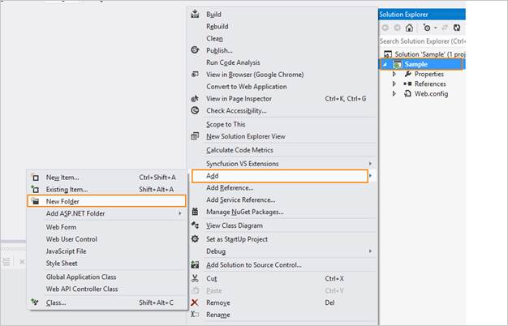 

2. Now right-click the wcf folder created and select Add > New Item.

   

3. In the Add New Item window, select WCF Service and name it as PivotGridService.svc. 

4. Click Add.

   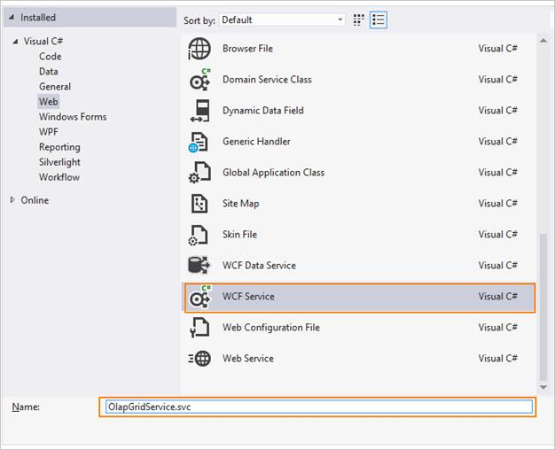 

### Add service methods inside Interface

Add the following code example inside the IPivotGridService interface available in an IPivotGridService.cs file.



[ServiceContract(SessionMode = SessionMode.Allowed)]

public interface IPivotGridService
    {
        Dictionary<string, object> InitializeGrid(string action, string gridLayout, bool enablePivotFieldList, object customObject);

        Dictionary<string, object> DrillGrid(string action, string cellPosition, string currentReport, string headerInfo, string gridLayout, object customObject);

        Dictionary<string, object> Paging(string action, string pagingInfo, string currentReport, string gridLayout, object customObject);

        Dictionary<string, object> NodeDropped(string action, string dropType, string nodeInfo, string filterParams, string currentReport);

        Dictionary<string, object> RemoveButton(string action, string headerInfo, string currentReport);

        Dictionary<string, object> FetchMembers(string action, string headerTag, string currentReport);

        Dictionary<string, object> Filtering(string action, string filterParams, string currentReport);

        Dictionary<string, object> MemberExpanded(string action, bool checkedStatus, string parentNode, string tag, string cubeName, string currentReport);

    }
	


### Add Namespaces

Add the following necessary namespaces required to implement the service methods.



using System;

using System.Collections.Generic;

using System.Linq;

using System.Runtime.Serialization;

using System.ServiceModel;

using System.Text;

using System.ServiceModel.Activation;

using System.Web.Script.Serialization;

using Syncfusion.Olap.Manager;

using Syncfusion.Olap.Reports;

using Syncfusion.JavaScript;

using OLAPUTILS = Syncfusion.JavaScript.Olap;



### Create Class in Service file

You can create the PivotGridService class to implement the service methods. You can inherit the class from the IPivotGridService interface that is created automatically while adding any new service.



namespace Sample

{
    [AspNetCompatibilityRequirements(RequirementsMode = AspNetCompatibilityRequirementsMode.Allowed)]

    public class PivotGridService : IPivotGridService

    {        

    }

}



### Implement Service Methods

You can add the following methods to the service that are invoked for any server-side operations to be performed in PivotGrid.

1. Initialize the PivotGrid helper class. 

   ~~~ cs

		PivotGrid htmlHelper = new PivotGrid();        

        static string connectionString = "Data Source=http://bi.syncfusion.com/olap/msmdpump.dll; Initial Catalog=Adventure Works DW 2008 SE;";   

        JavaScriptSerializer serializer = new JavaScriptSerializer();

   ~~~
   {:.prettyprint }

2. Add the following relevant service methods.

   ~~~ cs

		//This method provides the required information from the server side when initializing the PivotGrid. 

        public Dictionary<string, object> InitializeGrid(string action, string gridLayout, bool enablePivotFieldList, object customObject)

        {

            OlapDataManager DataManager = null;

            dynamic customData = serializer.Deserialize<dynamic>(customObject.ToString());

                DataManager = new OlapDataManager(connectionString);

            DataManager.SetCurrentReport(CreateOlapReport());

            return htmlHelper.GetJsonData(action, DataManager, gridLayout, enablePivotFieldList);

        }

		//This method provides the required information from the server side when drill up/down operation is performed in PivotGrid.

        public Dictionary<string, object> DrillGrid(string action, string cellPosition, string currentReport, string headerInfo, string layout, object customObject)

        {

            dynamic customData = serializer.Deserialize<dynamic>(customObject.ToString());

            OlapDataManager DataManager = new OlapDataManager(connectionString);

            DataManager = new OlapDataManager(connectionString);

            DataManager.SetCurrentReport(OLAPUTILS.Utils.DeserializeOlapReport(currentReport));

            return htmlHelper.GetJsonData(action, connectionString, DataManager, cellPosition, headerInfo, layout);

        }

		//This method provides the required information from the server side when tree node is dropped in PivotTable Field List.

        public Dictionary<string, object> NodeDropped(string action, string dropType, string nodeInfo, string filterParams, string currentReport)

        {

            OlapDataManager DataManager = new OlapDataManager(connectionString);

            DataManager.SetCurrentReport(OLAPUTILS.Utils.DeserializeOlapReport(currentReport));

            return htmlHelper.GetJsonData(action, DataManager, dropType, nodeInfo, filterParams, true);

        }

		//This method provides the required information from the server side when filtering values in PivotTable Field List.

        public Dictionary<string, object> Filtering(string action, string filterParams, string currentReport)

        {

            OlapDataManager DataManager = new OlapDataManager(connectionString);

            DataManager.SetCurrentReport(OLAPUTILS.Utils.DeserializeOlapReport(currentReport));

            return htmlHelper.GetJsonData(action, DataManager, null, filterParams);

        }

		//This method provides the required information from the server side when opening the editor in PivotTable Field List.

         public Dictionary<string, object> FetchMembers(string action, string headerTag, string currentReport)

        {

            OlapDataManager DataManager = new OlapDataManager(connectionString);

            DataManager.SetCurrentReport(OLAPUTILS.Utils.DeserializeOlapReport(currentReport));

            return htmlHelper.GetJsonData(action, DataManager, null, headerTag);

        }

		//This method provides the required information from the server side when paging is done in PivotGrid.

        public Dictionary<string, object> Paging(string action, string pagingInfo, string currentReport, string gridLayout, object customObject)

        {

            OlapDataManager DataManager = new OlapDataManager(connectionString);

            DataManager.SetCurrentReport(htmlHelper.SetPaging(currentReport, pagingInfo));

            return htmlHelper.GetJsonData(action, DataManager, gridLayout);

        }

		//This method provides the required information from the server side when removing the split button from PivotTable Field List.

        public Dictionary<string, object> RemoveButton(string action, string headerInfo, string currentReport)

        {

            OlapDataManager DataManager = new OlapDataManager(connectionString);

            DataManager.SetCurrentReport(OLAPUTILS.Utils.DeserializeOlapReport(currentReport));

            return htmlHelper.GetJsonData(action, DataManager, null, headerInfo);

        }

		//This method provides the required information from the server side when expanding member in member editor.

        public Dictionary<string, object> MemberExpanded(string action, bool     checkedStatus, string parentNode, string tag, string cubeName, string currentReport)

        {

            OlapDataManager DataManager = new OlapDataManager(connectionString);

            if (!string.IsNullOrEmpty(currentReport))

                DataManager.SetCurrentReport(OLAPUTILS.Utils.DeserializeOlapReport(currentReport));

            return htmlHelper.GetJsonData(action, DataManager, checkedStatus, parentNode, tag, cubeName);

        }

		//This method carries the information about the default report which when be rendered within PivotGrid initially. 

        private OlapReport CreateOlapReport()

        {

            OlapReport olapReport = new OlapReport();

            olapReport.CurrentCubeName = "Adventure Works";

            MeasureElements measureElement = new MeasureElements();

            measureElement.Elements.Add(new MeasureElement { UniqueName = "[Measures].[Internet Sales Amount]" });

            DimensionElement dimensionElementRow = new DimensionElement();

            dimensionElementRow.Name = "Date";

            dimensionElementRow.AddLevel("Fiscal", "Fiscal Year");

            DimensionElement dimensionElementColumn = new DimensionElement();

            dimensionElementColumn.Name = "Customer";

            dimensionElementColumn.AddLevel("Customer Geography", "Country");

            olapReport.SeriesElements.Add(dimensionElementRow);

            olapReport.CategoricalElements.Add(dimensionElementColumn);

            olapReport.CategoricalElements.Add(measureElement);

            return olapReport;

        }  

   ~~~
   {:.prettyprint }

### Configure Web.Config

1. You can expose services through the properties such as binding, contract and address etc. using an endpoint. In your application the service name is "Sample.PivotGridService" where "PivotGridService" is the service class name and “Sample" is the namespace name where service class appears. The following are the properties that meet the appropriate endpoint.  
   
   i) contract: This property indicates the contract of the endpoint is exposing. Here you are referring IPivotGridService contract and hence it is "Sample.IPivotGridService".

   ii) binding: In your application, you use webHttpBinding to post and receive the requests and responses between the client-end and the service-end.

   iii) behaviorConfiguration: This property contains the name of the behavior to be used in the endpoint. endpointBehaviors are illustrated as follows.

   ~~~ html

		<system.serviceModel>

			<services>

			  <service name="Sample.PivotGridService">

				<endpoint address="" behaviorConfiguration="Sample.PivotGridServiceAspNetAjaxBehavior"

				  binding="webHttpBinding" contract="Sample.IPivotGridService" />

			  </service>

			</services>

		</system.serviceModel>

   ~~~
   {:.prettyprint }

2. The endpointBehaviors contain all the behaviors for an endpoint. You can link each endpoint to the respective behavior only using this name property. In the following code example "Sample.PivotGridServiceAspNetAjaxBehavior" points the PivotGridService class under the namespace Sample in PivotGridService.svc.cs file that is the appropriate behavior for the endpoint. 

   ~~~ html

		<system.serviceModel>

			<behaviors>

			  <endpointBehaviors>

				<behavior name="Sample.PivotGridServiceAspNetAjaxBehavior">

				  <enableWebScript />

				</behavior>

			  </endpointBehaviors>

			</behaviors>

		</system.serviceModel>

   ~~~
   {:.prettyprint }

3. Register the assemblies in the web.config file by adding the following code example.

   ~~~ html

		<system.web>

			  <compilation debug="true" targetFramework="4.5" >

				<assemblies>

				  <add assembly="Syncfusion.EJ, Version=X.X.X.X, Culture=neutral, PublicKeyToken=3d67ed1f87d44c89" />

				  <add assembly="Syncfusion.EJ.Olap, Version=X.X.X.X, Culture=neutral, PublicKeyToken=3d67ed1f87d44c89" />

				  <add assembly="Syncfusion.PivotAnalysis.Base, Version= X.X.X.X, Culture=neutral, PublicKeyToken=3d67ed1f87d44c89" />

				  <add assembly="Syncfusion.Olap.Base, Version=X.X.X.X, Culture=neutral,      PublicKeyToken=3D67ED1F87D44C89"/>

				</assemblies>

			  </compilation>

		 </system.web> 

   ~~~
   {:.prettyprint }

   > Note: x.x.x.x in the above code example refers to the current version of the Essential Studio running in your system.

4. Register the namespace in web.config file by adding the following code example.

   ~~~ html

		<system.web>

		 <pages validateRequest="false">

			  <controls>

				  <add  namespace="Syncfusion.JavaScript.Web.Olap" assembly="Syncfusion.EJ.Olap, Version=X.X.X.X, Culture=neutral, PublicKeyToken=3d67ed1f87d44c89" tagPrefix="ej"/>

			  </controls>

		   </pages>

		</system.web>

   ~~~
   {:.prettyprint }

   > Note: In this example, “Sample” indicates the name of the project and “PivotGridService” indicates the name of the WCF service created. And x.x.x.x in the above code example refers to the current version of the Essential Studio running in your system.

In summary, this getting started tutorial gives you an overview of PivotGrid, its architecture, process flow, how to configure and integrate with a VS application through a simple example that is self-explanatory.

 
 

### Relational

### Control Structure

The following screenshot displays the PivotGrid Control.

  

### Create an application

This section encompasses on how to configure the PivotGrid component in an application.

You can also pass the required data to PivotGrid and customize it according to your requirements.

This example illustrates how the PivotGrid component tabulates the sales/revenue amount over a period of fiscal years across different geographic locations. 

 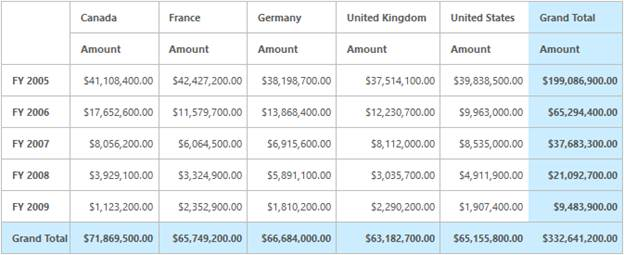 

Open Visual Studio and create a new project by clicking New Project. You can select the Web category. Select the ASP.NET Empty Web Application template and then click OK.  

The following screenshot displays project creation wizard

  

### Add Control in Application

1. Right click the project and select Add > New Folder.  Name the folder as pivotgrid.

    

2. Now right-click on the pivotgrid folder that is newly created and select Add > New Item.

   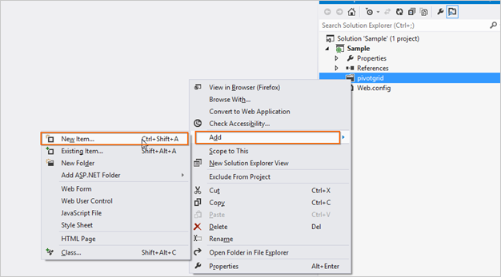 

3. Select Web Form and name it as Default.aspx.

   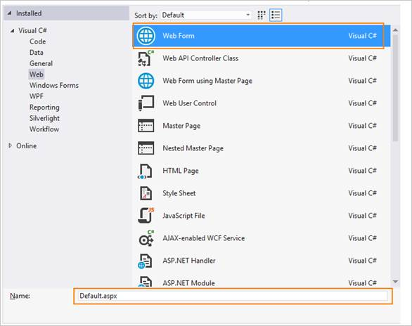 

4. Drag the PivotGrid control from the Syncfusion BI Web Toolbox into the Design page.

    

    

5. Enter the service URL value after dragging and dropping the control.

   > Note: Instructions to create a service is explained briefly in the upcoming sections.

   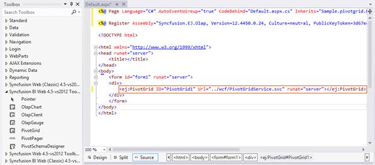 

6. Initialize the control using below code snippet.
 
   > Note: URL value needs to be defined in order to fetch the data from the service. Default properties values need to be initialized as follows to render the control appropriately.



<body>

    <form id="form1" runat="server">

    
   

      <ej:PivotGrid ID="PivotGrid1" Url="../wcf/PivotGridService.svc" runat="server">

       </ej:PivotGrid>

    

    </form>

</body>


 
 
### Add References, Scripts, Styles 

### Add References

1. In the Solution Explorer, right-click the References folder and then click Add Reference.

    

    

2. Select the following assemblies: 

   1. Syncfusion.Core.dll,
   2. Syncfusion.Compression.Base.dll,
   3. Syncfusion.Linq.Base.dll,
   4. Syncfusion.EJ.dll,
   5. Syncfusion.EJ.Olap.dll,
   6. Syncfusion.PivotAnalysis.Base.dll,
   7. Syncfusion.Olap.Base.dll,
   8. Syncfusion.XlsIO.Base.dll.

3. Click OK.

### Add Scripts and Styles

1. Add the script files and CSS files in the <head> tag of the Default.aspx page.

> Note: 
>
> 3. Use the following code example while adding scripts and styles             
> 4. Same files can also be acquired from the following location  
> C:\Users\<UserName>\AppData\Local\Syncfusion\EssentialStudio\<Version>\JavaScript\assets\

### Add WCF Service for PivotGrid



<head>

<link href="http://cdn.syncfusion.com/13.1.0.21/js/web/flat-azure/ej.web.all.min.css" rel="stylesheet" />

</head>



###Create WCF Services

1. Right-click the project and select Add > New Folder. Name the folder as wcf.

    

2. Now right-click the wcf folder created and select Add > New Item.

   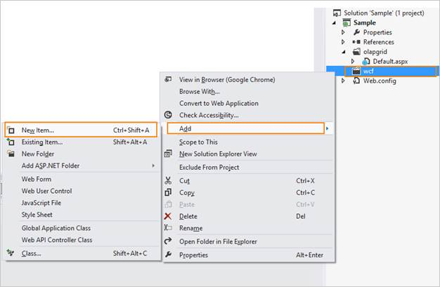 

3. In the Add New Item window, select WCF Service and name it as PivotGridService.svc. 
 
4. Click Add.

 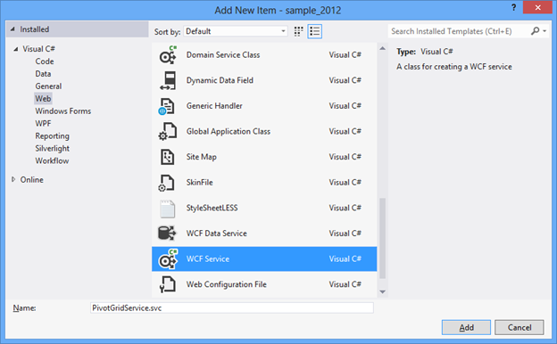 

### Add service methods inside Interface

Add the following code example inside the IPivotGridService interface available in an IPivotGridService.cs file.



    public interface IPivotGridService

    {

        Dictionary<string, object> InitializeGrid(string action);

        Dictionary<string, object> FetchMembers(string action, string headerTag, string sortedHeaders, string currentReport);

        Dictionary<string, object> Filtering(string action, string filterParams, string sortedHeaders, string currentReport);

        Dictionary<string, object> NodeStateModified(string action, string headerTag, string dropAxis, string sortedHeaders, string filterParams, string currentReport);

        Dictionary<string, object> NodeDropped(string action, string dropAxis, string headerTag, string sortedHeaders, string filterParams, string currentReport);

    }
	



### Add Namespaces

Add the following necessary namespaces required to implement the service methods.



using System;

using System.Collections.Generic;

using System.Linq;

using System.Runtime.Serialization;

using System.ServiceModel;

using System.Text;

using System.ServiceModel.Activation;

using System.Web.Script.Serialization;

using Syncfusion.Olap.Manager;

using Syncfusion.Olap.Reports;

using Syncfusion.JavaScript;

using Syncfusion.PivotAnalysis.Base;



### Create Class in Service file

You can create the PivotGridService class to implement the service methods. You can inherit the class from the IPivotGridService interface that is created automatically while adding any new service.



namespace Sample

{

    [AspNetCompatibilityRequirements(RequirementsMode = AspNetCompatibilityRequirementsMode.Allowed)]

    public class PivotGridService : IPivotGridService

    {        

    }

}



### Implement Service Methods

You can add the following methods to the service that are invoked for any server-side operations to be performed in PivotGrid.

1. Initialize the PivotGrids helper class. 

   ~~~ cs

      PivotGrid htmlHelper = new PivotGrid();

      JavaScriptSerializer serializer = new JavaScriptSerializer();

      Dictionary<string, object> dict = new Dictionary<string, object>();

   ~~~
   {:.prettyprint }

2. Add the following relevant service methods.

   ~~~ cs

			 //This method provides the required information from the server side when initializing the PivotGrid. 

				public Dictionary<string, object> InitializeGrid(string action)

				{

					htmlHelper.PivotReport = BindDefaultData();

					dict = htmlHelper.GetJsonData(action, ProductSales.GetSalesData());

					return dict;

				}

				//This method provides the required information from the server side when node state is modified in PivotTable Field List.

				public Dictionary<string, object> NodeStateModified(string action, string headerTag, string dropAxis, string sortedHeaders, string filterParams, string currentReport)

				{

					htmlHelper.PopulateData(currentReport);

					dict = htmlHelper.GetJsonData(action, ProductSales.GetSalesData(), headerTag, dropAxis, filterParams, sortedHeaders);

					return dict;

				}

		//This method provides the required information from the server side when tree node is dropped in PivotTable Field List.

				public Dictionary<string, object> NodeDropped(string action, string dropAxis, string headerTag, string sortedHeaders, string filterParams, string currentReport)

				{

					htmlHelper.PopulateData(currentReport);

					dict = htmlHelper.GetJsonData(action, ProductSales.GetSalesData(), dropAxis, headerTag, filterParams, sortedHeaders);

					return dict;

				} 

		//This method provides the required information from the server side when filtering values in PivotTable Field List.

				public Dictionary<string, object> Filtering(string action, string filterParams, string sortedHeaders, string currentReport)

				{

					htmlHelper.PopulateData(currentReport);

					dict = htmlHelper.GetJsonData(action, ProductSales.GetSalesData(), filterParams, sortedHeaders);

					return dict;

				}

		//This method provides the required information from the server side when opening the editor in PivotTable Field List.

				public Dictionary<string, object> FetchMembers(string action, string headerTag, string sortedHeaders, string currentReport)

				{

					htmlHelper.PopulateData(currentReport);

					dict = htmlHelper.GetJsonData(action, ProductSales.GetSalesData(), headerTag, sortedHeaders);

					return dict;

				}

		//This method carries the information about the default report that is rendered within PivotGrid initially. 

			   private PivotReport BindDefaultData()

				{

					PivotReport pivotSetting = new PivotReport();

					pivotSetting.PivotRows.Add(new PivotItem { FieldMappingName = "Date", FieldHeader = "Date", TotalHeader = "Total" });

					pivotSetting.PivotColumns.Add(new PivotItem { FieldMappingName = "Country", FieldHeader = "Country", TotalHeader = "Total", ShowSubTotal = false });

					pivotSetting.PivotCalculations.Add(new PivotComputationInfo { CalculationName = "Amount", Description = "Amount", FieldHeader = "Amount", FieldName = "Amount", Format = "C", SummaryType = Syncfusion.PivotAnalysis.Base.SummaryType.DoubleTotalSum });

					return pivotSetting;

				}

		namespace WebApplication2

		{

		   //This collection is bounded with the PivotGrid control.

		   internal class ProductSales

			{
				public string Product { get; set; }

				public string Date { get; set; }

				public string Country { get; set; }

				public string State { get; set; }

				public int Quantity { get; set; }

				public double Amount { get; set; }

				public static ProductSalesCollection GetSalesData()

				{
					/// Geography

					string[] countries = new string[] { "Australia", "Canada", "France", "Germany", "United Kingdom", "United States" };

					string[] ausStates = new string[] { "New South Wales", "Queensland", "South Australia", "Tasmania", "Victoria" };

					string[] canadaStates = new string[] { "Alberta", "British Columbia", "Brunswick", "Manitoba", "Ontario", "Quebec" };

					string[] franceStates = new string[] { "Charente-Maritime", "Essonne", "Garonne (Haute)", "Gers", };

					string[] germanyStates = new string[] { "Bayern", "Brandenburg", "Hamburg", "Hessen", "Nordrhein-Westfalen", "Saarland" };

					string[] ukStates = new string[] { "England" };

					string[] ussStates = new string[] { "New York", "North Carolina", "Alabama", "California", "Colorado", "New Mexico", "South Carolina" };

					/// Time

					string[] dates = new string[] { "FY 2005", "FY 2006", "FY 2007", "FY 2008", "FY 2009" };

					/// Products

					string[] products = new string[] { "Bike", "Van", "Car" };

					Random r = new Random(123345345);

					int numberOfRecords = 2000;

					ProductSalesCollection listOfProductSales = new ProductSalesCollection();

					for (int i = 0; i < numberOfRecords; i++)

					{

						ProductSales sales = new ProductSales();

						sales.Country = countries[r.Next(1, countries.GetLength(0))];

						sales.Quantity = r.Next(1, 12);

						/// 1 percent discount for 1 quantity

						double discount = (30000 * sales.Quantity) * (double.Parse(sales.Quantity.ToString()) / 100);

						sales.Amount = (30000 * sales.Quantity) - discount;

						sales.Date = dates[r.Next(r.Next(dates.GetLength(0) + 1))];

						sales.Product = products[r.Next(r.Next(products.GetLength(0) + 1))];

						switch (sales.Product)

						{

							case "Car":

								{

									sales.Date = "FY 2005";

									break;

								}

						}

						switch (sales.Country)

						{

							case "Australia":

								{

									sales.State = ausStates[r.Next(ausStates.GetLength(0))];

									break;

								}

							case "Canada":

								{

									sales.State = canadaStates[r.Next(canadaStates.GetLength(0))];

									break;

								}

							case "France":

								{

									sales.State = franceStates[r.Next(franceStates.GetLength(0))];

									break;

								}

							case "Germany":

								{

									sales.State = germanyStates[r.Next(germanyStates.GetLength(0))];

									break;

								}

							case "United Kingdom":

								{

									sales.State = ukStates[r.Next(ukStates.GetLength(0))];

									break;

								}

							case "United States":

								{

									sales.State = ussStates[r.Next(ussStates.GetLength(0))];

									break;

								}

						}

						listOfProductSales.Add(sales);

					}

					return listOfProductSales;

				}

				public override string ToString()

				{

					return string.Format("{0}-{1}-{2}", this.Country, this.State, this.Product);

				}

				public class ProductSalesCollection : List<ProductSales>

				{

				}

			}

		}

   ~~~
   {:.prettyprint }
   
### Configure Web.Config

1. You can expose services through the properties such as binding, contract and address etc. using an endpoint. In your application the service name is "Sample.PivotGridService" where "PivotGridService" is the service class name and “Sample" is the namespace name where service class appears. The following are the properties that meet the appropriate endpoint.  
   
   i) contract: This property indicates the contract of the endpoint is exposing. Here you are referring IPivotGridService contract and hence it is "Sample.IPivotGridService".
   
   ii) binding: In your application, you use webHttpBinding to post and receive the requests and responses between the client-end and the service-end.
   
   iii) behaviorConfiguration: This property contains the name of the behavior to be used in the endpoint. endpointBehaviors are illustrated as follows.

   ~~~ html

		<system.serviceModel>

			<services>

			  <service name="Sample.PivotGridService">

				<endpoint address="" behaviorConfiguration="Sample.PivotGridServiceAspNetAjaxBehavior"

				  binding="webHttpBinding" contract="Sample.IPivotGridService" />

			  </service>

			</services>

		</system.serviceModel>

   ~~~
   {:.prettyprint }

2. The endpointBehaviors contain all the behaviors for an endpoint. You can link each endpoint to the respective behavior only using this name property. In the following code example "Sample.PivotGridServiceAspNetAjaxBehavior" points the PivotGridService class under the namespace Sample in PivotGridService.svc.cs file that is the appropriate behavior for the endpoint. 

   ~~~ html

		<system.serviceModel>

			<behaviors>

			  <endpointBehaviors>

				<behavior name="Sample.PivotGridServiceAspNetAjaxBehavior">

				  <enableWebScript />

				</behavior>

			  </endpointBehaviors>

			</behaviors>

		</system.serviceModel>

   ~~~
   {:.prettyprint }

3. Register the assemblies in the web.config file by adding the following code example.

   ~~~ html

		<system.web>

			  <compilation debug="true" targetFramework="4.5" >

				<assemblies>

				  <add assembly="Syncfusion.EJ, Version=X.X.X.X, Culture=neutral, PublicKeyToken=3d67ed1f87d44c89" />

				  <add assembly="Syncfusion.EJ.Olap, Version=X.X.X.X, Culture=neutral, PublicKeyToken=3d67ed1f87d44c89" />

				  <add assembly="Syncfusion.PivotAnalysis.Base, Version= X.X.X.X, Culture=neutral, PublicKeyToken=3d67ed1f87d44c89" />

				  <add assembly="Syncfusion.Olap.Base, Version=X.X.X.X, Culture=neutral,      PublicKeyToken=3D67ED1F87D44C89"/>

				</assemblies>

			  </compilation>

		 </system.web> 

   ~~~
   {:.prettyprint }

   > Note: xx.x.x.xx in the above code example refers to the current version of the Essential Studio running in your system.

4. Register the namespace in web.config file by adding the following code example.

   ~~~ html

		<system.web>

		 <pages validateRequest="false">

			  <controls>

				  <add  namespace="Syncfusion.JavaScript.Web.Olap" assembly="Syncfusion.EJ.Olap, Version=X.X.X.X, Culture=neutral, PublicKeyToken=3d67ed1f87d44c89" tagPrefix="ej"/>

			  </controls>

		   </pages>

		</system.web>

   ~~~
   {:.prettyprint }

   > Note: In this example, “Sample” indicates the name of the project and “PivotGridService” indicates the name of the WCF service created. And xx.x.x.xx in the above code example refers to the current version of the Essential Studio running in your system.

In summary, this getting started tutorial gives you an overview of PivotGrid, its architecture, process flow, how to configure and integrate with a VS application through a simple example that is self-explanatory.

 