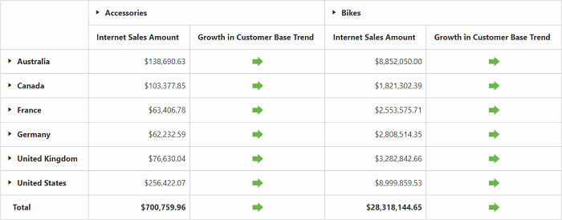

# KPI

Key Performance Indicators (KPI) are business metric that help to figure out the progress of an enterprise when meeting its business goals.

The different indicators available in KPI are:

* KPI value: A physical measure or a calculated measure.
* KPI goal: Defines the target for the measure.
* KPI status: Evaluates the current status of the value compared to the goal. 
* KPI trend: Evaluates the current trend of the value compared to the goal.

The **"KpiElements"** class in the OLAP base library holds the KPI names. When its object are added to an OlapReport, you can view the resultant information in the pivot grid.

## Client mode



<ej:PivotGrid ID="PivotGrid1" runat="server">
    <DataSource Catalog="Adventure Works DW 2008 SE" Cube="Adventure Works" Data="http://bi.syncfusion.com/olap/msmdpump.dll">
        <Rows>
            <ej:Field FieldName="[Customer].[Customer Geography]"></ej:Field>
        </Rows>
        <Columns>
            <ej:Field FieldName="[Product].[Product Categories]"></ej:Field>
        </Columns>
        <Values>
            <ej:Field Axis="Column">
                <Measures>
                    <ej:MeasuresItems FieldName="[Measures].[Internet Sales Amount]" />
                    <ej:MeasuresItems FieldName="[Measures].[Growth in Customer Base Trend]" />
                </Measures>
            </ej:Field>
        </Values>
    </DataSource>
</ej:PivotGrid>
        


## Server mode



OlapReport olapReport = new OlapReport();
olapReport.Name = "Sample Report";
olapReport.CurrentCubeName = "Adventure Works";

MeasureElements measureElementColumn = new MeasureElements();
measureElementColumn.Elements.Add(new MeasureElement { Name = "Gross Profit" });

DimensionElement dimensionElementRow = new DimensionElement();
dimensionElementRow.Name = "Date";
dimensionElementRow.AddLevel("Fiscal", "Fiscal Year");

KpiElements kpiElement = new KpiElements();
kpiElement.Elements.Add(new KpiElement { Name = "Revenue", ShowKPIStatus = true, ShowKPIGoal = false, ShowKPITrend = true, ShowKPIValue = true });

olapReport.CategoricalElements.Add(kpiElement);
olapReport.CategoricalElements.Add(measureElementColumn);
olapReport.SeriesElements.Add(dimensionElementRow);



