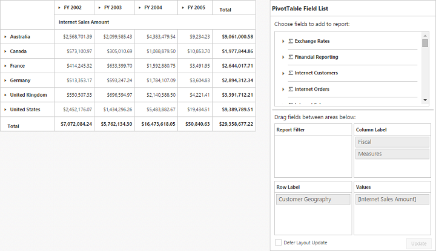
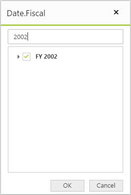

# Pivot table field list

## Initialization  

Field list, also known as Pivot Schema Designer, allows you to add, rearrange, filter, and remove the fields to show the data in pivot grid exactly the way as you desired.

Based on the data source and OLAP bound to the pivot grid control, the pivot table field list will be automatically populated with the cube information or field names. The pivot table field list provides an Excel like appearance and behavior.

To initialize the pivot table field list, first you can define a “div” tag with an appropriate “id” attribute which acts as a container for the control. Then, you can initialize the pivot table field list by using the **"PivotSchemaDesigner"** method.

### Client mode



<ej:PivotGrid ID="PivotGrid1" runat="server" EnableGroupingBar="true">
    <DataSource Catalog="Adventure Works DW 2008 SE" Cube="Adventure Works" Data="http://bi.syncfusion.com/olap/msmdpump.dll">
        <Rows>
            <ej:Field FieldName="[Customer].[Customer Geography]"></ej:Field>
        </Rows>
        <Columns>
            <ej:Field FieldName="[Date].[Fiscal]"></ej:Field>
        </Columns>
        <Values>
            <ej:Field Axis="Column">
                <Measures>
                    <ej:MeasuresItems FieldName="[Measures].[Internet Sales Amount]" />
                </Measures>
            </ej:Field>
        </Values>
    </DataSource>
    <ClientSideEvents RenderSuccess="loadSchemaDesigner" />
</ej:PivotGrid>
<ej:PivotSchemaDesigner ID="PivotSchemaDesigner1" runat="server">
    <OlapSettings ShowKPI="true" ShowNamedSets="true" />
</ej:PivotSchemaDesigner>
    

    


### Server mode



<ej:PivotGrid ID="PivotGrid1" runat=server url="/PivotGridService">
    <ClientSideEvents  AfterServiceInvoke="OnAfterServiceInvoke"/>
</ej:PivotGrid>

<ej:PivotSchemaDesigner ID="PivotSchemaDesigner" runat=server></ej:PivotSchemaDesigner>
 



## Layout

The top portion of the layout shows the field or cube items in a categorized way. The field or cube items can be dynamically added to the report either by drag and drop option or through the simple check box selection.
 
On item(s) selection, they will be placed in the row section by default except numeric based item(s) or measures, which will alone be placed in the value section by default.

The bottom portion of the layout is segregated as below:

* Report filter: Exclusively designed to filter the item(s) placed in the particular position of the layout. 
* Value section: The value label usually displays the numeric value item(s) present in the report.
* Column section: Displays the item(s) as column header and values in the pivot grid control.
* Row section: Displays the item(s) as row header and values in the pivot grid control.

## UI interactions

### By drag and drop

You can alter the report on fly through the drag-and-drop operation. You can drag any item from the field list and drop into the column, row, value, or filter section available at the bottom of the field list.

 

### By tree view selection

You can alter the report on fly through the check and uncheck option as an alternate. By default, the fields will be added to the row label when checked.

 

### By context menu

You can also alter the report by using the context menu.

## Searching values

The search option available in the field list allows you to search a specific value that should be filtered from the list of values in the filter pop-up window.

## Filtering
Values can be filtered by checking/unchecking the check box besides them in the filter pop-up window. At least, one value should in the checked state while filtering. If else, the OK button will be disabled.

 

