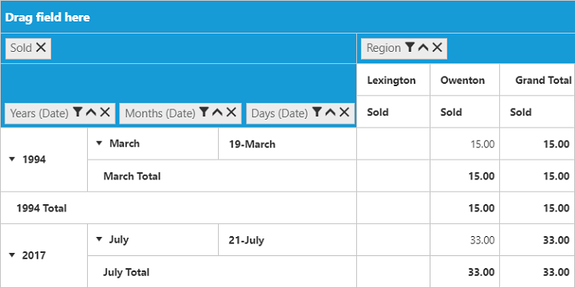

# Group by date

I> This feature is applicable for Relational datasource alone (in Client Mode).

Allows the user to categorize the date type field and showcase them based on year, quarter, month and day formats.  



<ej:PivotGrid ID="PivotGrid1" EnableGroupingBar="true" runat="server" ClientIDMode="Static">
    <DataSource>
    //...
        <Columns>
            <ej:Field FieldName="Date" FieldCaption="Date" Format="date" FotmatString: "yyy-MM-dd" Delimiter="-"></ej:Field>
        </Columns>
    </DataSource>
</ej:PivotGrid>
   


The type of date fields are given in the GettingStarted.aspx.cs as shown in the below snippet.



protected void Page_Load(object sender, EventArgs e)
{    
    this.PivotGrid1.Model.DataSource.Columns[0].GroupByDate.Interval = new List<string>() { "yyyy", "qqq", "MMMM", "dd-MMM" };
}



The properties associated with group by date option is,

* Format - To set the data type format. 
* FotmatString - Specifies the structure of the date format.
* Delimiter - Specifies the separator of the date values.
* GroupByDate.Interval - Specifies the pattern in which date type to be displayed.

