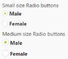

# Easy Customization

## Checked status

You have options to set the state of the radio button as either checked or unchecked. When you select any option from the group of radio buttons, a dot mark appears inside the circle. This is called the Checkedstate. Previously selected radio buttons in this group are unselected that is they go to the unChecked state. The Checked property is used to set the state of the radio button.

The following steps explain the details about rendering the Radio Button with the Checked option

In the ASPX page, add the following input elements to configure Radio Button.


<%--Here checked and unchecked type of radio buttons are rendered in same group

set checked state of radio button as follows--%>

<ej:RadioButton Name="Gender" ID="Radio_checked" runat="server" Size="Small" Checked="true">

</ej:RadioButton>

<label for="Radio_checked" class="clslab">

Male</label>

 

<ej:RadioButton Name="Gender" ID="Radio_unchecked" runat="server" Size="Small" Checked="false">

</ej:RadioButton>

<label for="Radio_unchecked" class="clslab">

Female</label>


Configure the CSS styles to align the radio buttons.





## Text

Specifies the text content for the radio button. In previous programs, separate labels were created for each radio button. But now you have the option to set the text for radio button by using the Text property. So here you do not have to add a label tag for each radio button in the HTML code.

The following steps explain the details about rendering the Radio Button with Text and without using the label tag options.

In the ASPX page, add the following input elements to configure the Radio Button.


<%--radio button with text property--%>

<ej:RadioButton Name="Gender" ID="RadBtn_male" runat="server" Size="Small" Checked="true"

Text="Male">

</ej:RadioButton>

 

<ej:RadioButton Name="Gender" ID="RadBtn_female" runat="server" Size="Small" Checked="false"

Text="Female">

</ej:RadioButton>


Configure the CSS styles to align the radio buttons.





## Size

You can render the Radio Button in different sizes. There are some predefined size options available for rendering a Radio Button in an easy way. Each size option has different height and width. It mainly avoids the complexity in rendering Radio Button with complex CSS class. 

<table>
<tr>
<th>
Property</th><th>
Description</th></tr>
<tr>
<td>
Small</td><td>
Creates radio button with inbuilt small size height, width specified.</td></tr>
<tr>
<td>
Medium</td><td>
Creates radio button with inbuilt medium size height, width specified.</td></tr>
</table>

The following steps explain the details about rendering Radio Button with different size options.

In the ASPX page, add the following input elements to configure Radio Button.


<%-- small and medium size of radio buttons in same group

By default, here no one radio button is checked--%>

Small size Radio buttons

 

<ej:RadioButton Name="Gender" ID="Radio_Male" runat="server" Size="Small" Checked="true">

</ej:RadioButton>

<label for="Radio_Male">

Male</label>

 

<ej:RadioButton Name="Gender" ID="Radio_Female" runat="server" Size="Small">

</ej:RadioButton>

<label for="Radio_Female">

Female</label>

 

Medium size Radio buttons

 

<ej:RadioButton Name="Gender1" ID="Radio1_Male" runat="server" Size="Medium" Checked="true">

</ej:RadioButton>

<label for="Radio1_Male">

Male</label>

 

<ej:RadioButton Name="Gender1" ID="Radio1_Female" runat="server" Size="Medium">

</ej:RadioButton>

<label for="Radio1_Female">

Female</label>


Configure the CSS styles to align the radio buttons





## RTL Support 

In some cases, you need to use right-to-left alignment. You can give RTL support by using EnableRTL property.  RTL mode works when you use the Text property in Radio Button. The Radio Buttons and text are aligned in the right-to-left format. For example, when text is right-aligned and Radio button is left-aligned, after you apply right-to-left alignment, these positions are interchanged. 

The following steps explain the details about rendering the Radio Button with right-to-left alignment support. Here the Text property is necessary.

In the ASPX page, add the following button elements to configure Radio Button.


<%--set radio button with right to left format--%>

    <table class="rightAlign">

        <tr>

            <td>

                <ej:RadioButton Name="Gender" ID="RadBtn_male" runat="server" Size="Small" Text="Male"

                EnableRTL="true">

                </ej:RadioButton>

            </td>

        </tr>

        <tr>

            <td>

                <ej:RadioButton Name="Gender" ID="RadBtn_female" runat="server" Size="Small" Text="Female"

                EnableRTL="true">

                </ej:RadioButton>

            </td>

        </tr>

    </table>



In the above mentioned code, the Text property has been used. In LTR format, the RadioButton is on the left side. In RTL format, the RadioButton appears on the right side. Here the Text property is used and the EnableRTL property is set as “True”. It changes the alignment to right-to-left.

Configure the CSS styles to align the RadioButtons.





