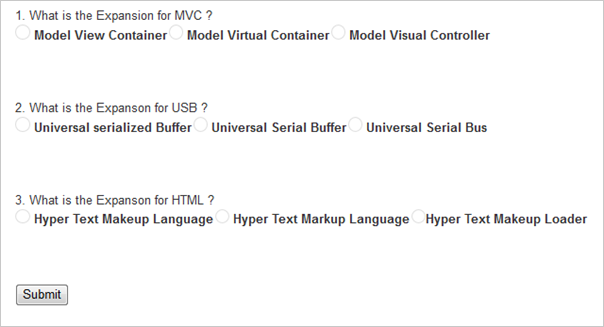
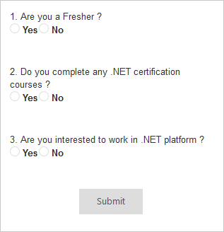
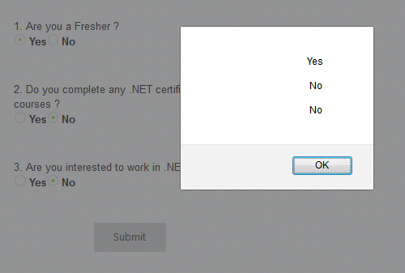

# Getting Started

This section briefly describes on how to create a QuizApp and RegistrationApp byusing ASP.NET Radio Button control and use the features available in it.

Create your first RadioButton in ASP.NET 

By using ASP.NET WebForms Radio Button supports RTL, custom skins and events to display customized Radio Buttons.  In this example, you can learn how to use Radio Button in a Quiz application. The following guidelines illustrate you on how to use the Radio Button to select the answers in the application and get the selected items. The following screenshot shows a sample Quiz application.

{  | markdownify }
{:.image }

Create a RadioButton in a Quiz Application

ASP.NET WebForms Radio Button provides support to display the Radio Button within your webpage and allows you to pick your choice. By using the following guidelines, you can customize the Radio Button for a real-time QuizApp and RegistrationApp scenarios. This allows you to select the corresponding choice for each question.

By using the following steps, you can create a Radio Button control.

You can create an ASP.NET Project and add necessary Dll and script with the help of the given [WebForms-Getting Started](http://help.syncfusion.com/ug/js/Documents/gettingstartedwithmv.htm) Documentation.

Add the following code to render Radio Button.



    1. What is the Expansion for MVC ?

     

    <table>

        <tr>

            <td>

                <ej:radiobutton name="question1" size="Medium" id="RadioButton1" text="Model View Controller"

                    runat="server">

                    </ej:radiobutton>

                <label for="Radio1">

                    Model View Container</label>

            </td>

            <td colspan="2">

                <ej:radiobutton name="question1" size="Medium" id="RadioButton2" text="Model Virtual Container"

                    runat="server">

                    </ej:radiobutton>

                <label for="Radio2">

                    Model Virtual Container</label>

            </td>

            <td colspan="2">

                <ej:radiobutton name="question1" size="Medium" id="RadioButton3" text="Model Visual Controller"

                    runat="server">

                    </ej:radiobutton>

                <label for="Radio3">

                    Model Visual Controller</label>

            </td>

        </tr>

    </table>

     

     

     

    2. What is the Expanson for USB ? 

    <table>

        <tr>

            <td>

                <ej:radiobutton name="question2" size="Medium" id="RadioButton4" runat="server">

                    </ej:radiobutton>

                <label for="Radio4">

                    Universal serialized Buffer</label>

            </td>

            <td>

                <ej:radiobutton name="question2" size="Medium" id="RadioButton5" runat="server">

                    </ej:radiobutton>

                <label for="Radio5">

                    Universal Serial Buffer</label>

            </td>

            <td>

                <ej:radiobutton name="question2" size="Medium" id="RadioButton6" runat="server">

                    </ej:radiobutton>

                <label for="Radio6">

                    Universal Serial Bus</label>

            </td>

        </tr>

    </table>

     

     

     

    3. What is the Expanson for HTML ? 

    <table>

        <tr>

            <td>

                <ej:radiobutton name="question3" size="Medium" id="RadioButton7" runat="server">

                    </ej:radiobutton>

                <label for="Radio7">

                    Hyper Text Makeup Language</label>

            </td>

            <td>

                <ej:radiobutton name="question3" size="Medium" id="RadioButton8" runat="server">

                    </ej:radiobutton>

                <label for="Radio8">

                    Hyper Text Markup Language</label>

            </td>

            <td>

                <ej:radiobutton name="question3" size="Medium" id="RadioButton9" runat="server">

                    </ej:radiobutton>

                <label for="Radio9">

                    Hyper Text Makeup Loader</label>

            </td>

        </tr>

    </table>

     

     

     

    <button id="submitid" onclick="button()">

        Submit</button>



Configure Style

Add the following styles.





{  | markdownify }
{:.image }

Create RegistrationApp

{  | markdownify }
{:.image }

In this section, you can learn how to create a RegistrationApp scenario as shown in the above screenshot.

By using the following steps, you can create a RegistrationApp by using the Radio Button control.

Add the following code to render the Radio Button. 



    

        

             

            1. Are you a Fresher ? 

            <table>

                <tr>

                    <td>

                        <ej:radiobutton name="question1" size="Small" id="RadioButton1" checked="false" enabled="true"

                            runat="server">

                            </ej:radiobutton>

                        <label for="Radio1" class="clslab">

                            Yes

                        </label>

                    </td>

                    <td>

                        <ej:radiobutton name="question1" size="Small" id="RadioButton2" checked="false" enabled="true"

                            runat="server">

                            </ej:radiobutton>

                        <label for="Radio2" class="clslab">

                            No

                        </label>

                    </td>

                </tr>

            </table>

             

             

            2. Do you complete any .NET certification courses ? 

            <table>

                <tr>

                    <td>

                        <ej:radiobutton name="question2" size="Small" id="RadioButton3" checked="false" enabled="true"

                            runat="server">

                            </ej:radiobutton>

                        <label for="Radio1" class="clslab">

                            Yes

                        </label>

                    </td>

                    <td>

                        <ej:radiobutton name="question2" size="Small" id="RadioButton4" checked="false" enabled="true"

                            runat="server">

                            </ej:radiobutton>

                        <label for="Radio2" class="clslab">

                            No

                        </label>

                    </td>

                </tr>

            </table>

             

             

            3. Are you interested to work in .NET platform ? 

            <table>

                <tr>

                    <td>

                        <ej:radiobutton name="question3" size="Small" id="RadioButton5" checked="false" enabled="true"

                            runat="server">

                            </ej:radiobutton>

                        <label for="Radio1" class="clslab">

                            Yes

                        </label>

                    </td>

                    <td>

                        <ej:radiobutton name="question3" size="Small" id="RadioButton6" checked="false" enabled="true"

                            runat="server">

                            </ej:radiobutton>

                        <label for="Radio2" class="clslab">

                            No

                        </label>

                    </td>

                </tr>

            </table>

             

             

            

                <ej:button id="button1" type="Submit" width="100px" size="Large" text="Submit" clientsideonclick="buttonClicked"

                    runat="server">

                    </ej:button>

            

             

        

    



Add Script

Add the following ClientSide event for submit button to get the selected items. 





Configure Style

 Add the following styles. 





{  | markdownify }
{:.image }

{  | markdownify }
{:.image }

