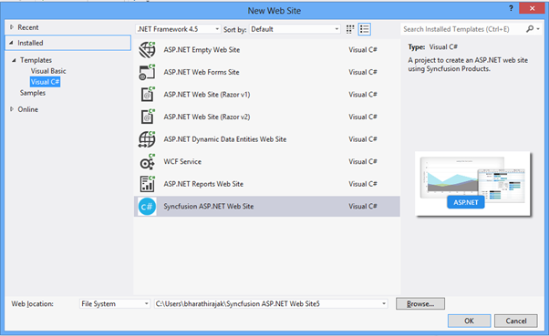
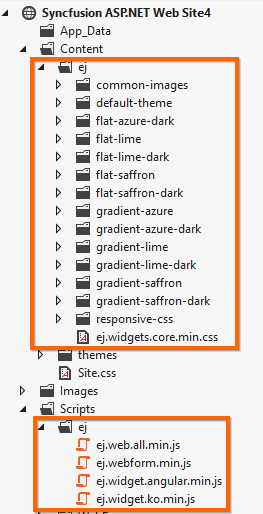
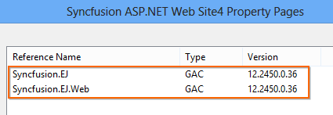
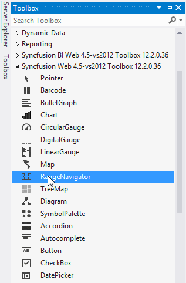
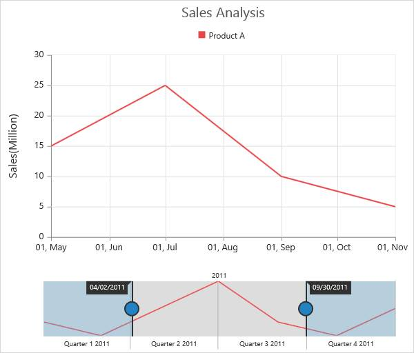

# Getting Started

This section explains briefly about how to create a RangeNavigator in your ASP.NET application.

## Create your first RangeNavigator in ASP.NET

This section encompasses the details on how to configure the RangeNavigator and update the chart control for RangeNavigator’s selected range. It also helps you to learn how to pass the required data to RangeNavigator and customize the scale and selected range for your requirements. In this example, you will learn how to configure the RangeNavigator to analyse sales of a product for a particular quarter in a year.

## Create a simple ASP.NET Application for RangeNavigator

 You can create a new ASP.NET Rangenavigator using Syncfusion ASP.NET website template.

1. On the File menu, click NewWeb Site. The New Web Site dialog box opens.

	

2. On the upper-right corner, select .NET Framework 4.5.
3. In the Installed Templates pane, expand either Visual Basic or Visual C# and then click Web.
4. In the Visual Studio Installed Templates pane, select Syncfusion ASP.NET Web Site project template.
5. Select location and enter web site name In the Web location box,
6. Click OK.
7. The New ASP.NET web site opens.
8. While creating web site through Sycfusion ASP template, the below changes will be applied in the project.
9. Configure web.config files for assemblies
   * The following assemblies references are added properly in web.config file.  

   ~~~ html	
	
	 [Web.config]
	 
		<compilation debug="true" targetFramework="4.5">
		
			<assemblies>
			
				<add assembly="Syncfusion.EJ.Web, Version=12.2450.0.36, Culture=neutral, PublicKeyToken=3d67ed1f87d44c89"/>
				
				<add assembly="Syncfusion.EJ, Version=12.2450.0.36, Culture=neutral, PublicKeyToken=3d67ed1f87d44c89"/>
				
			</assemblies>
			
		</compilation>	
		
		<httpRuntime targetFramework="4.5" />
		
		<pages> 
		
			<controls>
			
				<add namespace="Syncfusion.JavaScript.Web" assembly="Syncfusion.EJ.Web, Version=12.2450.0.36, Culture=neutral, PublicKeyToken=3d67ed1f87d44c89" tagPrefix="ej"/>
				
				<add namespace="Syncfusion.JavaScript.Web" assembly="Syncfusion.EJ, Version=12.2450.0.36, Culture=neutral, PublicKeyToken=3d67ed1f87d44c89" tagPrefix="ej"/>
				
				<add  namespace="Syncfusion.JavaScript.DataVisualization.Models" assembly="Syncfusion.EJ" tagPrefix="ej"/>
				
			</controls>
			
		</pages>	
		
   ~~~
   {:.prettyprint }

10. Syncfusion .CSS  and Script files are added in Content and Script folder
    
	

11. ASP Script Manager, Syncfusion CSS and Scripts file references are added from the respective folder in Site.Master page.
    
	

12. Syncfusion EJ and EJ.Web dll added in website property page

	

13. Now you can find Rangenavigator custom control in the Syncfusion Toolbox.
14. Click on Rangenavigator icon and drag and drop in your web page.

	

15. In designer page now RangeNavigator designer image will be created.

> Note: If you use web application, you will need to follow the above steps manually to use the Syncfusion controls.

## Configure RangeNavigator

Getting started with your ASP RangeNavigator is simple; all you need to do is initialize the RangeNavigator by setting range values.

The following Screen shot displays the RangeNavigator with a range from 2010 January 1st to December 31st.

## Add series

To add a series to RangeNavigator, you need to set DataSource property, as given in the following code example. 

You can add JSON data to the Range Navigator using the Datasource property.

In Default.ASPX.cs specify the data for data source.



List<NavigatorData> dataTable = new List<NavigatorData>();

            dataTable.Add(new NavigatorData(new DateTime(2011, 01, 01), 10));

            dataTable.Add(new NavigatorData(new DateTime(2011, 02, 01), 5));

            dataTable.Add(new NavigatorData(new DateTime(2011, 04, 01), 15));

            dataTable.Add(new NavigatorData(new DateTime(2011, 06, 01), 25));

            dataTable.Add(new NavigatorData(new DateTime(2011, 08, 01), 10));

            dataTable.Add(new NavigatorData(new DateTime(2011, 10, 01), 5));

            dataTable.Add(new NavigatorData(new DateTime(2011, 12, 31), 15));

            this.RangeNavigator1.DataSource = dataTable;

            this.RangeNavigator1.DataBind();

class NavigatorData

        {

            private DateTime xdate;

            public DateTime xDate

            {

                get { return xdate; }

                set { xdate = value; }

            }

            private double yvalue;

            public double yValue

            {

                get { return yvalue; }

                set { yvalue = value; }

            }

            public NavigatorData(DateTime xdate, double yvalue)

            {

                this.xdate = xdate;

                this.yvalue = yvalue;

            }

        }



In Default.ASPX specify the type of series you want to render using “Type” property. And specify the Datasource to the series of RangeNavigator.



<ej:RangeNavigator ID="RangeNavigator1" runat="server" XName="xDate" YName="yValue">        

    </ej:RangeNavigator>

The following screenshot displays the RangeNavigator with the type series as “line”. 



## Enable tooltip

Tooltip can be customized for RangeNavigator using Tooltip option. You can also use ToolipDisplayMode option in Tooltip to display the tooltip “always” or “ondemand” (displays tooltip only while dragging the sliders). You can also specify label format for tooltip using LabelFormat.



<ej:RangeNavigator ID="RangeNavigator1" runat="server" XName="xDate" YName="yValue">

        <TooltipSettings Visible="true" LabelFormat="MMM/yyyy" TooltipDisplayMode="always"></TooltipSettings>        

    </ej:RangeNavigator>

The following screen shot displays the label format Tooltip in RangeNavigator:



## Update Chart

RangeNavigator is used along with the controls like chart and grid to view the range of data selected in RangeNavigator. 

In order to update chart, whenever the selected range changes in RangeNavigator, you need to use RangeChanged event of RangeNavigator and then update the chart with the selected data in this event. 

Now, add the DataSource to the series and provide the field name to get the values from the DataSource in XName and YName options and also trigger the RangeChanged event for updating the chart.



List<NavigatorData> dataTable = new List<NavigatorData>();

            dataTable.Add(new NavigatorData(new DateTime(2011, 01, 01), 10));

            dataTable.Add(new NavigatorData(new DateTime(2011, 02, 01), 5));

            dataTable.Add(new NavigatorData(new DateTime(2011, 04, 01), 15));

            dataTable.Add(new NavigatorData(new DateTime(2011, 06, 01), 25));

            dataTable.Add(new NavigatorData(new DateTime(2011, 08, 01), 10));

            dataTable.Add(new NavigatorData(new DateTime(2011, 10, 01), 5));

            dataTable.Add(new NavigatorData(new DateTime(2011, 12, 31), 15));

            this.Chart1.DataSource = dataTable;

            this.Chart1.DataBind();

            this.RangeNavigator1.DataSource = dataTable;

            this.RangeNavigator1.DataBind();
			
			



<ej:Chart ID="Chart1" runat="server">

        <Title Text="Sales Analysis"></Title>

        <Legend Visible="true" Position="Top"></Legend>

        <PrimaryXAxis>

            <Title Text="Sales(Million)"></Title>

        </PrimaryXAxis>

       <Series>

        <ej:Series Name="Product A" Type="Line" XName="xDate" YName="yValue"></ej:Series>

    </Series>     

    </ej:Chart> 

<ej:RangeNavigator ID="RangeNavigator1" runat="server" XName="xDate" YName="yValue" onClientSideRangeChanged="onrangechanged">

</ej:RangeNavigator>



The following code example illustrates how to use the RangeChanged event of RangeNavigator for updating the chart with the selected data.





The following screenshot displays how the RangeNavigator is updated when the selected range is changed.

## Set value type

RangeNavigator can also be used with numerical values. You can specify the data type using ValueType option. 

First let’s create a DataSource for Chart Series with integer Values. 

 

List<NavigatorData> dataTable = new List<NavigatorData>();

            dataTable.Add(new NavigatorData(0, 10));

            dataTable.Add(new NavigatorData(50, 5));

            dataTable.Add(new NavigatorData(100, 15));

            dataTable.Add(new NavigatorData(150, 25));

            dataTable.Add(new NavigatorData(200, 10));

            dataTable.Add(new NavigatorData(250, 5));

            dataTable.Add(new NavigatorData(300, 15));

            this.RangeNavigator1.DataSource = dataTable;

            this.RangeNavigator1.DataBind();

 class NavigatorData

        {

            private double xdate;

            public double xDate

            {

                get { return xdate; }

                set { xdate = value; }

            }

            private double yvalue;

            public double yValue

            {

                get { return yvalue; }

                set { yvalue = value; }

            }

            public NavigatorData(double xdate, double yvalue)

            {

                this.xdate = xdate;

                this.yvalue = yvalue;

            }

        }

		
		
In Default.ASPX specify the DataSource to the series and provide the field name to get the values from the DataSource in XName and YName options series and also set the ValueType property to “numeric” as given in the following code example. 



  <ej:RangeNavigator ID="RangeNavigator1" runat="server" ValueType="numeric">

    <Series>

        <ej:Series XName="xDate" YName="yValue"></ej:Series>

    </Series>

</ej:RangeNavigator>       



The following screenshot displays the RangeNavigator with numerical values:

 

