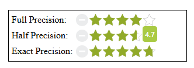

# Rating Customization

## Setting Value

The Value property sets the display value of the Rating. For example, when the Value property is set to 4, the Rating control renders 4 ratings. By default, Value property’s value is one.

In an ASPX page add the following code to render the Rating with the customized value.



    <table>

        <tr>

            <td valign="top">

                Rating:

            </td>

            <td>

                <ej:Rating ID="Rating" Value="4" runat="server"></ej:Rating>

            </td>

        </tr>

    </table>



The following screenshot displays the output of the above code example.

 

## Min Value

EJ Rating control provides support for setting the minimum value. This is achieved by adding the MinValue property. When the MinValue property is set, the Rating value starts with MinValue+1.

Add the following code example to the corresponding ASPX page to render the Rating with the customized minimum value.



      <table>

            <tr>

                <td valign="top">Rating:

                </td>

                <td>

                    <ej:Rating ID="Rating" MinValue="3" runat="server"></ej:Rating>

                </td>

            </tr>

      </table>



The following screenshot displays the output of the above code example.

## Max Value

EJ Rating control provides support for setting the maximum value. This is achieved by adding the MaxValue property. By default, MaxValue is 5.

Add the following code example to the corresponding ASPX page to render the Rating with the customized maximum value.



      <table>

            <tr>

                <td valign="top">Rating:

                </td>

                <td>

                    <ej:Rating ID="Rating" MaxValue="10" runat="server"></ej:Rating>

                </td>

            </tr>

        </table>

 



The following screenshot displays the output of the above code example.

## Set Precision

In a real-time movie Rating scenario, you can set Precision between the two whole numbers such as 2.5 or 3.7 and it is achieved by using the property Precision by changing the value to Half or Exact. By default, Precision is Full.

Add the following code example to the corresponding ASPX page to render the Rating with Precision.



        <table>

            <tr>

                <td valign="top">Full Precision:

                </td>

                <td>

                    <ej:Rating ID="FullRating" Precision="Full" Value="4" runat="server"></ej:Rating>               

                </td>

            </tr>  

            <tr>

                <td valign="top">Half Precision:

                </td>

                <td>

                    <ej:Rating ID="HalfRating" Precision="Half" Value="3.5" runat="server"></ej:Rating>                  

                </td>

            </tr> 

            <tr>

                <td valign="top">Exact Precision:

                </td>

                <td>

                    <ej:Rating ID="ExactRating" Precision="Exact" Value="4.7" runat="server"></ej:Rating>                 

                </td>

            </tr>        

        </table>



The following screenshot displays the output of the above code example.

## Increment Step

EJ Rating control supports customized increment value for the Rating. This is achieved by adding the IncrementStep property.

Add the following code example to the corresponding ASPX page to render the Rating with the the customized increment.



    <table>

        <tr>

            <td valign="top">Rating:

            </td>

            <td>

                <ej:Rating ID="Rating" IncrementStep="2" MaxValue="10" runat="server"></ej:Rating>

            </td>

        </tr>

    </table>



The following screenshot displays the output of the above code example.

## Resetting values

EJ Rating control provides support for value reset at runtime. This is achieved by enabling the AllowReset property to be True. By default, the property value is set to True.

Add the following code example to the corresponding ASPX page to render the Rating with AllowReset.



    <table>

        <tr>

            <td valign="top">Rating:

            </td>

            <td>

                <ej:Rating ID="Ratingreset" AllowReset="true" runat="server"> </ej:Rating>

            </td>

        </tr>

        <tr>

            <td valign="top">Rating:

            </td>

            <td>

                <ej:Rating ID="Rating" AllowReset="false" runat="server"></ej:Rating>

            </td>

        </tr>

    </table>



The following screenshot displays the output of the above code example.

## Read Only

Rating control provides support for changeable or unchangeable values for Rating control. This is achieved by the ReadOnly property. When this property is set to True, the Rating value becomes unchangeable. By default, this property value is set to False.

Add the following code example to the corresponding ASPX page to render Rating with ReadOnly.



    <table>

        <tr>

            <td valign="top">Rating:

            </td>

            <td>

                <ej:Rating ID="Rating1" ReadOnly="true" runat="server"></ej:Rating>

            </td>

        </tr>

    </table>



The following screenshot displays the output of the above code example.

## Enable or Disable

Rating control provides support to enable or disable the control. This is achieved by the Enabled property. By default, the property value is True.

Add the following code example to the corresponding ASPX page to render the Rating with enable or disable support.



    <table>

        <tr>

            <td valign="top">Rating:

            </td>

            <td>

                <ej:Rating ID="Rating1" Enabled="false" runat="server"></ej:Rating>

            </td>

        </tr>

    </table>



The following screenshot displays the output of the above code example.

