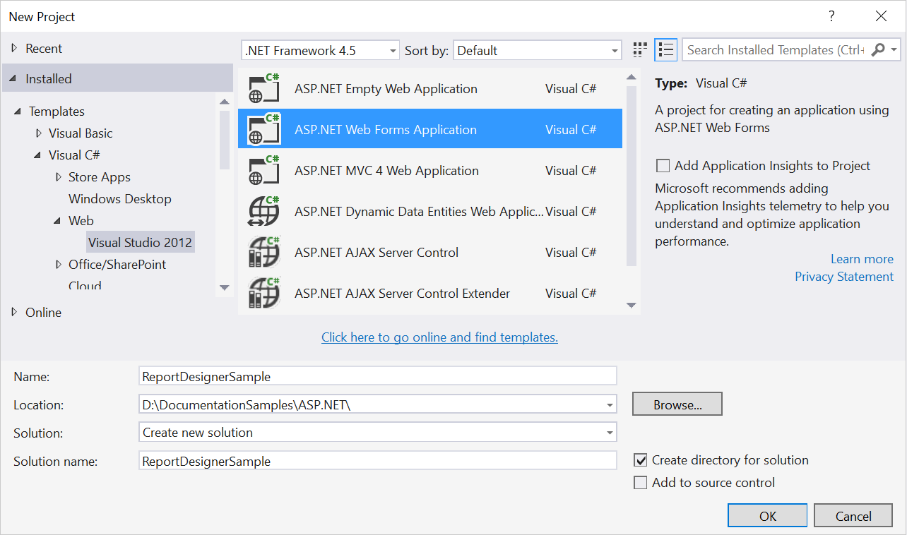
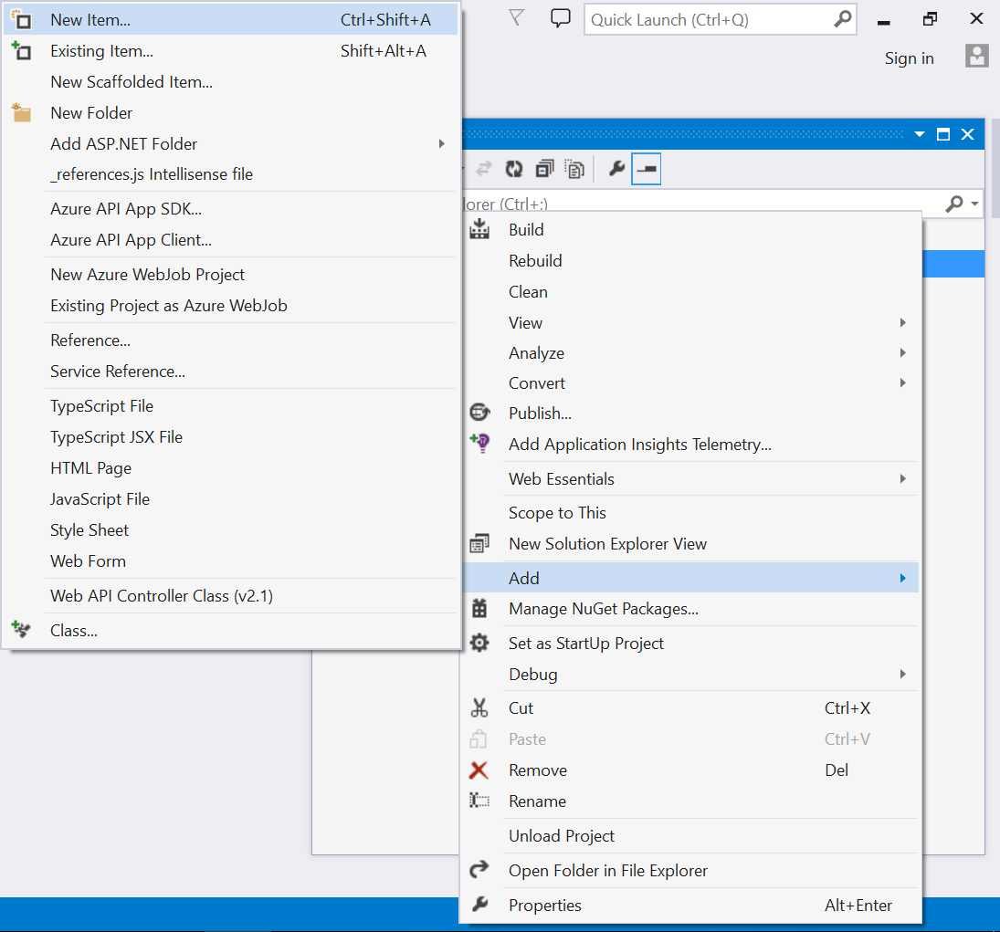
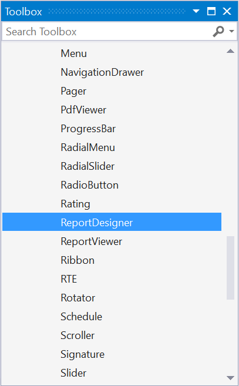
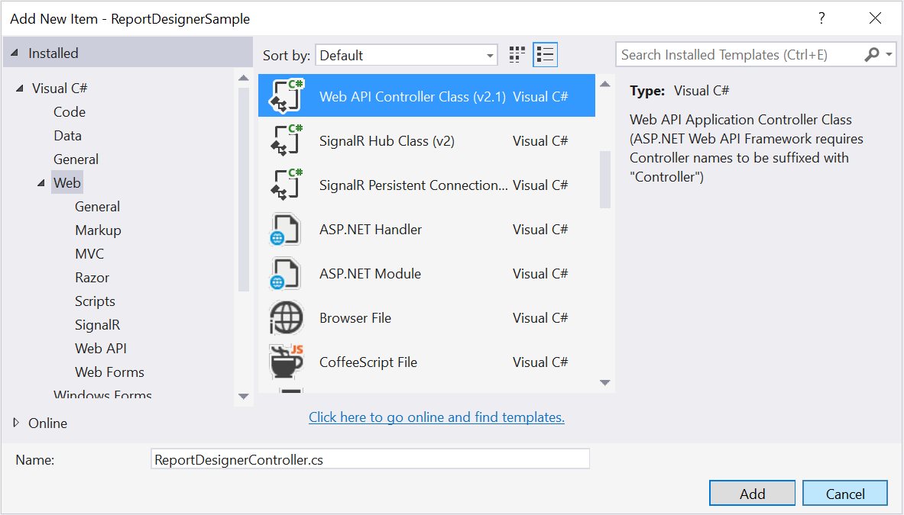
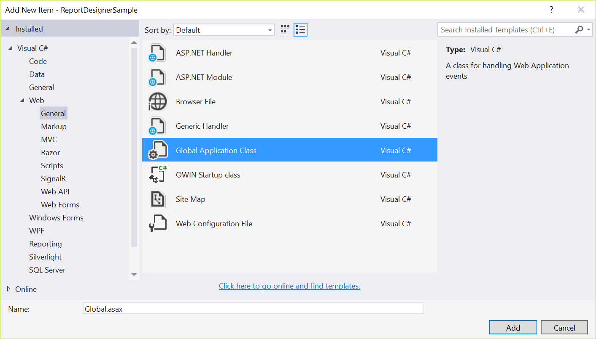

# Getting Started

This section explains briefly about how to create a ReportDesigner in your web application with ASP.NET.

## Create your first ReportDesigner in ASP.NET

The following screenshots displays the Project Creation Wizard in Visual Studio 2012.

Open Visual Studio and create a new project by clicking `New Project`. Select the **Web** category, select the ASP.NET Empty Web Application template, and then click `OK`. The following screenshot displays the Project Creation Wizard.

 

Project Creation Wizard
{:.caption}

### Create ASPX Page

To create a new Web Forms in the application

1. Right-Click on the project and select `Add`.

    

2. Click `New Item` and select `Web Form` from the listed templates

    
   
   Adding Web Forms
   {:.caption}
   
3. Name the page as Default.aspx and click OK.

### Add References, Scripts, Styles and Control in ASPX Page

#### Add References

1. In the Solution Explorer, right-click the project `References` folder and then click `Add Reference`.

    
   
   Adding Reference
   {:.caption}
   
2. Add the following assemblies

   * System.Web.Routing
   * System.Web.Http
   * System.Web.WebHost
   * System.Net.Http
   * System.Net.Http.WebRequest
   * System.Net.Http.Formatting
   * Syncfusion.Compression.Base
   * Syncfusion.EJ
   * Syncfusion.EJ.Web
   * Syncfusion.EJ.ReportDesigner
   * Syncfusion.EJ.ReportDesigner
   * Syncfusion.Pdf.Base
   * Syncfusion.XlsIO.Base
   * Syncfusion.Presentation.Base
   * Syncfusion.DocIO.Base
   * Syncfusion.Shared.Wpf
   * Syncfusion.Chart.Wpf
   * Syncfusion.Gauge.Wpf
   * Syncfusion.SfMaps.Wpf
   
   > Refer the above assemblies from the installed location, C:\Program Files (x86)\Syncfusion\Essential Studio\ASP.NET\{{ site.releaseversion }}\Assemblies

   > Refer System.Web.Http, System.Web.WebHost, System.Net.Http.WebRequest and System.Net.Http.Formatting assemblies from ASP.NET WebApi NuGet package.

#### Add Scripts and Styles

Add the script files and CSS files in the &lt;head&gt; tag of the default.aspx page.

Use the following code example while adding scripts and styles.



<head>
<link href="http://cdn.syncfusion.com/{{ site.releaseversion }}/js/web/flat-azure/ej.web.all.min.css"  rel="stylesheet" />
<link href="http://cdn.syncfusion.com/{{ site.releaseversion }}/js/web/flat-azure/ej.reportdesigner.min.css" rel="stylesheet" />
<link href="https://cdnjs.cloudflare.com/ajax/libs/codemirror/5.37.0/codemirror.min.css" rel="stylesheet" />
<link href="https://cdnjs.cloudflare.com/ajax/libs/codemirror/5.37.0/addon/hint/show-hint.min.css" rel="stylesheet" />

</head>



### Add Control in ASPX Page

1. Drag the ReportDesigner control from the Syncfusion Web Toolbox onto the Design Page.

    
   
   ReportDesigner Control in Toolbox
   {:.caption} 

2. Set the desired `ServiceUrl` to ReportDesigner.
   
   ~~~ html   
   <form id="form1" runat="server">
       

           <ej:ReportDesigner runat="server" ID="designer" ServiceUrl="/api/ReportDesigner">
           </ej:ReportDesigner>
       

   </form>   
   ~~~
   
### Add WebAPI controller for ReportDesigner

The ASP.NET ReportDesigner uses WebApi services to process the report file and process the request from control.

 

Adding WebApi Controller
{:.caption} 

### Inherit the ReportDesigner IReportController

The ApiController inherits the `IReportController` and you can add the following code example to its methods definition in order to process the report file. The interface IReportController contains the required actions and helper methods declaration to process the report. The ReportHelper class contains helper methods that helps to process Post/Get request from control and return the response to control.



using System;
using Syncfusion.EJ.ReportViewer;
using System.Collections.Generic;
using System.Linq;
using System.Net;
using System.Net.Http;
using System.Web.Http;
using Syncfusion.Reports.EJ;
using System.Collections;
using System.Web;
using Syncfusion.EJ.ReportDesigner;
using System.IO;

namespace ReportDesignerSample
{
    public class ReportDesignerController : ApiController, Syncfusion.EJ.ReportDesigner.IReportDesignerController
    {
        public ReportDesignerController()
        {
        }

        [HttpPost]
        public void UploadReportAction()
        {
            ReportDesignerHelper.ProcessDesigner(null, this, HttpContext.Current.Request.Files[0]);
        }

        [HttpGet]
        public object GetImage(string key, string image)
        {
            return ReportDesignerHelper.GetImage(key, image, this);
        }

        [HttpPost]
        public object PostDesignerAction(Dictionary<string, object> jsonResult)
        {
            return ReportDesignerHelper.ProcessDesigner(jsonResult, this, null);
        }

        public object PostReportAction(Dictionary<string, object> jsonResult)
        {
            return ReportHelper.ProcessReport(jsonResult, this as IReportController);
        }

        public void OnInitReportOptions(Syncfusion.EJ.ReportViewer.ReportViewerOptions reportOption)
        {
            //You can update report options here
        }

        public void OnReportLoaded(Syncfusion.EJ.ReportViewer.ReportViewerOptions reportOption)
        {
            //You can update report options here
        }

        public object GetResource(string key, string resourcetype, bool isPrint)
        {
            return ReportHelper.GetResource(key, resourcetype, isPrint);
        }

        public bool UploadFile(HttpPostedFile httpPostedFile)
        {
            string targetFolder = HttpContext.Current.Server.MapPath("~/");
            string fileName = !string.IsNullOrEmpty(ReportDesignerHelper.SaveFileName) ? ReportDesignerHelper.SaveFileName : Path.GetFileName(httpPostedFile.FileName);
            targetFolder += "Cache";

            if (!Directory.Exists(targetFolder))
            {
                Directory.CreateDirectory(targetFolder);
            }

            if (!Directory.Exists(targetFolder + "\\" + ReportDesignerHelper.EJReportDesignerToken))
            {
                Directory.CreateDirectory(targetFolder + "\\" + ReportDesignerHelper.EJReportDesignerToken);
            }

            httpPostedFile.SaveAs(targetFolder + "\\" + ReportDesignerHelper.EJReportDesignerToken + "\\" + fileName);
            return true;
        }

        public List<Syncfusion.EJ.ReportDesigner.FileModel> GetFiles(Syncfusion.EJ.ReportDesigner.FileType fileType)
        {
            throw new NotImplementedException();
        }

        public string GetFilePath(string fileName)
        {
            string targetFolder = HttpContext.Current.Server.MapPath("~/");
            targetFolder += "Cache";

            if (!Directory.Exists(targetFolder))
            {
                Directory.CreateDirectory(targetFolder);
            }

            if (!Directory.Exists(targetFolder + "\\" + ReportDesignerHelper.EJReportDesignerToken))
            {
                Directory.CreateDirectory(targetFolder + "\\" + ReportDesignerHelper.EJReportDesignerToken);
            }

            var folderPath = HttpContext.Current.Server.MapPath("~/") + "Cache\\" + ReportDesignerHelper.EJReportDesignerToken + "\\";
            return folderPath + fileName;
        }

        public FileModel GetFile(string filename, bool isOverride)
        {
            throw new NotImplementedException();
        }
    }
}



>NOTE: 
You can refer the External Server sample and service from the installed location :
API Service: %public%\Documents\Syncfusion\ASP.NET\{{ site.releaseversion }}\Samples\Web\WebAPI\ReportDesignerController.cs .
External Server: %public%\Documents\Syncfusion\ASP.NET\{{ site.releaseversion }}\Samples\Web\WebAPI\ExternalReportServer.cs

### WebAPI Routing

1. Right-click the project and select `Add` and select `Global Application Class file` from the listed templates.

    
   
   Adding Global.asax
   {:.caption} 
   
2. You can route the WebAPI in Application_Start event into Global.asax file as follows.
   


using System;
using System.Collections.Generic;
using System.Linq;
using System.Web;
using System.Web.Security;
using System.Web.SessionState;
using System.Web.Http;

namespace ReportDesignerSample
{
    public class Global : System.Web.HttpApplication
    {
        protected void Application_Start(object sender, EventArgs e)
        {
            System.Web.Http.GlobalConfiguration.Configuration.Routes.MapHttpRoute(
            name: "DefaultApi",
            routeTemplate: "api/{controller}/{action}/{id}",
            defaults: new { id = RouteParameter.Optional });
            AppDomain.CurrentDomain.SetData("SQLServerCompactEditionUnderWebHosting", true);
        }
    }
}



### Run the Application

Run the sample application and you can see the ReportDesigner on the page as displayed in the following screenshot.

  
