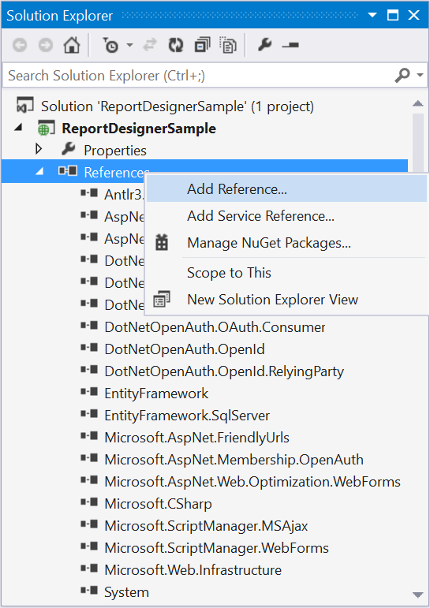
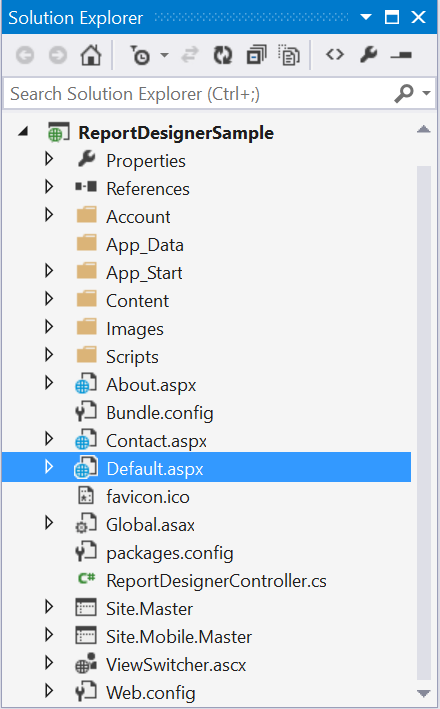
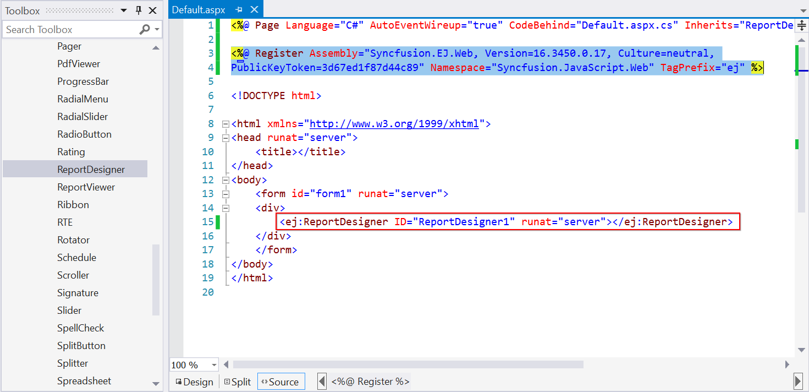
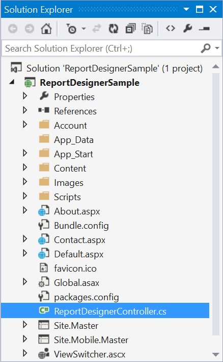
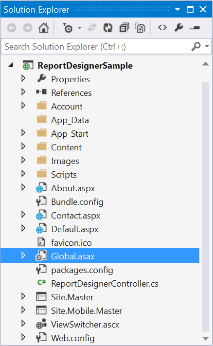

# Getting Started

This section explains briefly about how to create a ReportDesigner in your web application with ASP.NET.

## Create your first ReportDesigner application in ASP.NET

The following screenshots displays the Project Creation Wizard in Visual Studio 2013.

Open Visual Studio and create a new project by clicking `New Project`. Select the **Web** category, select the ASP.NET Web Forms Application template, and then click `OK`. The following screenshot displays the Project Creation Wizard.

 

Project Creation Wizard
{:.caption}

### Add References

1. In the Solution Explorer, right-click the `References` folder and then click `Add Reference`.

     

2. Add the following references to the project that are necessary for using the report designer control and click OK.

   * Syncfusion.Chart.Wpf
   * Syncfusion.Compression.Base
   * Syncfusion.DocIO.Base
   * Syncfusion.EJ.ReportDesigner
   * Syncfusion.EJ.ReportViewer
   * Syncfusion.Gauge.Wpf
   * Syncfusion.Pdf.Base
   * Syncfusion.Presentation.Base
   * Syncfusion.Shared.Wpf
   * Syncfusion.SfMaps.Wpf
   * Syncfusion.XlsIO.Base
   * Syncfusion.EJ
   * Syncfusion.EJ.Web

    > Refer the above assemblies from the installed location, [Installed Location]:\Program Files (x86)\Syncfusion\Essential Studio\ASP.NET\{{ site.releaseversion }}\Assemblies

3.  Add reference to the following assemblies from [NuGet package](https://www.nuget.org/packages/Microsoft.AspNet.WebApi/ "Web NuGet Package Details").

    * System.Web.Http
    * System. Web.Http.WebHost
    * System.Net.Http.WebRequest
    * System.Net.Http.Formatting

    > The System.Web.Routing and System.Net.Http assemblies are also required, which are referred by default when creating the project.

### Create ASPX Page

If `Default.aspx` page already exists in your application skip the below steps.

To create a new Web Forms in the application

1. Right-Click on the project and select `Add` then click `New Item`. 

    

2. Select `Web Form` from the listed templates and name the page as **Default.aspx**.

    
   
   Adding Web Forms
   {:.caption}
   
3.  Click Add.

    

### Add Scripts and Styles

For complete dependencies list of report designer control [Click here](/aspnet/ReportDesigner/Dependencies).

Add the script files and theme files in the &lt;head&gt; tag of the Default.aspx page.

**Themes**



<link href="http://cdn.syncfusion.com/{{ site.releaseversion }}/js/web/flat-azure/ej.web.all.min.css" rel="stylesheet" />
<link href="http://cdn.syncfusion.com/{{ site.releaseversion }}/js/web/flat-azure/ej.reportdesigner.min.css" rel="stylesheet" />

 

**Scripts**

**External dependencies**



 

**Internal dependencies**

Refer the below scripts to render report designer control.



 
 

**Code Mirror**

To edit the SQL queries with syntax highlighter need to refer the below code mirror scripts and themes.



<link href="https://cdnjs.cloudflare.com/ajax/libs/codemirror/5.37.0/codemirror.min.css" rel="stylesheet" />
<link href="https://cdnjs.cloudflare.com/ajax/libs/codemirror/5.37.0/addon/hint/show-hint.min.css" rel="stylesheet" />

 

Use the above code example while adding scripts and styles.

> Refer the following installed location to get scripts and styles in local machine, [Installed Location]:\Program Files (x86)\Syncfusion\Essential Studio\ASP.NET\{{ site.releaseversion }}\JavaScript\assets.

### Add Control in ASPX Page

To add the control, we can use either of the following two ways:

*	Drag and drop the control from the toolbox.  
*	Manually using the control code.  

#### Drag and drop the control from the toolbox

1.	An easy way of adding control into the Default.aspx page is by making use of the Toolbox option present in the Visual Studio. When you install Essential Studio Package or ASP.NET setup in your machine, all the available ASP.NET controls are automatically configured into the Visual Studio Toolbox.

    You just need to drag the required control from the toolbox and then drop it into the body section of the Default.aspx page, so that the required control code gets generated automatically and also the required dependent assembly get registered automatically.

     
   
    ReportDesigner Control in Toolbox
    {:.caption} 

2.	When you drag and drop the Report Designer control into the Default.aspx page, the page looks as the image shown in the following with the automatic control code generated and the required assemblies registered.

    

3. Set the desired `ServiceUrl` to ReportDesigner.

    

    <ej:ReportDesigner ID="designer" runat="server" ServiceUrl="/api/ReportDesigner"></ej:ReportDesigner>

    
    
#### Manually using the control code

If you want to add the control code manually, follow the below steps.

##### Assembly Reference

Refer to the following assemblies in your newly created ASP.NET application that allows you to use any of the Syncfusion ASP.NET controls within it.

* Syncfusion.EJ
* Syncfusion.EJ.Web

> Refer the above assemblies from the installed location, [Installed Location]:\Program Files (x86)\Syncfusion\Essential Studio\ASP.NET\{{ site.releaseversion }}\Assemblies

##### Registering Syncfusion Assemblies within the Web.config

In your application’s web.config file, add the following assembly information within the <assemblies> tag.



<system.web>
    <compilation debug="true" targetFramework="4.5">
          <assemblies>

            <add assembly="Syncfusion.EJ, Version=16.3450.0.17, Culture=neutral, PublicKeyToken=3d67ed1f87d44c89" />

            <add assembly="Syncfusion.EJ.Web, Version=16.3450.0.17, Culture=neutral, PublicKeyToken=3d67ed1f87d44c89" />

          </assemblies>
    </compilation>
    <authentication mode="Forms">
</system.web>



1.	Add the following ReportDesigner code into the body section of the Default.aspx file, as shown in the image following it.

    
    
    <form id="form1" runat="server">
        

            <ej:ReportDesigner ID="designer" runat="server"></ej:ReportDesigner>
        

    </form>   
    

2.	Also register the required assemblies within the Default.aspx page at the top where you are using the control as shown in the following.

    

3. Set the desired `ServiceUrl` to ReportDesigner.
   
    

   <form id="form1" runat="server">
       

           <ej:ReportDesigner runat="server" ID="designer" ServiceUrl="/api/ReportDesigner">
           </ej:ReportDesigner>
       

   </form>   
   
   
   
### Add WebAPI controller for ReportDesigner

The ASP.NET ReportDesigner uses WebApi services to process the report file and process the request from control.

**Add Controller**

1. Right-Click on the project and select `Add` then click `New Item`. 

    

2. Select `Web API Controller Class` from the listed templates and name the controller as **ReportDesignerController.cs**. 

    

3. Click Add.

    

#### Inherit IReportDesignerController
 
The ApiController should inherit the `IReportDesignerController` and to process the report file. The interface `IReportDesignerController` contains the required actions and helper methods declaration to process the report. The `ReportDesignerHelper` and `ReportHelper` class contains helper methods that helps to process Post/Get request from control and return the response to control.

Please add the following code example in `ReportDesignerController.cs`.



using System;
using System.Collections.Generic;
using System.Linq;
using System.Net;
using System.Net.Http;
using System.Web.Http;
using System.IO;
using System.Web;
using Syncfusion.EJ.ReportViewer;
using Syncfusion.Reports.EJ;
using Syncfusion.EJ.ReportDesigner;

namespace ReportDesignerSample
{
    public class ReportDesignerController : ApiController, Syncfusion.EJ.ReportDesigner.IReportDesignerController
    {
        public string GetFilePath(string fileName)
        {
            string targetFolder = HttpContext.Current.Server.MapPath("~/");
            targetFolder += "Cache";

            if (!Directory.Exists(targetFolder))
            {
                Directory.CreateDirectory(targetFolder);
            }

            if (!Directory.Exists(targetFolder + "\\" + ReportDesignerHelper.EJReportDesignerToken))
            {
                Directory.CreateDirectory(targetFolder + "\\" + ReportDesignerHelper.EJReportDesignerToken);
            }

            var folderPath = HttpContext.Current.Server.MapPath("~/") + "Cache\\" + ReportDesignerHelper.EJReportDesignerToken + "\\";
            return folderPath + fileName;
        }

        public object GetImage(string key, string image)
        {
            return ReportDesignerHelper.GetImage(key, image, this);
        }

        public object PostDesignerAction(Dictionary<string, object> jsonResult)
        {
            return ReportDesignerHelper.ProcessDesigner(jsonResult, this, null);
        }

        public bool UploadFile(System.Web.HttpPostedFile httpPostedFile)
        {
            string targetFolder = HttpContext.Current.Server.MapPath("~/");
            string fileName = !string.IsNullOrEmpty(ReportDesignerHelper.SaveFileName) ? ReportDesignerHelper.SaveFileName : Path.GetFileName(httpPostedFile.FileName);
            targetFolder += "Cache";

            if (!Directory.Exists(targetFolder))
            {
                Directory.CreateDirectory(targetFolder);
            }

            if (!Directory.Exists(targetFolder + "\\" + ReportDesignerHelper.EJReportDesignerToken))
            {
                Directory.CreateDirectory(targetFolder + "\\" + ReportDesignerHelper.EJReportDesignerToken);
            }

            httpPostedFile.SaveAs(targetFolder + "\\" + ReportDesignerHelper.EJReportDesignerToken + "\\" + fileName);
            return true;
        }

        public void UploadReportAction()
        {
            ReportDesignerHelper.ProcessDesigner(null, this, HttpContext.Current.Request.Files[0]);
        }

        public object GetResource(string key, string resourcetype, bool isPrint)
        {
            return ReportHelper.GetResource(key, resourcetype, isPrint);
        }

        public void OnInitReportOptions(ReportViewerOptions reportOption)
        {
            //You can update report options here
        }

        public void OnReportLoaded(ReportViewerOptions reportOption)
        {
            //You can update report options here
        }

        public object PostReportAction(Dictionary<string, object> jsonResult)
        {
            return ReportHelper.ProcessReport(jsonResult, this as IReportController);
        }

        public FileModel GetFile(string filename, bool isOverride)
        {
            throw new NotImplementedException();
        }

        public List<FileModel> GetFiles(FileType fileType)
        {
            throw new NotImplementedException();
        }
    }
}



### WebAPI Routing

If `Global Application Class` file already exists in your application skip the below **Add Global Application Class** section.

#### Add Global Application Class

1. Right-Click on the project and select `Add` then click `New Item`. 

     

2. Select `Global Application Class` from the listed templates and name it as `Global.asax`.

    

3. Click Add.

    
 
#### Route WebAPI

Open the `Global Application Class` file in the application and modify the WebAPI routing in Application_Start event as follows.



using System;
using System.Collections.Generic;
using System.Linq;
using System.Web;
using System.Web.Security;
using System.Web.SessionState;
using System.Web.Http;

namespace ReportDesignerSample
{
    public class Global : System.Web.HttpApplication
    {
        protected void Application_Start(object sender, EventArgs e)
        {
            System.Web.Http.GlobalConfiguration.Configuration.Routes.MapHttpRoute(
            name: "DefaultApi",
            routeTemplate: "api/{controller}/{action}/{id}",
            defaults: new { id = RouteParameter.Optional });
            AppDomain.CurrentDomain.SetData("SQLServerCompactEditionUnderWebHosting", true);
        }
    }
}



### Run the Application

Run the sample application and you can see the ReportDesigner on the page as displayed in the following screenshot.

  
