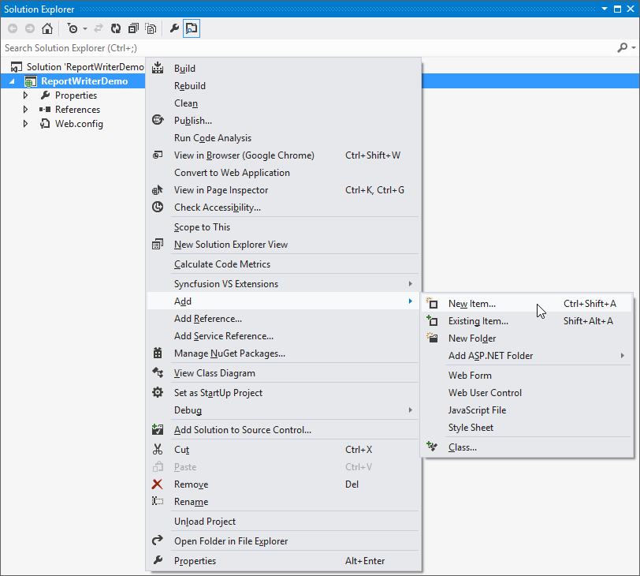
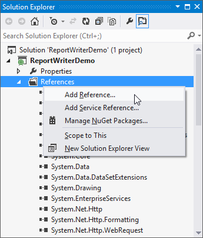

# Getting Started with ASP.NET Application

This section describes how to export the Report Server report as PDF, Word, Excel, PPT and HTML formats in ASP.NET application using ReportWriter.

## Project Creation

This section illustrates how to add ReportWriter to the ASP.NET application. It includes the following steps.

Create a new ASP.NET Empty web application project by selecting the WEB category from the listed project template in Microsoft Visual Studio IDE.

 
   
### Create ASPX Page

To create a new Web Forms in the application.

1. Right-Click on the project and select Add.
 
   

2. Click New Item and select Web Form from the listed templates.

   

### Add References   

1. In the Solution Explorer, Right-click on the References folder and then click Add Reference.

    

2. Add the following assemblies and click OK.
 
   * Syncfusion.Chart.Wpf
   * Syncfusion.Compression.Base
   * Syncfusion.DocIO.Base   
   * Syncfusion.EJ.ReportViewer   
   * Syncfusion.Gauge.Wpf
   * Syncfusion.Linq.Base
   * Syncfusion.Pdf.Base
   * Syncfusion.SfMaps.Wpf
   * Syncfusion.Shared.Wpf
   * Syncfusion.XlsIO.Base  
 
   N> You can get the above assemblies from the installed location %localappdata%\Syncfusion\ReportsSDK\Samples\Common\Assemblies  
 
### Registering Assemblies within the Web.config file  

In your application's root web.config file, add the below assembly information within the &lt;assemblies&gt; tag.

~~~html
<system.web>
    <compilation debug="true" targetFramework="4.5">
        <assemblies>
            <add assembly="Syncfusion.Chart.WPF, Version=14.1400.0.42, Culture=neutral, PublicKeyToken=3d67ed1f87d44c89"/>
            <add assembly="Syncfusion.Compression.Base, Version=14.1400.0.42, Culture=neutral, PublicKeyToken=3d67ed1f87d44c89"/>
            <add assembly="Syncfusion.DocIO.Base, Version=14.1400.0.42, Culture=neutral, PublicKeyToken=3d67ed1f87d44c89"/>
            <add assembly="Syncfusion.EJ.ReportViewer, Version=14.1400.0.42, Culture=neutral, PublicKeyToken=3d67ed1f87d44c89"/>
            <add assembly="Syncfusion.Gauge.WPF, Version=14.1400.0.42, Culture=neutral, PublicKeyToken=3d67ed1f87d44c89"/>
            <add assembly="Syncfusion.Linq.Base, Version=14.1400.0.42, Culture=neutral, PublicKeyToken=3d67ed1f87d44c89"/>
            <add assembly="Syncfusion.Pdf.Base, Version=14.1400.0.42, Culture=neutral, PublicKeyToken=3d67ed1f87d44c89"/>
            <add assembly="Syncfusion.SfMaps.WPF, Version=14.1400.0.42, Culture=neutral, PublicKeyToken=3d67ed1f87d44c89"/>
            <add assembly="Syncfusion.Shared.WPF, Version=14.1400.0.42, Culture=neutral, PublicKeyToken=3d67ed1f87d44c89"/>      
            <add assembly="Syncfusion.XlsIO.Base, Version=14.1400.0.42, Culture=neutral, PublicKeyToken=3d67ed1f87d44c89"/>
        </assemblies>
    </compilation>      
</system.web>
~~~

### Registering namespaces within Web.config

Now you need to register the below mentioned two namespaces in the web.config file present within the Views folder as well as the Root directory of your application.

* Syncfusion.EJ.ReportViewer

~~~html
<namespaces>
    <add namespace="System.Web.Mvc"/>
    <add namespace="System.Web.Mvc.Ajax"/>
    <add namespace="System.Web.Mvc.Html"/>    
    <add namespace="System.Web.Routing"/>
    <add namespace="System.Web.WebPages"/>    
    <add namespace="Syncfusion.EJ.ReportViewer"/>
</namespaces>
~~~

## ReportWriter Initialization  

1. Set the following properties to ReportWriter.   

   * ReportPath - Set the local file system or Report Server path of report.
   
   * ReportProcessingMode - Set ProcessingMode as Remote for RDL and Report Server report also Local for RDLC report.
   
   * WriterFormat - Set WriterFormat as PDF, Excel, Word, PPT and HTML.

2. Initialize ReportWriter by using the following code example in the Default.aspx.cs page export button click event.

   ~~~ csharp
   protected void ExportButton_Click(object sender, EventArgs e)
   {
       try
       {
           string fileName = null;
           WriterFormat format;
           HttpContext httpContext = System.Web.HttpContext.Current;
           ReportWriter reportWriter = new ReportWriter();
           reportWriter.ReportPath = Server.MapPath("~/App_Data/GroupingAgg.rdl");
           reportWriter.ReportProcessingMode = ProcessingMode.Remote;

           if (this.ExportFormat.SelectedValue == "PDF")
           {
               fileName = "GroupingAgg.pdf";
               format = WriterFormat.PDF;
           }
           else if (this.ExportFormat.SelectedValue == "Word")
           {
               fileName = "GroupingAgg.doc";
               format = WriterFormat.Word;
           }
           else if (this.ExportFormat.SelectedValue == "Html")
           {
               fileName = "GroupingAgg.Html";
               format = WriterFormat.HTML;
           }
           else if (this.ExportFormat.SelectedValue == "PPT")
           {
               fileName = "GroupingAgg.ppt";
               format = WriterFormat.PPT;
           }
           else
           {
               fileName = "GroupingAgg.xls";
               format = WriterFormat.Excel;
           }
           reportWriter.Save(fileName, format, httpContext.Response);
       }
       catch { }
   }
   ~~~
   
3. Add the following code example in the &lt;body&gt; tag of the Default.aspx page to view ReportWriter export options.

   ~~~ html
   <body>
       

           

               ReportWriter Demo
           

           

               <form id="form1" runat="server">
                   

                       <h3>Description</h3>
                       
                           Essential Report Writer is a powerful control for exporting RDL files into specified
                           format files.The following are some of the key features of this component: Provides
                           support for various chart types that include Area, Bar, Column, Pie, Funnel, Radar,
                           Line and so on. Provides support for both Matrix and Table and also provides support for
                           both single, and multi-level row groupings and column groupings. Provides support
                           for other common controls such as Textbox, Image, Rectangle, Line and both Circular
                           Linear Gauges. Provides support for report parameter.
                       
                   /div>
                   

                       <h3>Export Report</h3>
                       
                           Choose a file format to view the selected document generated from Report file by using Essential ReportWriter.
                       
                       

                           <asp:Label Style="font-size: large;" runat="server">
                               Save As :
                           </asp:Label>

                           <asp:RadioButtonList RepeatLayout="Flow" ID="ExportFormat" RepeatDirection="Horizontal" runat="server">
                               <asp:ListItem Selected="True">PDF</asp:ListItem>
                               <asp:ListItem>Word</asp:ListItem>
                               <asp:ListItem>Excel</asp:ListItem>
                               <asp:ListItem>Html</asp:ListItem>
                               <asp:ListItem>PPT</asp:ListItem>
                           </asp:RadioButtonList>

                           <asp:Button style="width: 18%; margin-left: 2%;" ID="ExportButton" runat="server" OnClick="ExportButton_Click" Text="Generate" />
                       

                   

               </form>
           

       

   </body>   
   ~~~
   
4. Run the application. The following output displays ReportWriter export options, Select the export option and click on Generate button.

    
   
5. The following output displays exported report in PDF format.

   