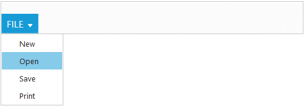
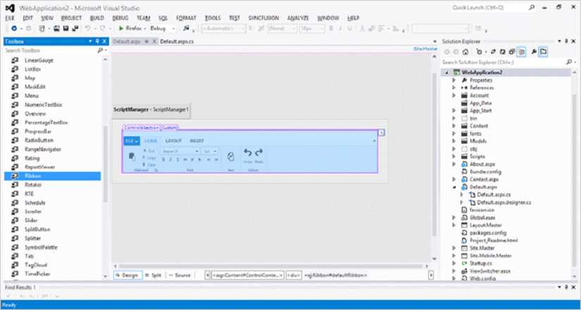
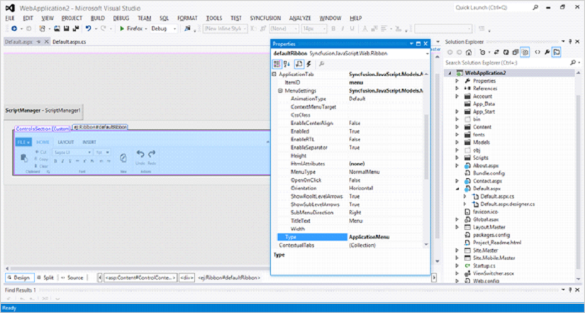

# Getting Started

This section explains briefly how to create a Ribbon.

## Control Initialization

Ribbon can be initialized with `Application Tab` and UL list is needed for binding menu to application menu which can be specified through `MenuItemID` which denotes `Id` of UL.

Define the Application Tab with `Type` as `Menu` to render simple Ribbon control.



    <ej:Ribbon ID="Ribbon" runat="server" Width="100%">
      <ApplicationTab MenuItemID="ribbonmenu" Type="Menu">
          <MenuSettings OpenOnClick="false"></MenuSettings>
      </ApplicationTab>
    </ej:Ribbon>
    <ul id="ribbonmenu">
      <li><a>FILE</a>
          <ul>
              <li><a>New</a></li>
              <li><a>Open</a></li>
              <li><a>Save</a></li>
              <li><a>Print</a></li>
          </ul>
      </li>
    </ul>



N> _Set the required `Width` to Ribbon, else default parent container or window width will be considered_

1. Create a Syncfusion ASP.NET Web form application.

2. Drag and drop the Ribbon control in the Index.aspx page from the toolbox.
 
 
 
  
## Adding Tabs
 
 RibbonTab is a set of related groups which are combined into single item. For creating Tab, `Id ` and `Text` properties should be specified. 
 
 The following screenshot shows designer page of ApplicationTab.
 
 
 
 
 

    <ej:Ribbon ID="Ribbon" runat="server" Width="100%">
        <ApplicationTab MenuItemID="ribbonmenu" Type="Menu">
            <MenuSettings OpenOnClick="false"></MenuSettings>
        </ApplicationTab>
        <RibbonTabs>
            <ej:RibbonTab Id="home" Text="HOME">
            </ej:RibbonTab>
        </RibbonTabs>
    </ej:Ribbon>
    <ul id="ribbonmenu">
        <li><a>FILE</a>
            <ul>
                <li><a>New</a></li>
            </ul>
        </li>
    </ul>


 

## Configuring Groups

List of controls are combined as logical `TabGroupCollection ` into RibbonTab. TabGroup alignment type as “Rows/Columns”, Default is `Rows`. 

Create TabGroup item with `Text` specified and add ContentGroupCollection to ContentGroup with Button control settings.

The following screenshot shows designer page of TabGroupCollection



    <ej:Ribbon ID="Ribbon" runat="server" Width="100%">
        <ApplicationTab MenuItemID="ribbonmenu" Type="Menu">
            <MenuSettings OpenOnClick="false"></MenuSettings>
        </ApplicationTab>
        <RibbonTabs>
            <ej:RibbonTab Id="home1" Text="HOME">
                <TabGroupCollection>
                    <ej:TabGroup Text="New" AlignType="Columns">
                        <ContentCollection>
                            <ej:TabContent>
                                <ContentGroupCollection>
                                    <ej:ContentGroup Id="new1" Text="New" Type="Button">
                                        <ButtonSettings Type="Button" ContentType="ImageOnly" PrefixIcon="e-ribbon e-new" />
                                    </ej:ContentGroup>
                                </ContentGroupCollection>
                            </ej:TabContent>
                        </ContentCollection>
                    </ej:TabGroup>
                </TabGroupCollection>
            </ej:RibbonTab>
        </RibbonTabs>
    </ej:Ribbon>
    <ul id="ribbonmenu">
        <li><a>FILE</a>
            <ul>
                <li><a>New</a></li>
            </ul>
        </li>
    </ul>   



## Adding Controls to Group

Syncfusion ASP.NET Controls can be added to group’s content with corresponding `Type` specified like Button, Split button, Toggle button, Dropdownlist, Gallery, Custom, etc. Default type is `Button`.





        <ej:Ribbon ID="Ribbon" runat="server" Width="100%" AllowResizing="true" Create="createControl">
            <ApplicationTab MenuItemID="ribbonmenu" Type="Menu">
                <MenuSettings OpenOnClick="false"></MenuSettings>
            </ApplicationTab>
            <RibbonTabs>
                <ej:RibbonTab Id="home" Text="HOME">
                    <TabGroupCollection>
                        <ej:TabGroup Text="SplitButton & Dropdown" AlignType="Columns">
                            <ContentCollection>
                                <ej:TabContent>
                                    <ContentDefaults Width="50" Height="75" Type="SplitButton" />
                                    <ContentGroupCollection>
                                        <ej:ContentGroup Id="paste" ToolTip="Paste">
                                            <SplitButtonSettings ButtonMode="Dropdown" ArrowPosition="Bottom" TargetID="pasteul" ContentType="TextAndImage" PrefixIcon="e-ribbon e-ribbonpaste" Click="executeAction" />
                                        </ej:ContentGroup>
                                    </ContentGroupCollection>
                                </ej:TabContent>
                            </ContentCollection>
                            <ContentCollection>
                                <ej:TabContent>
                                    <ContentDefaults Height="28" Type="DropDownList" />
                                    <ContentGroupCollection>
                                        <ej:ContentGroup Id="fontfamily" ToolTip="Font" Type="DropDownList">
                                            <DropdownSettings Text="Segoe UI" Width="150"></DropdownSettings>        
                                        </ej:ContentGroup>
                                    </ContentGroupCollection>
                                </ej:TabContent>
                            </ContentCollection>
                        </ej:TabGroup>
                    </TabGroupCollection>
                </ej:RibbonTab>      
            </RibbonTabs>
        </ej:Ribbon>       
        <ul id="ribbonmenu">
            <li><a>FILE</a>
                <ul>
                    <li><a>New</a></li>
                </ul>
            </li>
        </ul>
        <ul id="pasteul">
            <li><a>Paste</a></li>
        </ul>





    protected void Page_Load(object sender, EventArgs e)
        {
            var fontlist = new List<string> { "Segoe UI", "Arial"};
            var fontsize = new List<string>() { "1pt", "2pt"};
            this.fontfamily.DropdownSettings.DataSource = fontlist;
        }





