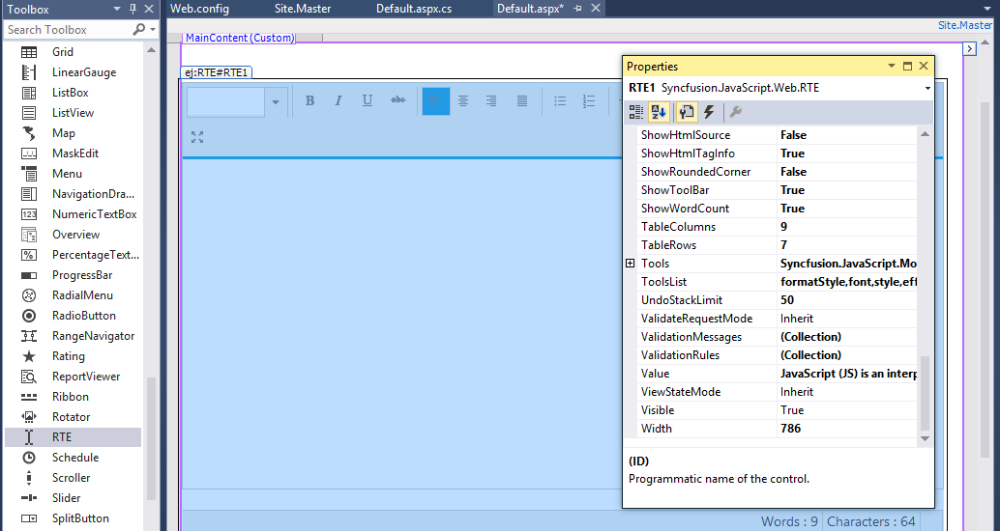

# Getting Started with ASP.NET RichTextEditor

This section explains the step-by-step instructions to create RichTextEditor in an ASP.NET web application.

## Create your First RichTextEditor in ASP.NET

1.	Create an ASP.NET Web Forms application and add RichTextEditor control to the Default.aspx page.

    

2.  Once the control is dragged and dropped into the page,all the dependent scripts and CSS files will be loaded as an embedded resource from Syncfusion.EJ.Web. This will add the following appSetting key in web.config file to load resource files.

    
    <appSettings>
        <add key="LoadEJResourcesFromAssembly" value="true"/>
        <add key="EJResources" value="jsrender:true;jqueryeasing:true;globalize:true;themes:true;"/>
    </appSettings>
    
    
    >Refer the [ASP.NET-Getting Started](http://help.syncfusion.com/aspnet/getting-started#manual-integration-of-syncfusion-aspnet-controls-into-the-newexisting-application) Documentation to know further details about necessary DLL's, Script and CSS files.
        
3.  Customize the RichTextEditor control using properties panel as well as set the value for the RichTextEditor as given below.

    

    Switching from Design view to Source to view the RichTextEditor code.  
    
    
    
    <ej:RTE ID="RTE1" runat="server" ShowFooter="True" Value="JavaScript (JS) is an interpreted computer programming language.">

    </ej:RTE>
    
    

## Toolbar–Configuration

You can configure the toolbar with the tools as your application requires.



<ej:RTE ID="RTE2" runat="server" ToolsList="style,doAction,lists,images,links">
    <RTEContent>
        <ul>
            <li>The Rich Text Editor  (RTE) control is an easy to render in client side. </li>
            <li>Customer easy to edit the contents and get the HTML content for the displayed content. </li>
            <li> A rich text editor control provides users with a toolbar that helps them to apply rich text formats to the text entered  in the text area.</li>
        </ul>       
    </RTEContent>
    <Tools Styles="bold,italic,underline,strikethrough"
        Lists="unorderedList,orderedList"
        DoAction="undo,redo"
        Links="createLink,removeLink"
        Images="image">
    </Tools>
</ej:RTE>
	


 

## Setting and Getting Content

You can set the content of the editor as follows.



<ej:RTE ID="RTE1" runat="server">
    <RTEContent>
        The Rich Text Editor
        (RTE) control is an easy to render in client side. Customer easy to edit the contents
        and get the HTML content for the displayed content. A rich text editor control provides
        users with a toolbar that helps them to apply rich text formats to the text entered
        in the text area.
    </RTEContent>
</ej:RTE>
		


To retrieve the editor contents using Value property,



protected void onClick(object Sender, Syncfusion.JavaScript.Web.ButtonEventArgs e)
{
    var currentValue = RTE1.Value;
}
    


