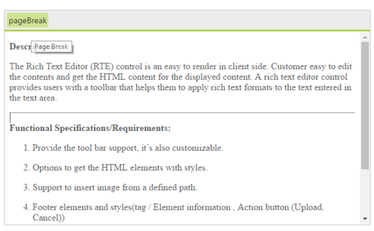

# How to

## Initiate RTE in server side

Create an instance of the RichTextEditor control and set its properties in server side, as shown in the following example:



protected void Page_Load(object sender, EventArgs e)
{
    Syncfusion.JavaScript.Web.RTE rte = new Syncfusion.JavaScript.Web.RTE();
        
    rte.ID = "RTE1";

    rte.Value = "The Essential RichTextEditor is a perfect HTML text editor component for the web that helps to enhance the editing experience. The editor provides powerful features such as file manager, formatting, links, tables, lists, localization, accessibility, and more.";

    List<String> toolsList = new List<string>() { "formatStyle", "font", "style", "effects", "alignment" };

    rte.ToolsList = toolsList;

    List<String> font = new List<string>() { "fontName", "fontSize", "fontColor", "backgroundColor" };
    List<String> style = new List<string>() { "bold", "italic", "underline", "strikethrough" };
    List<String> alignment = new List<string>() { "justifyLeft", "justifyCenter", "justifyRight", "justifyFull" };
    List<String> formatStyle = new List<string>() { "format" };
    List<String> effects = new List<string>() { "superscript", "subscript" };

    rte.Tools.Font = font;
    rte.Tools.FormatStyle = formatStyle;
    rte.Tools.Effects = effects;
    rte.Tools.Alignment = alignment;
    rte.Tools.Styles = style;

    ContentPlaceHolder ctrl = (ContentPlaceHolder)this.Master.FindControl("MainContent");
    ctrl.Controls.Add(rte);
}



## Add the Page Breaker to the RTE’s tools

We don't have support for page break in RTE inbuilt. But this can be achieved in custom tool options in RTE. We have prepared a sample by using line break in RTE.

Initialize the RTE with custom tool in the ToolsList.



<ej:RTE ID="rteSample" AllowEditing="true" Width="100%" ToolsList="customTools" runat="server" MinWidth="200px">
    <RTEContent>
            The Rich Text Editor (RTE) control is an easy to render in
        client side. Customer easy to edit the contents and get the HTML content for
        the displayed content. A rich text editor control provides users with a toolbar
        that helps them to apply rich text formats to the text entered in the text
        area. 
    </RTEContent>
    <Tools>
        <CustomTools>
            <ej:CustomTools Action="pageBreak" Name="pageBreak" Text="pageBreak" Tooltip="Page Break" />
        </CustomTools>
    </Tools>
</ej:RTE>



Upon clicking to the pageBreak button, the corresponding function(“pageBreak”) will be triggered. In that, the “hr” tag will be inserted to the RTE by using “executeCommand” method.





## Render the RTE inside in the Dialog

While rendering RTE control inside Dialog, initially child control RTE will be rendered first, the parent control Dialog is rendered next, after which it will be appended in the document. 



<ej:Dialog ID="Dialog1" ClientSideOnCreate="OnCreate" runat="server">
    <DialogContent>
        <ej:RTE ID="DefaultRTE" runat="server">
            <RTEContent>
                Description:
                The Rich Text Editor (RTE) control is an easy to render in
                client side. Customer easy to edit the contents and get the HTML content for
                the displayed content. A rich text editor control provides users with a toolbar
                that helps them to apply rich text formats to the text entered in the text
                area.
            </RTEContent>
        </ej:RTE>
    </DialogContent>
</ej:Dialog>



In this case, events will not be bounded for RTE control. So we cannot enter text into RTE while rendering RTE inside Dialog. To resolve this, you need to call refresh method of RTE control in the “ClientSideOnCreate” event of Dialog. This refresh method is used to refresh the RTE control and the events are re-bound. Please find the code for same:





