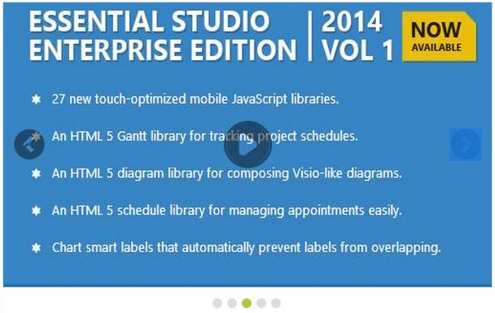

# Getting Started

## Create your first Rotator in ASP.NET

ASP.NET Image Rotator comes with a visual that has a spectacular zoom in and fade out effect. A single line of code invokes the Rotator effect. By using the following guidelines, you can create Rotator control for a real-time website banner. It has five images that slide automatically. When you click the center button, image slides in a rotating manner and on second click the rotation stops.

## Create a Rotator

You can create an ASP.NET Project and add the necessary Dll’s and scripts with the help of the given [ ASP.NET -Getting Started Documentation](http://help.syncfusion.com/ug/js/Documents/gettingstartedwithmv.htm).

Add the following code example to the corresponding ASPX page to render the Rotator. Place the images under the folder/Images/rotator.



    <ej:Rotator ID="RotatorContent" SlideWidth="600px" SlideHeight="350px" ShowPlayButton="true" runat="server">

        <items>

            <ej:rotatoritem url="/images/rotator/EssentialJS.png">

            </ej:rotatoritem>

            <ej:rotatoritem url="/images/rotator/EssentialStudio.png">

            </ej:rotatoritem>

            <ej:rotatoritem url="/images/rotator/EnterpriseEdition.png">

            </ej:rotatoritem>

            <ej:rotatoritem url="/images/rotator/BusinessIntelligence.png">

            </ej:rotatoritem>

            <ej:rotatoritem url="/images/rotator/WinRT.png">

            </ej:rotatoritem>

        </items>

    </ej:Rotator>



  Add the following styles to the corresponding view page.

.frame {

        width: 600px;

    }

    #RotatorContent > li img {

        width: 610px;

    }

  The following banner is displayed as output.

{  | markdownify }
{:.image }

