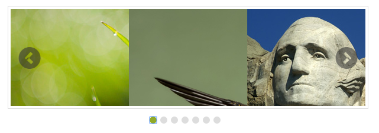
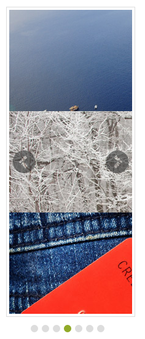

## Orientation

The Rotator control supports both vertical and horizontal orientations, allowing it to fit into any scenario. The Rotator property, Orientation, defines the orientation where the control is rendered. The value set to this property is enum or string type. It accepts the following values.

•ej.Orientation.Horizontal or “Horizontal”

•ej.Orientation.Vertical  or “Vertical”

The following steps explain how to set orientation for the Rotator.

### Horizontal

This property sets the Rotator in the horizontalorientation. You can refer to the following steps to set horizontalorientation for Rotator control.

In an ASPX page, add the following code example and set the Orientation property as Horizontal.

<ej:Rotator ID="sliderContent" SlideWidth="200px"

                FrameSpace="0px"

                DisplayItemCount="3"

                SlideHeight="165px"

                PagerPosition="Outside"

                ShowThumbnail="false"

                Orientation="Horizontal"

                ShowPager="true"

                runat="server">

                &lt;Items&gt;

                    &lt;ej:RotatorItem Caption="Nature" Url="../images/rotator/nature.jpg"&gt;&lt;/ej:RotatorItem&gt;

                &lt;/Items&gt;

                &lt;Items&gt;

                    &lt;ej:RotatorItem Caption="Beautiful Bird" Url="../images/rotator/bird.jpg"&gt;&lt;/ej:RotatorItem&gt;

                &lt;/Items&gt;

                &lt;Items&gt;

                    &lt;ej:RotatorItem Caption="Amazing Sculptures" Url="../images/rotator/sculpture.jpg"&gt;&lt;/ej:RotatorItem&gt;

                &lt;/Items&gt;

                &lt;Items&gt;

                    &lt;ej:RotatorItem Caption="Sea-View" Url="../images/rotator/seaview.jpg"&gt;&lt;/ej:RotatorItem&gt;

                &lt;/Items&gt;

                &lt;Items&gt;

                    &lt;ej:RotatorItem Caption="Snow Fall" Url="../images/rotator/snowfall.jpg"&gt;&lt;/ej:RotatorItem&gt;

                &lt;/Items&gt;

                &lt;Items&gt;

            &lt;/ej:Rotator&gt;

The following screenshot displays the output of the above code example.

{  | markdownify }
{:.image }

### Vertical

This property sets the Rotator in verticalorientation. You can refer to the following steps to set the verticalorientation for  Rotator control.

In an ASPX page, add the following code example and set the Orientation property as Vertical.



<ej:Rotator ID="sliderContent" SlideWidth="200px"

                FrameSpace="0px"

                DisplayItemCount="3"

                SlideHeight="165px"

                PagerPosition="Outside"

 Orientation="Horizontal"

                runat="server">

                <Items>

                    <ej:RotatorItem Caption="Nature" Url="../images/rotator/nature.jpg"></ej:RotatorItem>

                </Items>

                <Items>

                    <ej:RotatorItem Caption="Beautiful Bird" Url="../images/rotator/bird.jpg"></ej:RotatorItem>

                </Items>

                <Items>

                    <ej:RotatorItem Caption="Amazing Sculptures" Url="../images/rotator/sculpture.jpg"></ej:RotatorItem>

                </Items>

                <Items>

                    <ej:RotatorItem Caption="Sea-View" Url="../images/rotator/seaview.jpg"></ej:RotatorItem>

                </Items>

                <Items>

                    <ej:RotatorItem Caption="Snow Fall" Url="../images/rotator/snowfall.jpg"></ej:RotatorItem>

                </Items>

                <Items>

            </ej:Rotator>



The following screenshot displays the output of the above code example.

{  | markdownify }
{:.image }

