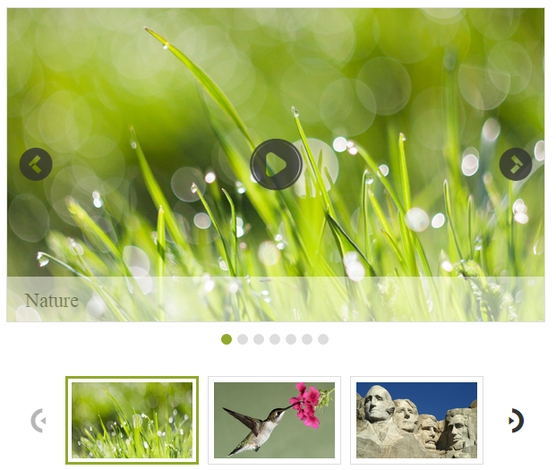

# Thumbnail

This feature implements the Thumbnail in the Rotator control. You can view or access any of the Rotator items instantly. All the images are given as Thumb Element to use this feature.

The property, ShowThumbnail, turns on or off the thumbnail support of the Rotator control. Thumbnail is used to navigate between slides. Thumbnail supports only single slide transition. You must specify the source for thumbnail elements through the ThumbnailSourceID property. The default value is false. The value set to this property is Boolean.

The property, ThumbnailSourceID, specifies the source for thumbnail elements. The default value is null. The value set to this property is object.

You can refer the following code example of Thumbnail in the Rotator.

In an ASPX page, add the following code example to render the Rotator control.



<ej:Rotator ID="sliderContent" runat="server"

        SlideWidth="600px"

        FrameSpace="0px"

        DisplayItemCount="1"

        SlideHeight="350px"

        NavigateSteps="1"

        EnableResize="false"

        ShowPager="true"

        Enabled="true"

        ShowCaption="true"

        ShowPlayButton="true"

        ShowThumbnail="true"

        thumbnailSourceID="thumbContent">

        <Items>

            <ej:RotatorItem Caption="Nature" Url="../images/rotator/nature.jpg"></ej:RotatorItem>

            <ej:RotatorItem Caption="Beautiful Bird" Url="../images/rotator/bird.jpg"></ej:RotatorItem>

            <ej:RotatorItem Caption="Amazing Sculptures" Url="../images/rotator/sculpture.jpg"></ej:RotatorItem>

            <ej:RotatorItem Caption="Sea-View" Url="../images/rotator/seaview.jpg"></ej:RotatorItem>

            <ej:RotatorItem Caption="Snow Fall" Url="../images/rotator/snowfall.jpg"></ej:RotatorItem>

            <ej:RotatorItem Caption="Credit Card" Url="../images/rotator/card.jpg"></ej:RotatorItem>

            <ej:RotatorItem Caption="Colorful Night" Url="../images/rotator/night.jpg"></ej:RotatorItem>

        </Items>

        <ThumbItems>

            <ej:ThumbItem Caption="Nature" Url="../images/rotator/nature.jpg"></ej:ThumbItem>

            <ej:ThumbItem Caption="Beautiful Bird" Url="../images/rotator/bird.jpg"></ej:ThumbItem>

            <ej:ThumbItem Caption="Amazing Sculptures" Url="../images/rotator/sculpture.jpg"></ej:ThumbItem>

            <ej:ThumbItem Caption="Sea-View" Url="../images/rotator/seaview.jpg"></ej:ThumbItem>

            <ej:ThumbItem Caption="Snow Fall" Url="../images/rotator/snowfall.jpg"></ej:ThumbItem>

            <ej:ThumbItem Caption="Credit Card" Url="../images/rotator/card.jpg"></ej:ThumbItem>

            <ej:ThumbItem Caption="Colorful Night" Url="../images/rotator/night.jpg"></ej:ThumbItem>

        </ThumbItems>

    </ej:Rotator>



Define the style for the Rotator control.



        #<%=sliderContent.ClientID%> > li .image {

            width: 600px;

            height: 350px;

        }



The following screenshot displays the output of the above code example.

