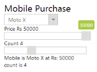
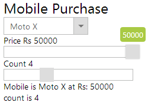
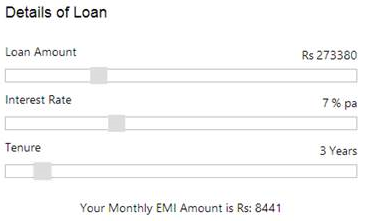

# Getting Started

## Create your first Slider in ASP.NET

ASP.NET Slider control provides support to display a Slider within the web page. Here, you can learn how to use Sliders in a real-time application. The following example illustrates you how to use the Slider control to select mobile model within the specified price range in a Mobile Purchase Application.

The following screenshot demonstrates the functionality of Slider control. By selecting mobile model in the dropdown, you can purchase a mobile at any rate specified in the MobilePriceSlider. In addition, you can also specify the number of mobiles required by using the MobileCountSlider. Simultaneously, you can observe the changes in the Mobile Price and Count by using Sliders.

 

## Create a Slider

ASP.NET Slider control allows you to switch between different ranges of input. The basic Slider is in horizontal position and has a single handle that is moved by the mouse or the arrow keys.

You can create an ASP.NET Project and add necessary Dll’s and scripts with the help of the given [ASP.NET -Getting Started](http://help.syncfusion.com/aspnetmvc/captcha/getting-started#create-your-first-captcha-in-aspnet-mvc) Documentation.

Add the following code example to the corresponding ASPX page to render Slider control.



    

        Mobile Purchase

        <ej:DropDownList ID="SelectMobile" runat="server" SelectedItemIndex="0">

            <items>

                <ej:dropdownlistitem text="Nokia Lumia" value="Nokia Lumia">

                </ej:dropdownlistitem>

                <ej:dropdownlistitem text="Nokia Asha" value="Nokia Asha">

                </ej:dropdownlistitem>

                <ej:dropdownlistitem text="Xolo" value="Xolo">

                </ej:dropdownlistitem>

                <ej:dropdownlistitem text="Samsung Galaxy" value="Samsung Galaxy">

                </ej:dropdownlistitem>

                <ej:dropdownlistitem text="Moto X" value="Moto X">

                </ej:dropdownlistitem>

            </items>

        </ej:DropDownList>

        Price 

            Rs 

            

        

        <ej:Slider ID="RateSlider" Height="20px" ClientSideOnChange="onChange" Value="5500"

                   MinValue="5000" MaxValue="50000" IncrementStep="20" runat="server">

        </ej:Slider>

        Count <spanclass ="value">

        

        <ej:Slider ID="CountSlider" ClientSideOnChange="onChange" Height="20px" Value="1"

                   MinValue="1" MaxValue="10" IncrementStep="1" runat="server">

        </ej:Slider>

        Mobile is

    



Add the following styles for Sliders.



.frame

{

	width: 320px;

	height: 290px;

	border: 1px solid black;

	margin-right: 100px;

	font-family: Segoe UI;

	font-size: 14px;

	border-radius: 10px;

}

.header

{

	font-size: x-large;

}

.ctrllabel, .loan

{

	font-weight: bold;

}

.inner

{

	width: 219px;

	height: 174px;

	padding: 55px 40px 20px 50px;

}

.mobileList

{

	display: block;

}



Add the following script to the Slider.



var mobileObj, rateObj, countObj;

function onChange(args) {

	$('#' + args.id).parent().prev().find('.value').html(args.value)

	show();

}

function show() {

	selectObj = $('#SelectMobile').data('ejDropDownList');

	rateObj = $('#RateSlider').data('ejSlider');

	countObj = $('#CountSlider').data('ejSlider');

	var x = selectObj.getValue();

	var y = rateObj.getValue();

	var z = countObj.getValue();

	$('#EventLog').html("\n" + x + "\n" + "at Rs: " + y + "\n" + "count is " + z);

}



The following screenshot illustrates the final output in the Slider creation.

 

## Create EMI Calculator

Based on the loan amount, interest rate and tenure, you can calculate EMI amount by using the Slider.

Add the following code for Slider to the corresponding ASPX page.



    

        

            Details of Loan

        

        Loan Amount <spanclass ="columnright">

            

                Rs

            

            <ej:Slider ID="LoanSlider" ClientSideOnChange="onChange" Height="16px" Value="292620"

                       MinValue="10000" MaxValue="1000000" IncrementStep="10" runat="server">

            </ej:Slider>

            Interest Rate <spanclass ="columnright">

                % pa 

                <ej:Slider ID="InterestSlider" ClientSideOnChange="onChange" Height="16px" Value="9"

                           MinValue="1" MaxValue="20" IncrementStep="1" runat="server">

                </ej:Slider>

                Tenure <spanclass ="columnright">

                    Years 

                    <ej:Slider ID="TenureSlider" ClientSideOnChange="onChange" Height="16px" Value="10"

                               MinValue="1" MaxValue="20" IncrementStep="1" runat="server">

                    </ej:Slider>

                    Your Monthly EMI Amount is 

    



Include the following styles for Slider.



.inner

{

	width: 413px;

	height: 174px;

	padding: 55px 40px 20px 50px;

}

.frame

{

	width: 520px;

	height: 349px;

	border: 1px solid black;

	margin-right: 100px;

	font-family: Segoe UI;

	font-size: 14px;

	border-radius: 10px;

}

.loan, .interest, .tenure

{

	margin-top: 5px;

	font-weight: 400;

}

.value

{

	float: right;

	position: relative;

	width: auto;

	padding-left: 3px;

}           

#result

{

	margin-top: 25px;

	text-align: center;

	font-weight: 600;

}

.frame .e-slider-wrap

{

	display: block;

	margin-top: 40px;

}

.columnleft

{

	width: 35%;

	float: left;

	font-weight: 400;

	margin-top: 10px;

}

.columnright

{

	width: 17%;

	float: right;

	font-weight: 600;

	margin-top: 14px;

}

#loanheading

{

	font-family: 'Arial' , Gadget, sans-serif;

	font-size: 18px;

	padding-bottom: 15px;

}



Include the following Script to calculate the EMI amount.



var loanObj, interestObj, tenureObj;

function onChange(args) {

	$('#' + args.id).parent().prev().find('.value').html(args.value)

	calculate();

}

function calculate() {

	loanObj = $('#LoanSlider').data('ejSlider');

	interestObj = $('#InterestSlider').data('ejSlider');

	tenureObj = $('#TenureSlider').data('ejSlider');

	var loan = loanObj.getValue(), interest = interestObj.getValue(), tenure = tenureObj.getValue();

	var P = loan;

	var y = interest / 1200;

	var tenureamt = tenure * 12;

	//actual processing

	var top = y * (Math.pow((1 + y), tenureamt));

	var bottom = (Math.pow((1 + y), tenureamt)) - 1;

	var ans = top / bottom;

	var final = P * ans;

	var z = Math.round(final);

	$('#EventLog').html("Rs: " + z);

}



 The following screenshot displays the calculated EMI amount by using Slider.

 

