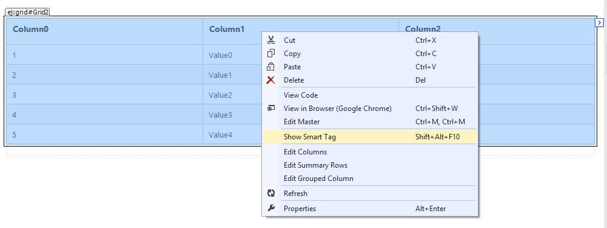

# Design Time Support

Syncfusion ASP.NET component provides the rich design-time support for controls in the .NET development environment. Developers can drag server controls from the Visual studio .NET toolbox onto a page, access their properties through the Properties window.

## Smart tag

The Smart Tag facility added to the controls will have an extra benefit to the developers. They could customize the controls according to their needs in different forms in the project during design-time by setting various properties and behaviors. 

### Smart Tag of DropDownList

The DropDownList Smart Tag allows easy access to frequently needed tasks. You can display the Smart Tag by right clicking on a DropDownList control in the design window, and choosing Show Smart Tag.

### Smart tag of unbound DropDownList

When DropDownList is unbound, the Smart Tag looks like the following:

#### DropDownList Tasks

•	<kbd> Choose Data Source </kbd> lets you bind DropDownList declaratively by selecting a data source from a drop-down list of all available data source components. If you select <New Data Source...> the standard Windows Data Source Configuration Wizard appears, where you can create and configure a data source component.

•	<kbd> Edit items </kbd> opens the DropDownListItems Collection Editor, where you can add static items to the DropDownList and set their properties.

##### Edit items

The DropDownList Edit items Builder lets you define items inline (in the aspx page).

You can add, edit, delete items as follows

<table>
    <tr>
        <th>
            Button
             
        </th>
        <th>
            Description
             
        </th>
    </tr>
    <tr>
        <td>
            Add
        </td>
        <td>
            Click the Add button to append a DropDownListItem to the list.
        </td>
    </tr>
    <tr>
        <td>
            Remove
        </td>
        <td>
            Select an item and click the Remove button to delete it from the list.
        </td>
    </tr>
    <tr>
        <td>
            Navigation Buttons
        </td>
        <td>
            Use the up and down arrow buttons to navigate to the items of DropDownList
        </td>
    </tr>
    <tr>
        <td>
            Properties
        </td>
        <td>
            Select individual items to change their properties using the property pane on the right of the DropDownList Edit Item builder. Use the sorting controls above the property paneto sort the properties by category or alphabetically.
        </td>
    </tr>
</table>

### Smart Tag of bound DropDownList

When DropDownList is bound to a data source, the Smart Tag looks like the following:

Using the Smart Tag of bound DropDownList lets you perform any task you can perform with the Smart Tag of unbound DropDownList. In addition, you can choose Configure Data Source... to open the standard [Data Source Configuration](http://msdn2.microsoft.com/en-us/library/ms247282(VS.80).aspx) Wizard where you can configure the currently bound data source component.