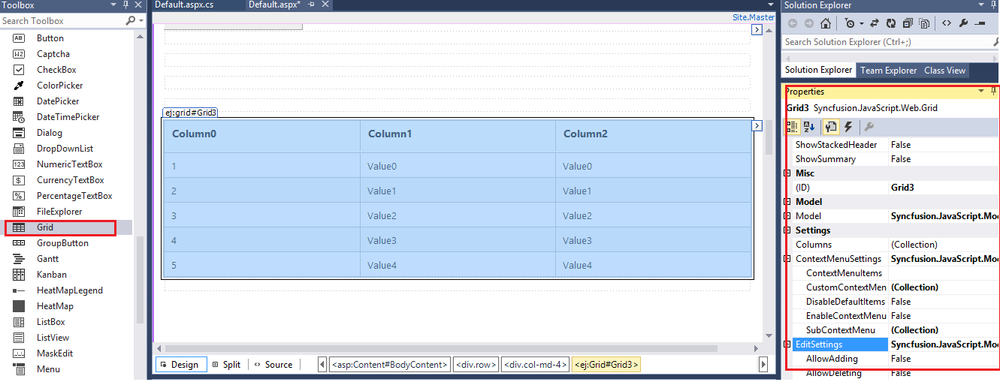
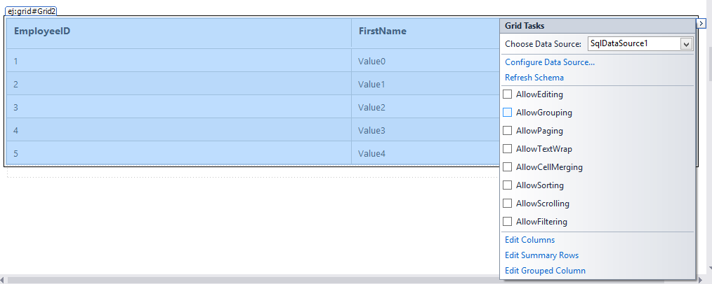

# Design Time Support

Syncfusion ASP.NET component provides the rich design-time support for controls in the .NET development environment. Developers can drag server controls from the Visual Studio .NET toolbox into a page, and access their properties through the Properties window.

## Smart Tag

The Smart Tag facility added to the controls will have an extra benefit to the developers. They can customize the controls according to their needs in different forms in the project during design-time by setting various properties and behaviors.

### Smart Tag of Grid

The Grid Smart Tag allows easy access to frequently needed tasks. To display the Smart Tag, right-click the Grid control in the design window, and choose the Show Smart Tag.

### Smart Tag of unbound Grid

The Smart Tag looks like the following, When the Grid is unbound.

#### Grid Tasks

•	<kbd> Choose Data Source </kbd> drop-down lets you to bind the grid to a declarative data source. You can select from the existing data source components on the Web page, or create and configure a new one.

•   <kbd> The Configure Data Source </kbd> link launches the Configure Data Source wizard for the current data source. This link does not appear in the Smart Tag unless the grid is bound to a declarative data source.

•   <kbd> The Refresh schema </kbd> link refreshes the schema for the data source to which the grid is bound. This link does not appear in the Smart Tag unless the grid is bound to a declarative data source.

•	<kbd> Edit columns </kbd> opens the Columns Collection Editor, where you can edit the Columns and set their properties.

#### General Features

* AllowTextWrap check box sets the AllowTextWrap property of the Grid control. It specifies whether the Content will wrap to the next line if the content exceeds the boundary of the Column Cells.

* AllowScrolling check box sets the AllowScrolling property of the Grid control. It specifies whether to enable the scrollbar in the grid and view the records by scroll through the grid manually.

* AllowPaging check box sets the AllowPaging property of the Grid control. It specifies the grid to show the paginated data and also enables pager control at the bottom of grid for dynamic navigation through data source. Paging can be further customized through “PageSettings” property.

* AllowSorting check box sets the AllowSorting property of the Grid control. It specifies whether to enable the dynamic sorting behavior on grid data. Sorting can be done by clicking the particular column header.

* AllowFiltering check box sets the AllowFiltering property of the Grid control. It specifies whether to enable dynamic filtering behavior on grid. Filtering can be used to limit the records displayed using required criteria and this can be further customized through “FilterSettings” property.

* AllowGrouping check box sets the AllowGrouping property of the Grid control. It specifies whether to enable dynamic grouping behavior. Grouping can be done by drag and drop desired columns to grid’s GroupDropArea. It can be further customized through “GroupSettings” property.

* AllowCellMerging check box sets the AllowCellMerging property of the Grid control. It specifies whether to customizing cell based on our needs.

* AllowEditing check box sets the AllowEditing property of the Grid control. Edit the action either by double clicking the particular row, or by selecting the required row and click the Edit icon in the toolbar.

### Smart Tag of bound Grid

The Smart Tag looks like the following, when the Grid is bound to a data source.

Using the Smart Tag of bound Grid helps you to perform any task you can perform with the Smart Tag of unbound Grid. In addition, you can choose Configure Data Source to open the standard [Data Source Configuration](http://msdn2.microsoft.com/en-us/library/ms247282(VS.80).aspx) Wizard where you can configure the currently bound data source component.