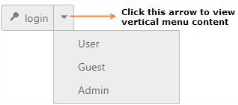
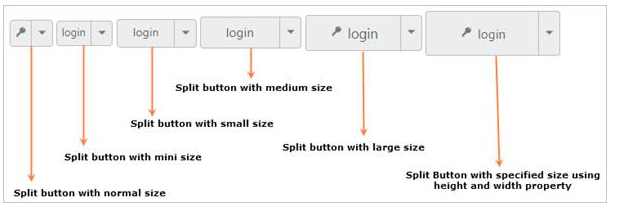

# Easy customization

Split Button is used in many applications. Split Button Size, Content and content location are varied according to each application. The following sections describe you some customizable options for the Split Button.

## Content for Split button 

The Items tag is a mandatory one. Without this field, Split Button acts as normal button on two sides. This is used to specify the list of contents for the Split Button. The list of contents is rendered as a vertical menu list. This vertical menu list is opened, when you click on the down arrow of the Split Button.

The following steps explain the details about rendering the Split Button with content.

In an ASPX page, define the Split Button control and add the contents for the Split Button correspondingly.



<ej:SplitButton ID="SplitButton_Text" runat="server" Text="login" ShowRoundedCorner="true" Size="Small" ContentType="TextAndImage" PrefixIcon="e-login e-uiLight">

        <Items>

            <ej:SplitItem Text="User"></ej:SplitItem>

            <ej:SplitItem Text="Guest"></ej:SplitItem>

            <ej:SplitItem Text="Admin"></ej:SplitItem>

        </Items>

</ej:SplitButton>



The following screenshot displays the output of the above code example.

 

## Button Size

You can render the Split Button in different sizes. The following table contains some predefined size options for rendering a Split Button in an easiest way. Each size option has different heights and widths. Mainly it avoids the complexity in rendering Split Button with complex CSS class.

<table>
<tr>
<td>
normal</td><td>
Creates the Split Button with content size.</td></tr>
<tr>
<td>
mini</td><td>
Creates the Split Button with in-built mini size height and width specified.</td></tr>
<tr>
<td>
small</td><td>
Creates the Split Button with in-built small size height and width specified.</td></tr>
<tr>
<td>
medium</td><td>
Creates the Split Button with inbuilt medium size height and width specified.</td></tr>
<tr>
<td>
Large</td><td>
Creates the Split Button with inbuilt large size height and width specified.</td></tr>
</table>

Apart from the above mentioned predefined size options, you can set your own width and height for the Split Button by using Height and Width properties.

The following steps explain the details about rendering the Split Button with above mentioned size options.

In an ASPX page, define the Split Button control and set the different size types.



<table>

        <tr>

            <td>

                <ej:SplitButton ID="ButtonSizeNormal" runat="server" Text="login" Size="Normal" ShowRoundedCorner="true" ContentType="ImageOnly" PrefixIcon="e-uiLight e-login" Height="27">

                    <Items>

                        <ej:SplitItem Text="User"></ej:SplitItem>

                        <ej:SplitItem Text="Guest"></ej:SplitItem>

                        <ej:SplitItem Text="Admin"></ej:SplitItem>

                    </Items>

                </ej:SplitButton>

            </td>

            <td>

                <ej:SplitButton ID="ButtonSizeMini" runat="server" Text="login" Size="Mini" ShowRoundedCorner="true">

                    <Items>

                        <ej:SplitItem Text="User"></ej:SplitItem>

                        <ej:SplitItem Text="Guest"></ej:SplitItem>

                        <ej:SplitItem Text="Admin"></ej:SplitItem>

                    </Items>

                </ej:SplitButton>

            </td>

            <td>

                <ej:SplitButton ID="ButtonSizeSmall" runat="server" Text="login" Size="Small" ShowRoundedCorner="true">

                    <Items>

                        <ej:SplitItem Text="User"></ej:SplitItem>

                        <ej:SplitItem Text="Guest"></ej:SplitItem>

                        <ej:SplitItem Text="Admin"></ej:SplitItem>

                    </Items>

                </ej:SplitButton>

            </td>

            <td>

                <ej:SplitButton ID="ButtonSizeMedium" runat="server" Text="login" Size="Medium" ShowRoundedCorner="true">

                    <Items>

                        <ej:SplitItem Text="User"></ej:SplitItem>

                        <ej:SplitItem Text="Guest"></ej:SplitItem>

                        <ej:SplitItem Text="Admin"></ej:SplitItem>

                    </Items>

                </ej:SplitButton>

            </td>

            <td>

                <ej:SplitButton ID="ButtonSizeLarge" runat="server" Text="login" Size="Large" ShowRoundedCorner="true" ContentType="TextAndImage" PrefixIcon="e-login e-uiLight">

                    <Items>

                        <ej:SplitItem Text="User"></ej:SplitItem>

                        <ej:SplitItem Text="Guest"></ej:SplitItem>

                        <ej:SplitItem Text="Admin"></ej:SplitItem>

                    </Items>

                </ej:SplitButton>

            </td>

            <td>

                <ej:SplitButton ID="CustomSizeButton" runat="server" Text="login" ShowRoundedCorner="true" ContentType="TextAndImage" PrefixIcon="e-login e-uiLight" Height="50" Width="150">

                    <Items>

                        <ej:SplitItem Text="User"></ej:SplitItem>

                        <ej:SplitItem Text="Guest"></ej:SplitItem>

                        <ej:SplitItem Text="Admin"></ej:SplitItem>

                    </Items>

                </ej:SplitButton>

            </td>

        </tr>

</table>



The following screenshot displays the output of the above code example.

 

## Content Type

The content of the Split Button is mainly rendered as text and images. Instead of using the complex CSS classes to render the Split Button with different content types, you can use some predefined content type options listed in the following table. By using this content types, you can easily add different types of content for the Split Button. Split Button supports the following content types.

<table>
<tr>
<td>
Textonly</td><td>
Supports the text content only.</td></tr>
<tr>
<td>
Imageonly</td><td>
Supports the image content only</td></tr>
<tr>
<td>
Imageboth</td><td>
Supports image for both ends of the button.</td></tr>
<tr>
<td>
Textandimage</td><td>
Supports image with the text content.</td></tr>
<tr>
<td>
Imagetextimage</td><td>
Supports image for both ends and middle in the text.</td></tr>
</table>

## Prefix and Suffix icons

Icons inside the Split Button are added easily by using the PrefixIcon and SuffixIcon properties. Location of the icon in the Split Button is a necessary thing. You can customize the location of Icon easily by using the following mentioned options.

Split Button control also supports the build-in icon libraries. The ej.widgets.core.min CSS contains definitions for important icons that are used in the Split Buttons. You can use these build-in icons by mentioning the icon class name as value in the PrefixIcon and SuffixIcon properties. You can use any font icon defined in the ej.widgets.core.min CSS. It avoids the complexity in specifying the icon by using the sprite image and CSS.

For example, the following build-in CSS class is used to display the font icons used by media player.

* e-mediaback
* e-mediaforward
* e-medianext
* e-mediaprev
* e-mediaeject
* e-mediaclose
* e-mediapause
* e-mediaplay

### Prefix Icon

It inserts the icon at the starting position of the Split Button. After this prefix icon, you can use text or suffix icon.

### Suffix Icon

It inserts the icon at the ending position of the Split Button. Before this suffix icon, you can use text or prefix icon.

The following steps explain the details on rendering the Split Button with above mentioned content type, prefix and suffix icon options

In an ASPX page, define the Split Button control. Set the different content types and use the necessary build-in icons.



<table>

        <tr>

            <td>

                <ej:SplitButton ID="Content_ImageOnly" runat="server" Text="login" Size="Medium" ShowRoundedCorner="true" ContentType="ImageOnly" PrefixIcon="e-uiLight e-handup">

                    <Items>

                        <ej:SplitItem Text="User"></ej:SplitItem>

                        <ej:SplitItem Text="Guest"></ej:SplitItem>

                        <ej:SplitItem Text="Admin"></ej:SplitItem>

                    </Items>

                </ej:SplitButton>

            </td>

            <td>

                <ej:SplitButton ID="Content_TextOnly" runat="server" Text="login" Size="Medium" ShowRoundedCorner="true">

                    <Items>

                        <ej:SplitItem Text="User"></ej:SplitItem>

                        <ej:SplitItem Text="Guest"></ej:SplitItem>

                        <ej:SplitItem Text="Admin"></ej:SplitItem>

                    </Items>

                </ej:SplitButton>

            </td>

            <td>

                <ej:SplitButton ID="Content_ImagesBoth" runat="server" Text="login" Size="Medium" ShowRoundedCorner="true" ContentType="ImageBoth" PrefixIcon="e-handup e-uiLight" SuffixIcon="e-palette  e-uiLight">

                    <Items>

                        <ej:SplitItem Text="User"></ej:SplitItem>

                        <ej:SplitItem Text="Guest"></ej:SplitItem>

                        <ej:SplitItem Text="Admin"></ej:SplitItem>

                    </Items>

                </ej:SplitButton>

            </td>

            <td>

                <ej:SplitButton ID="Content_TextAndImage" runat="server" Text="login" Size="Medium" ShowRoundedCorner="true" ContentType="TextAndImage" PrefixIcon="e-handup e-uiLight">

                    <Items>

                        <ej:SplitItem Text="User"></ej:SplitItem>

                        <ej:SplitItem Text="Guest"></ej:SplitItem>

                        <ej:SplitItem Text="Admin"></ej:SplitItem>

                    </Items>

                </ej:SplitButton>

            </td>

            <td>

                <ej:SplitButton ID="Content_ImageTextImage" runat="server" Text="login" Size="Medium" ShowRoundedCorner="true" ContentType="ImageTextImage" PrefixIcon="e-handup e-uiLight" SuffixIcon="e-palette e-uiLight">

                    <Items>

                        <ej:SplitItem Text="User"></ej:SplitItem>

                        <ej:SplitItem Text="Guest"></ej:SplitItem>

                        <ej:SplitItem Text="Admin"></ej:SplitItem>

                    </Items>

                </ej:SplitButton>

            </td>

        </tr>

</table>



The following screenshot displays the output of the above code example.

  

## Image Position

To provide the best look and feel for the Split Button, position of images in the Split Button is important. By using ImagePosition property, you can easily customize the position of images inside the Split Button without by using any complex CSS. ImagePosition property is applicable only with the textandimage content type property. This property represents the position of images with respect to text.

<table>
<tr>
<td>
Imageleft</td><td>
Support for aligning text in the right and image in the left.</td></tr>
<tr>
<td>
Imageright</td><td>
Support for aligning text in the left and image in the right.</td></tr>
<tr>
<td>
Imagetop</td><td>
Support for aligning text at the bottom and image at the top.</td></tr>
<tr>
<td>
Imagebottom</td><td>
Support for aligning text at the top and image at the bottom.</td></tr>
</table>

The following steps explain the details on rendering the Split Button with above mentioned image position options.

In an ASPX page, define the Split Button control. Set the different image position.



<table>

        <tr>

            <td>

                <ej:SplitButton ID="NormalSptButton_ImageLeft" runat="server" Text="login" ShowRoundedCorner="true" ContentType="TextAndImage" PrefixIcon="e-handup e-uiLight" ImagePosition="ImageLeft">

                    <Items>

                        <ej:SplitItem Text="User"></ej:SplitItem>

                        <ej:SplitItem Text="Guest"></ej:SplitItem>

                        <ej:SplitItem Text="Admin"></ej:SplitItem>

                    </Items>

                </ej:SplitButton>

            </td>

            <td>

                <ej:SplitButton ID="SmallSptButton_ImageLeft" runat="server" Text="login" Size="Small" ShowRoundedCorner="true" ContentType="TextAndImage" PrefixIcon="e-handup e-uiLight" ImagePosition="ImageLeft">

                    <Items>

                        <ej:SplitItem Text="User"></ej:SplitItem>

                        <ej:SplitItem Text="Guest"></ej:SplitItem>

                        <ej:SplitItem Text="Admin"></ej:SplitItem>

                    </Items>

                </ej:SplitButton>

            </td>

            <td>

                <ej:SplitButton ID="MediumSptButton_ImageLeft" runat="server" Text="login" Size="Medium" ShowRoundedCorner="true" ContentType="TextAndImage" PrefixIcon="e-handup e-uiLight" ImagePosition="ImageLeft">

                    <Items>

                        <ej:SplitItem Text="User"></ej:SplitItem>

                        <ej:SplitItem Text="Guest"></ej:SplitItem>

                        <ej:SplitItem Text="Admin"></ej:SplitItem>

                    </Items>

                </ej:SplitButton>

            </td>

            <td>

                <ej:SplitButton ID="LargeSptButton_ImageLeft" runat="server" Text="login" Size="Large" ShowRoundedCorner="true" ContentType="TextAndImage" PrefixIcon="e-handup e-uiLight" ImagePosition="ImageLeft">

                    <Items>

                        <ej:SplitItem Text="User"></ej:SplitItem>

                        <ej:SplitItem Text="Guest"></ej:SplitItem>

                        <ej:SplitItem Text="Admin"></ej:SplitItem>

                    </Items>

                </ej:SplitButton>

            </td>

        </tr>

</table>

 

<table>

        <tr>

            <td>

                <ej:SplitButton ID="NormalSptButton_ImageRight" runat="server" Text="login" ShowRoundedCorner="true" ContentType="TextAndImage" PrefixIcon="e-handup e-uiLight" ImagePosition="ImageRight">

                    <Items>

                        <ej:SplitItem Text="User"></ej:SplitItem>

                        <ej:SplitItem Text="Guest"></ej:SplitItem>

                        <ej:SplitItem Text="Admin"></ej:SplitItem>

                    </Items>

                </ej:SplitButton>

            </td>

            <td>

                <ej:SplitButton ID="SmallSptButton_ImageRight" runat="server" Text="login" Size="Small" ShowRoundedCorner="true" ContentType="TextAndImage" PrefixIcon="e-handup e-uiLight" ImagePosition="ImageRight">

                    <Items>

                        <ej:SplitItem Text="User"></ej:SplitItem>

                        <ej:SplitItem Text="Guest"></ej:SplitItem>

                        <ej:SplitItem Text="Admin"></ej:SplitItem>

                    </Items>

                </ej:SplitButton>

            </td>

            <td>

                <ej:SplitButton ID="MediumSptButton_ImageRight" runat="server" Text="login" Size="Medium" ShowRoundedCorner="true" ContentType="TextAndImage" PrefixIcon="e-handup e-uiLight" ImagePosition="ImageRight">

                    <Items>

                        <ej:SplitItem Text="User"></ej:SplitItem>

                        <ej:SplitItem Text="Guest"></ej:SplitItem>

                        <ej:SplitItem Text="Admin"></ej:SplitItem>

                    </Items>

                </ej:SplitButton>

            </td>

            <td>

                <ej:SplitButton ID="LargeSptButton_ImageRight" runat="server" Text="login" Size="Large" ShowRoundedCorner="true" ContentType="TextAndImage" PrefixIcon="e-handup e-uiLight" ImagePosition="ImageRight">

                    <Items>

                        <ej:SplitItem Text="User"></ej:SplitItem>

                        <ej:SplitItem Text="Guest"></ej:SplitItem>

                        <ej:SplitItem Text="Admin"></ej:SplitItem>

                    </Items>

                </ej:SplitButton>

            </td>

        </tr>

</table>

 

<table>

        <tr>

            <td>

                <ej:SplitButton ID="SplitButton_ImageTop" runat="server" Text="login" ShowRoundedCorner="true" ContentType="TextAndImage" PrefixIcon="e-handup e-uiLight" ImagePosition="ImageTop" Height="60" Width="84">

                    <Items>

                        <ej:SplitItem Text="User"></ej:SplitItem>

                        <ej:SplitItem Text="Guest"></ej:SplitItem>

                        <ej:SplitItem Text="Admin"></ej:SplitItem>

                    </Items>

                </ej:SplitButton>

            </td>

            <td>

                <ej:SplitButton ID="SplitButton_ImageBottom" runat="server" Text="login" Size="Small" ShowRoundedCorner="true" ContentType="TextAndImage" PrefixIcon="e-handup e-uiLight" ImagePosition="ImageBottom" Height="60" Width="84">

                    <Items>

                        <ej:SplitItem Text="User"></ej:SplitItem>

                        <ej:SplitItem Text="Guest"></ej:SplitItem>

                        <ej:SplitItem Text="Admin"></ej:SplitItem>

                    </Items>

                </ej:SplitButton>

            </td>

        </tr>

</table>



The following screenshot displays the output of the above code example.

 

__

## Theme support

You can control the style and appearance ofthe Split Button based on CSS classes. In order to apply styles to the Split Button control, you can refer to two files namely, ej.widgets.core.min.css and ej.theme.min.css. When you refer to the ej.widgets.all.min.css file, then it is not necessary to include the files ej.widgets.core.min.css and ej.theme.min.css in your project, as ej.widgets.all.min.css is the combination of these two.

By default, there are 13 themes support available for the Split Button control.

* bootstrap-theme
* default-theme
* flat-azure-dark
* fat-lime
* flat-lime-dark
* flat-saffron
* flat-saffron-dark
* gradient-azure
* gradient-azure-dark
* gradient-lime
* gradient-lime-dark
* gradient-saffron
* gradient-saffron-dark

## Custom CSS

You can use the CSS class to customize the Split Button control appearance. Define a CSS class as per requirement and assign the class name to CssClass property.

The following steps explain the details about rendering the Split Button with custom CSS.

In an ASPX page, define the Split Button control and set custom CSS class.



<table>

        <tr>

            <td>

                <ej:SplitButton ID="SplitButton_CustomCss1" runat="server" Text="login" Size="Small" ShowRoundedCorner="true" ContentType="TextAndImage" PrefixIcon="e-handup e-uiLight" CssClass="customCss1">

                    <Items>

                        <ej:SplitItem Text="User"></ej:SplitItem>

                        <ej:SplitItem Text="Guest"></ej:SplitItem>

                        <ej:SplitItem Text="Admin"></ej:SplitItem>

                    </Items>

                </ej:SplitButton>

            </td>

            <td>

                <ej:SplitButton ID="SplitButton_CustomCss2" runat="server" Text="login" Size="Small" ShowRoundedCorner="true" ContentType="TextAndImage" PrefixIcon="e-handup e-uiLight" CssClass="customCss2">

                    <Items>

                        <ej:SplitItem Text="User"></ej:SplitItem>

                        <ej:SplitItem Text="Guest"></ej:SplitItem>

                        <ej:SplitItem Text="Admin"></ej:SplitItem>

                    </Items>

                </ej:SplitButton>

            </td>

            <td>

                <ej:SplitButton ID="SplitButton_CustomCss3" runat="server" Text="login" Size="Small" ShowRoundedCorner="true" ContentType="TextAndImage" PrefixIcon="e-handup e-uiLight" CssClass="customCss3">

                    <Items>

                        <ej:SplitItem Text="User"></ej:SplitItem>

                        <ej:SplitItem Text="Guest"></ej:SplitItem>

                        <ej:SplitItem Text="Admin"></ej:SplitItem>

                    </Items>

                </ej:SplitButton>

            </td>

            <td>

                <ej:SplitButton ID="SplitButton_CustomCss4" runat="server" Text="login" Size="Small" ShowRoundedCorner="true" ContentType="TextAndImage" PrefixIcon="e-handup e-uiLight" CssClass="customCss4">

                    <Items>

                        <ej:SplitItem Text="User"></ej:SplitItem>

                        <ej:SplitItem Text="Guest"></ej:SplitItem>

                        <ej:SplitItem Text="Admin"></ej:SplitItem>

                    </Items>

                </ej:SplitButton>

            </td>

            <td>

                <ej:SplitButton ID="SplitButton_CustomCss5" runat="server" Text="login" Size="Small" ShowRoundedCorner="true" ContentType="TextAndImage" PrefixIcon="e-handup e-uiLight" CssClass="customCss5">

                    <Items>

                        <ej:SplitItem Text="User"></ej:SplitItem>

                        <ej:SplitItem Text="Guest"></ej:SplitItem>

                        <ej:SplitItem Text="Admin"></ej:SplitItem>

                    </Items>

                </ej:SplitButton>

            </td>

        </tr>

</table>



Define the style for the Split Button control.


       // Customizes the button background 

       .e-split .customCss1 {

            background-color: #121111;

        }

        .e-split .customCss2 {

            background-color: #94bbd5;

        }

        .e-split .customCss3 {

            background-color: #f3533c;

        }

        .e-split .customCss4 {

            background-color: #d1eeed;

        }

        .e-split .customCss5 {

            background-color: #deb66e;

        }

         // Customizes the button image & text color

        .e-split .customCss1.e-btn.e-select .e-icon, .e-split .customCss1.e-btn.e-select .e-btntxt {

            color: #94bbd5;

        }

        .e-split .customCss2.e-btn.e-select .e-icon, .e-split .customCss2.e-btn.e-select .e-btntxt {

            color: #121111;

        }

        .e-split .customCss3.e-btn.e-select .e-icon, .e-split .customCss3.e-btn.e-select .e-btntxt {

            color: #cef6f7;

        }

        .e-split .customCss5.e-btn.e-select .e-icon, .e-split .customCss5.e-btn.e-select .e-btntxt {

            color: #534f4f;

        }



The following screenshot displays the output of the above code example.

 

