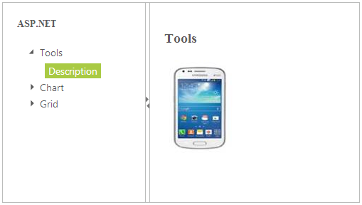

# Getting Started

## Create your first Splitter in ASP.NET

ASP.NET Splitter control consists of movable split bar(s) that divides a container's display area into two or more resizable and collapsible panels.

From the following guidelines, you can create a Splitter, add TreeView in the Splitter and set actions to view the image. It is used to split the document or image and Expand or Collapse in the Splitter. The following screenshot demonstrates the functionality of Splitter widget.

 

### Create Splitter Control

You can create an ASP.NET Web Forms Project and add necessary Dll’s and scripts with the help of the given [ ASP.NET -Getting Started](http://help.syncfusion.com/ug/js/Documents/gettingstartedwithmv.htm) Documentation.

Add the following code example to the corresponding ASPX page to render Splitter.



    

        

            <ej:Splitter ID="outterSplitter" runat="server" Height="280" Width="501">

                <ej:splitpane panesize="200">

                    

                        

                            <h3 class="h3">

                                ASP.NET

                            </h3>

                            <%--add tree view control here--%>

                        

                    

                </ej:splitpane>

                <ej:splitpane panesize="200">

                    

                        

                            

                                Select any product from the tree to show the description.

                            

                            

                                <h3>

                                    Tools

                                </h3>

                                

                            

                            

                                <h3>

                                    Chart

                                </h3>

                                

                            

                            

                                <h3>

                                    Grid

                                </h3>

                                

                            

                        

                    

                </ej:splitpane>

            </ej:Splitter>

        

    



Add the following styles to show the Splitter control in horizontal order.

       #outterSplitter

        {

            margin: 0 auto;

        }

        .cont

        {

            padding: 20px;

            min-width: 50px;

        }

        .cont #treeView_Container

        {

            margin-bottom: 0;

            border: none;

        }

        .h3

        {

            font-size: 14px;

            margin: 0;

        }

        .des

        {

            display: none;

        }

### Configure Tree View

Add the following code example in ASPX file to configure TreeView. Refer to the following link to know more details on TreeView control.

[http://help.syncfusion.com/ug/js/documents/createyourfirsttreev.htm](http://help.syncfusion.com/ug/js/documents/createyourfirsttreev.htm)



<ej:TreeView ID="TreeView" runat="server" ClientSideOnNodeSelected="treeClicked">

    <nodes>

        <ej:treeviewnode text="Tools">

            <nodes>

                <ej:treeviewnode text="Description" id="tool">

                </ej:treeviewnode>

            </nodes>

        </ej:treeviewnode>

        <ej:treeviewnode text="Chart">

            <nodes>

                <ej:treeviewnode text="Description" id="chart">

                </ej:treeviewnode>

            </nodes>

        </ej:treeviewnode>

        <ej:treeviewnode text="Grid">

            <nodes>

                <ej:treeviewnode text="Description" id="grid">

                </ej:treeviewnode>

            </nodes>

        </ej:treeviewnode>

    </nodes>

</ej:TreeView>



### Set Actions

Add the following code example in the ASPX page to set the action to view the image.



    function treeClicked(sender, args) {

        var content = $('.' + sender.currentElement[0].id).html();

        $('._content').html(content);

    }



The following screenshot is the output for the above code.

 

