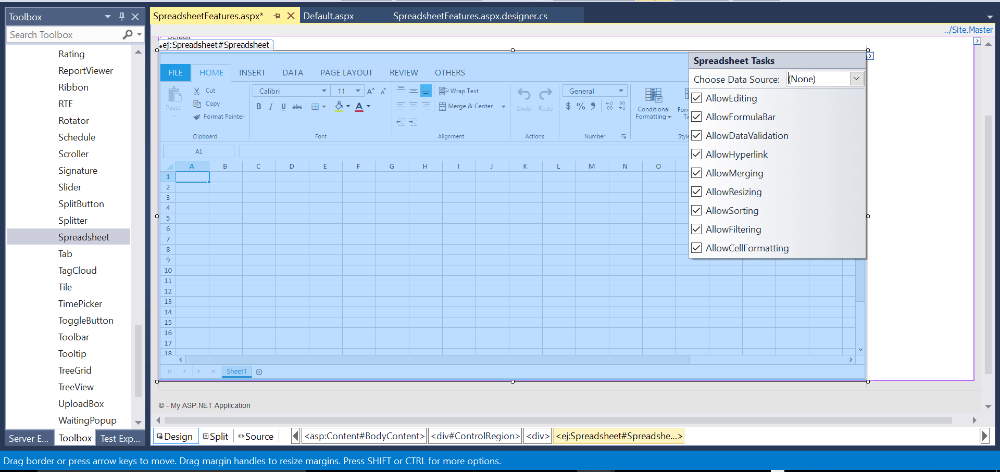

# Getting started

This section explains you the steps required to populate the Spreadsheet with data, format, and export it as excel file. This section covers only the minimal features that you need to know to get started with the Spreadsheet.

## Create your first SpreadSheet ASP.NET Web Forms Application

1. Create a Syncfusion ASP.NET Web Forms application.

2. Drag and drop the SpreadSheet control in the Index.aspx page from the toolbox.
 
 

The Spreadsheet is rendered based on default `Width` and `Height`. You can also customize the Spreadsheet dimension by setting the [`Width`](http://help.syncfusion.com/api/js/ejspreadsheet#members:scrollsettings-width "width") and [`Height`](http://help.syncfusion.com/api/js/ejspreadsheet#members:scrollsettings-height "height") property in [`ScrollSettings`](http://help.syncfusion.com/api/js/ejspreadsheet#members:scrollsettings "scrollSettings").



<ej:Spreadsheet ID="Spreadsheet" runat="server">
            <ScrollSettings Width="100%" Height="100%" IsResponsive="true" />
</ej:Spreadsheet>



Now, the Spreadsheet is rendered with default row and column count.

## Populate Spreadsheet with data

Now, this section explains how to populate JSON data to the Spreadsheet. You can set [`DataSource`](http://help.syncfusion.com/api/js/ejspreadsheet#members:sheets-datasource "dataSource") property in [`Sheet`](http://help.syncfusion.com/api/js/ejspreadsheet#members:sheets "sheet") settings to populate JSON data in Spreadsheet.





         <ej:Spreadsheet ID="Spreadsheet"  runat="server">
            <ClientSideEvents LoadComplete="loadComplete" OpenFailure="openfailure" />
        </ej:Spreadsheet>





    protected void Page_Load(object sender, EventArgs e)
        {
            BindDataSource();
        }

    private void BindDataSource()
        {
            var dataSource = new OrderItemsDataContext().GetAllItemDetails.ToList();
            this.Spreadsheet.Sheets.Add(new Syncfusion.JavaScript.Models.Sheet()
            {
                Datasource = dataSource
            });
        }





N> For more details about `data binding` refer following [`link`](http://help.syncfusion.com/js/spreadsheet/data-binding "link")

## Apply Conditional Formatting

Conditional formatting helps you to apply formats to a cell or range with certain color based on the cells values. You can use [`AllowConditionalFormats`](http://help.syncfusion.com/api/js/ejspreadsheet#members:allowconditionalformats "allowConditionalFormats") property to enable/disable Conditional formats.

To apply conditional formats for a range use [`setCFRule`](http://help.syncfusion.com/api/js/ejspreadsheet#methods:xlcformat-setcfrule "setCFRule") method. The following code example illustrates this,



          <ej:Spreadsheet ID="Spreadsheet"  runat="server">
            <ClientSideEvents LoadComplete="loadComplete" OpenFailure="openfailure" />
        </ej:Spreadsheet>
        



N> For more details about `Conditional Formatting` refer following [`link`](http://help.syncfusion.com/js/spreadsheet/data-presentation#conditional-formatting "link")

## Export Spreadsheet as Excel File

The Spreadsheet can save its data, style, format into an excel file. To enable save option in Spreadsheet set [`AllowExporting`](http://help.syncfusion.com/api/js/ejspreadsheet#members:exportsettings-allowexporting "allowExporting") option in [`ExportSettings`](http://help.syncfusion.com/api/js/ejspreadsheet#members:exportsettings "exportSettings") as `true`. Since Spreadsheet uses server side helper to save documents set [`ExcelUrl`](http://help.syncfusion.com/api/js/ejspreadsheet#members:exportsettings-excelurl "excelUrl") in [`ExportSettings`](http://help.syncfusion.com/api/js/ejspreadsheet#members:exportsettings "exportSettings") option. The following code example illustrates this,



<ej:Spreadsheet ID="Spreadsheet"  runat="server">
     <ImportSettings ImportMapper="http://js.syncfusion.com/demos/ejservices/api/Spreadsheet/Import"/>
     <ExportSettings ExcelUrl="http://js.syncfusion.com/demos/ejservices/api/Spreadsheet/ExcelExport"
                     CsvUrl="http://js.syncfusion.com/demos/ejservices/api/Spreadsheet/CsvExport" 
                     PdfUrl="http://js.syncfusion.com/demos/ejservices/api/Spreadsheet/PdfExport"/>
</ej:Spreadsheet>



Use shortcut [`Ctrl + S`](http://help.syncfusion.com/js/spreadsheet/keyboard-shortcuts "Ctrl + S") to save Spreadsheet as excel file.

N> 1. For more details about `Export` refer following [`link`](http://help.syncfusion.com/js/spreadsheet/open-and-save#save "link")
N> 2. For more details about `Server Configuration` refer following [`link`](http://help.syncfusion.com/js/spreadsheet/open-and-save#server-configuration "link")

