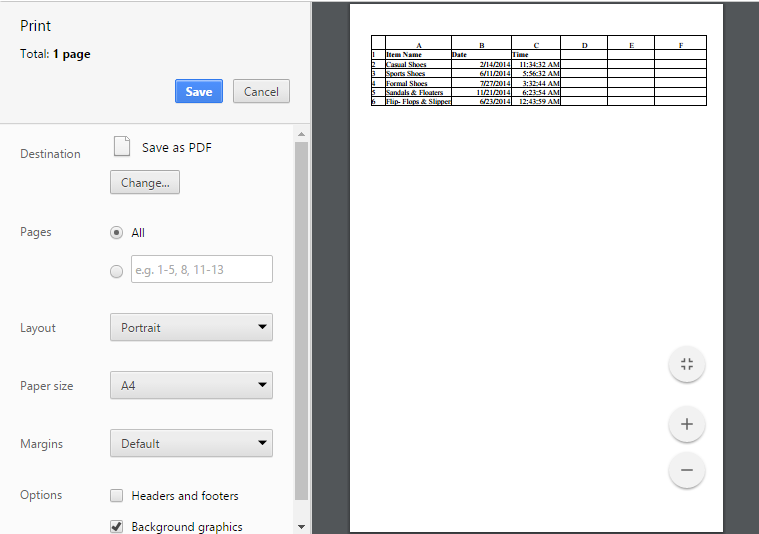

# Print

This feature is used for produce text and graphics from a computer screen or file onto a sheet of paper. You can use [`AllowPrinting`](https://help.syncfusion.com/api/js/ejspreadsheet#members:printsettings-allowprinting "AllowPrinting") property in [`PrintSettings`](https://help.syncfusion.com/api/js/ejspreadsheet#members:printsettings "PrintSettings") to enable/disable the print operation.

You have following options in printing.

* Print Sheet / Print Selected Area.
* Print with Gridlines
* Print with Headers

## Print Sheet / Print Selected Area

You can print the sheet or print the selected area by following ways,

* Using the Print button or Print Selected button under Print group of PAGE LAYOUT tab in ribbon.
* Using [`printSheet`](https://help.syncfusion.com/api/js/ejspreadsheet#methods:xlprint-printsheet "printSheet") or [`printSelection`](https://help.syncfusion.com/api/js/ejspreadsheet#methods:xlprint-printselection "printSelection") method to print the spreadsheet.

The following code example describes the above behavior.





<ej:Spreadsheet ID="FlatSpreadsheet" runat="server">
   <PrintSettings AllowPrinting="true" />
</ej:Spreadsheet>
<ej:Button ID="btnPrint" Width="80" ShowRoundedCorner="true" Type="Button" ClientSideOnClick="printClick" runat="server"></ej:Button>
<ej:Button ID="btnPrintSel" Width="80" ShowRoundedCorner="true" Type="Button" ClientSideOnClick ="printSelClick" runat ="server"></ej:Button>





 protected void Page_Load(object sender, EventArgs e)
        {
            if (!IsPostBack)
            {
                BindDataSource();
            }
        }
 
  private void BindDataSource()
        {
             var dataSource = new OrderItemsDataContext().GetAllItemDetails.ToList();
            this.FlatSpreadsheet.Sheets.Add(new Syncfusion.JavaScript.Models.Sheet()
            {
                Datasource = dataSource

            });
        }




The following output is displayed as a result of the above code example.

Print dialog with entire sheet in Chrome browser
{:.caption}

Print dialog with selected area print in chrome browser
{:.caption}

## Print with Gridlines

You have an option to print the spreadsheet with gridlines or without gridlines. You can do this by one of the following ways,

* Check the Gridlines option under Show group of PAGE LAYOUT tab in ribbon to print with Gridlines.
* Using [`ShowGridlines`](https://help.syncfusion.com/api/js/ejspreadsheet#members:sheets-showgridlines "ShowGridlines") property to enable / disable the gridlines.

The following code example describes the above behavior.





<ej:Spreadsheet ID="FlatSpreadsheet" runat="server">
        <Sheets>
         <ej:Sheet ShowGridlines="false"></ej:Sheet>
     </Sheets>
</ej:Spreadsheet>





 protected void Page_Load(object sender, EventArgs e)
        {
            if (!IsPostBack)
            {
                BindDataSource();
            }
        }

        private void BindDataSource()
        {
            var dataSource = new OrderItemsDataContext().GetAllItemDetails.ToList();
            this.FlatSpreadsheet.Sheets.Add(new Syncfusion.JavaScript.Models.Sheet()
            {
                Datasource = dataSource
            });
        }





Print dialog without gridlines in chrome browser
{:.caption}

## Print with Headings

You have an option to print the spreadsheet with headers or without headers. You can do this by one of the following ways,

* Check the Headings option under Show group of PAGE LAYOUT tab in ribbon. 
* Using [`ShowHeadings`](https://help.syncfusion.com/api/js/ejspreadsheet#members:sheets-showheadings "ShowHeadings") property to enable / disable headings.

The following code example describes the above behavior.





<ej:Spreadsheet ID="FlatSpreadsheet" runat="server">
        <Sheets>
         <ej:Sheet ShowHeadings="false"></ej:Sheet>
     </Sheets>
</ej:Spreadsheet>





 protected void Page_Load(object sender, EventArgs e)
        {
            if (!IsPostBack)
            {
                BindDataSource();
            }
        }

        private void BindDataSource()
        {
            var dataSource = new OrderItemsDataContext().GetAllItemDetails.ToList();
            this.FlatSpreadsheet.Sheets.Add(new Syncfusion.JavaScript.Models.Sheet()
            {
                Datasource = dataSource
            });
        }





Print dialog without headings in chrome browser
{:.caption}
