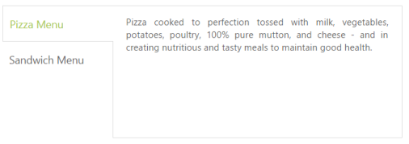

# Behavior Settings

## Close Button

By default, Tab contents are rendered without Close Button. You can add the Close Button by setting the ShowCloseButton property to true. When you move the cursor over the Tab headers, the Close Button is displayed.   

The following code example is used to render the Tab control with Close Button.

Add the following ASPX for simple Tab creation with Close Button.



<ej:Tab ID="dishtype" runat="server" ShowCloseButton="true" Width="600px">

    <Items>

        <ej:TabItem ID="pizzatype" Text="Pizza Menu">

            <ContentSection>

                

                    Pizza cooked to perfection tossed with milk, vegetables, potatoes, poultry, 100% pure mutton, and cheese - and in creating nutritious and tasty meals to maintain good health.

            </ContentSection>

        </ej:TabItem>

        <ej:TabItem ID="sandwichtype" Text="Sandwich Menu">

            <ContentSection>

                

                    Sandwich cooked to perfection tossed with bread, milk, vegetables, potatoes, poultry, 100% pure mutton, and cheese - and in creating nutritious and tasty meals to maintain good health.

            </ContentSection>

        </ej:TabItem>

    </Items>

</ej:Tab>



The following screenshot illustrates the Tab with Close Button. 

 

### Orientation

By default, Tab control renders in horizontal orientation. You can change the Orientation to vertical by using the HeaderPosition property. With this property, you can customize the header by Top, Bottom, Left, and Right.

The following code example is used to render the sub Tab control in the vertical orientation. 

Add the following ASPX for Tab orientation.



<ej:Tab ID="dishtype" runat="server" HeaderPosition="Left" Width="600px">

    <Items>

        <ej:TabItem ID="pizzatype" Text="Pizza Menu">

            <ContentSection>

                

                    Pizza cooked to perfection tossed with milk, vegetables, potatoes, poultry, 100% pure mutton, and cheese - and in creating nutritious and tasty meals to maintain good health.

            </ContentSection>

        </ej:TabItem>

        <ej:TabItem ID="sandwichtype" Text="Sandwich Menu">

            <ContentSection>

                

                    Sandwich cooked to perfection tossed with bread, milk, vegetables, potatoes, poultry, 100% pure mutton, and cheese - and in creating nutritious and tasty meals to maintain good health.

            </ContentSection>

        </ej:TabItem>

    </Items>

</ej:Tab>


The following screenshot illustrates the sub Tab with vertical orientation. 

 

