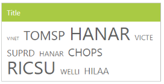

## Data-Binding

To render the TagCloud control, it is necessary to bind the data to it correctly. The following sub-properties provides a way to bind local or remote data to the TagCloud control by binding the appropriate data fields to the corresponding options.

### Fields 

DataSource 

This property assigns the local JSON data or remote (URL binding) data to the TagCloud control.

Query 

It accepts the data of the object type that is usually the Query string, to fetch the required data from a specific table based on certain conditions. As this property is optional, when it is not specified, all the records initially assigned through DataSource is taken into consideration.

DataTextField

It maps the corresponding text field name from the data table or JSON data that is assigned to the DataSource with the text property of the TagCloud control. The text value that is fetched from the table renders the value to be displayed in the TagCloud.

DataUrlField

URL field in the data table or JSON data assigned the DataSource is mapped to the DataUrlField property of the TagCloud control. The DataUrlField property defines the link to be navigated on clicking the corresponding text item.

DataFrequencyField

It maps the DataFrequencyField name from the data table or JSON data that is assigned to the DataSource. The frequency value fetched from the table should be a number to categorize the font size.

### Local Binding

Local databinding allows you to map JSON data to TagCloud that the corresponding DataTextField, DataUrlField, and DataFrequencyField are assigned with the respective local JSON data.

#### Defining the Local data for TagCloud

The following explains the local data binding to the TagCloud control. In the ASPX page, include the TagCloud control code example.

<table>
<tr>
<td>
&lt;ej:TagCloud ID="tagcloud" runat="server" DataTextField="text" DataUrlField="url" DataFrequencyField="frequency"&gt; &lt;/ej:TagCloud&gt;</td></tr>
<tr>
<td>
</td></tr>
</table>



protected void Page_Load(object sender, EventArgs e)

        {

            this.tagcloud.DataSource = new TagCloudData().GetTagCloudItems();           

        }

        public class TagCloudData

        {

            public TagCloudData()

            {

            }

            public TagCloudData(string _text, string _url, int _frequency)

            {

                this.text = _text;

                this.url = _url;

                this.frequency = _frequency;

            }

            public TagCloudData()

            {

            }

            public string text

            {

                get;

                set;

            }

            public string url

            {

                get;

                set;

            }

            public int frequency

            {

                get;

                set;

            }

            public List<TagCloudData> GetTagCloudItems()

            {

                List<TagCloudData> data = new List<TagCloudData>();

                data.Add(new TagCloudData("Hindustan Motors", "http://www.zigwheels.com/newcars/Hindustan-Motors", 10));

                data.Add(new TagCloudData("Bentley Continental ", "http://www.zigwheels.com/newcars/Bentley/Continental", 3));

                data.Add(new TagCloudData("BMW 7", "http://www.zigwheels.com/newcars/BMW/7-Series", 4));

                data.Add(new TagCloudData("Bugatti Veyron", "http://www.zigwheels.com/newcars/Bugatti/Veyron", 2));

                data.Add(new TagCloudData("Honda", "http://www.zigwheels.com/newcars/Honda", 3));

                data.Add(new TagCloudData("Chevrolet Beat", "http://www.zigwheels.com/newcars/Chevrolet/Beat", 7));

                return data;

             }

}     



The following screenshot displays the TagCloud control with local data binding.

{  | markdownify }
{:.image }

### Remote Binding

TagCloud provides remote data binding support to populate the TagCloud items and the values that can be mapped to the TagCloud fields from a remote web service by using the DataManager and Query. 

DataManager is used to manage relational data in JavaScript. It supports CRUD (Create, Read, Update, and Destroy) in individual requests and batches. DataManager uses two different classes, ej.DataManager for processing and ej.Query for serving data. ej.DataManager communicates with DataSource and ej.Query generates data queries that are read by DataManager.

#### Configuring Remote data for TagCloud

To bind local data to the TagCloud control, include the following TagCloud control code example in the ASPX page. 

<table>
<tr>
<td>
&lt;ej:TagCloud ID="tagcloud" runat="server" DataTextField="CustomerID" Query="ej.Query().from('Orders').take(10)" DataFrequencyField="EmployeeID"&gt;&lt;/ej:TagCloud&gt;</td></tr>
<tr>
<td>
</td></tr>
</table>
Assign the Datasource and Query property values to bind the remote data. Map the corresponding fields to the TagCloud control as follows:



protected void Page_Load(object sender, EventArgs e)

        {

            this.tagcloud.DataSource = "http://mvc.syncfusion.com/Services/Northwnd.svc/";

        }



The following screenshot displays the TagCloud control with remote data binding.

{  | markdownify }
{:.image }

