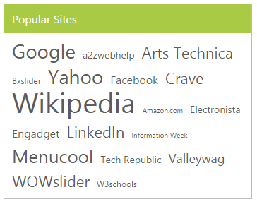

# Integration 

## Angular binding

TagCloud control is availed with two types of Angular JS support namely, 

* One-way binding
* Two-way binding 

One-way binding refers to the process of applying scope values to all the available properties of the TagCloud control, but the changes made in the TagCloud control are not reflected or triggered in turn in the scope collection. This kind of binding applies to all the properties of the TagCloud control.

Two-way binding supports both the processes. It applies the scope values to the TagCloud properties and the changes made in the TagCloud control are also reflected and triggered within the angular scope change function.

Apply the plugin and property assigning to the TagCloud control element through the directive that starts with a letter “e-“.

To know more detail about the Angular binding, refer to the following link location,

<http://docs.syncfusion.com/js/angularjs>

The following example shows the way to bind data to the TagCloud control by using Angular support.



<!doctype html>

<html lang="en" ng-app="tagApp">

<head>

    <title>Essential Studio for JavaScript : Angular JS Support for Tagcloud </title>

    <meta name="viewport" content="width=device-width, initial-scale=1.0" charset="utf-8" />

   <link href="[http://cdn.syncfusion.com/ {{site.releaseversion}}/js/web/flat-lime/ej.web.all.min.css](http://cdn.syncfusion.com/13.1.0.21/js/web/flat-lime/ej.web.all.min.css)" rel="stylesheet" />

    <!--scripts-->

    

    

    

               

     

        

    

</head>

<body ng-controller="TagCtrl">

    

    

</body>

</html>



The following screenshot illustrates the TagCloud control with Angular data binding.

 

## Knockout binding

Two types of knockout binding are supported by TagCloud,

* One-way binding
* Two-way binding

One-way binding refers to the process of applying observable values to all the available properties of the TagCloud control, but the changes made are not reflected and triggered in turn to the observable collection. This kind of binding applies to all the properties of the TagCloud control.

Two-way binding supports both the processes. It applies the observable values to the TagCloud control properties and the changes made in the TagCloud control are also reflected back and triggered within the observable collections. 

For more information about the knockout binding, refer to the following link location,

<http://docs.syncfusion.com/js/knockoutjs>

The following code example shows the way to bind data to the TagCloud control by using knockout support.



<!doctype html>

<html>

<head>

    <title>Essential Studio for JavaScript :  KO Support for Tagcloud</title>

    <meta name="viewport" content="width=device-width, initial-scale=1.0" charset="utf-8"  />

    <link href="[http://cdn.syncfusion.com/ {{site.releaseversion}}/js/web/flat-lime/ej.web.all.min.css](http://cdn.syncfusion.com/13.1.0.21/js/web/flat-lime/ej.web.all.min.css)" rel="stylesheet" />

    <!--scripts-->

    

    

    

    

    

    

    

</head>

<body>

    

        

            

            

        

    

    

</body>

</html>



Run the above code to render the following output.

 

