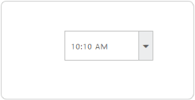
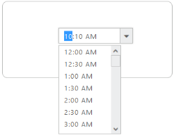
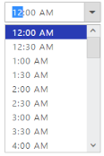

# Appearance and Styling

## Scaling

TimePicker control provides options to change its height, width and also to change popup height and width.

### Change TimePicker control Height and Width

In the ASPX page, include the following TimePicker control code example to specify the height and width.



<ej:TimePicker ID="time" Height="50" Width="150" runat="server"> </ej:TimePicker>



Run the above code to render the following output.

 

## Change TimePicker PopupHeight and PopupWidth

You can use PopupHeight and PopupWidth properties to customize the TimePicker width and height.



<ej:TimePicker ID="time" PopupHeight="50" PopupWidth="150" runat="server"> </ej:TimePicker>



Run the above code to render the following output.

 

## Theme

TimePicker control’s style and appearance are controlled based on CSS classes. In order to apply Theme to the DatePicker control, you can refer to 2 files namely, ej.widgets.core.min.css and ej.theme.min.css. When the file ej.widgets.all.min.css is referred, then it is not necessary to include the files ej.widgets.core.min.css and ej.theme.min.css in your project, as ej.widgets.all.min.css is the combination of these both. 

By default, there are 13 themes support available for the TimePicker control namely,

* default-theme
* flat-azure-dark
* fat-lime
* flat-lime-dark
* flat-saffron
* flat-saffron-dark
* gradient-azure
* gradient-azure-dark
* gradient-lime
* gradient-lime-dark
* gradient-saffron
* gradient-saffron-dark
* bootstrap-theme

## CSS Class

To apply custom styles to your TimePicker control, you can specify CssClass property. The specified CSS name is added in the root of the TimePicker control.

The following code example renders the TimePicker control with the customized style.



<ej:TimePicker ID="timepicker" runat="server" CssClass="custom"></ej: TimePicker>



Add the following customized style in a page. In the following CSS style, exiting theme style overrides by using root class custom.



.custom  .e-active {

  background-color: #293CB4;

}



The following screenshot displays the output for the above code.

 

