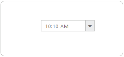
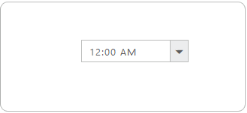

## Behaviour Settings

### Set value of the TimePicker Control

You can use Value property to set default time for the TimePicker.

The following step explains how to set the default value of the TimePicker.

In the ASPX page, include the following TimePicker control code example.



  <ej:TimePicker ID="time" Value="10:10 AM" runat="server"></ej:TimePicker>



Run the above code to render the following output.

{  | markdownify }
{:.image }

### Enable/Disable TimePicker Control

TimePicker control provides you an option to enable /disable the control. You can disable the TimePicker by setting the Enabled property value to false.

The following step explains you to enable/disable property in the TimePicker control.

In the ASPX page, include the following TimePicker control code example.



<ej:TimePicker ID="Timepick" Enabled="true" runat="server"></ej:TimePicker>



Run the above code to render the following output.

<table>
<tr>
<td>

{:.image }
</td><td>

{:.image }
</td></tr>
</table>
### Restrict editing

TimePicker control provides ReadOnly property to disable editing in the control. Therefore, you can only read the value that is set to the TimePicker and cannot modify it. The value property allows you to set the default value for the TimePicker control when it is created.

#### Configure TimePicker textbox to restrict editing

The following step allows you to disable editing value in the TimePicker.

In the ASPX page, include the following TimePicker control code example.



  <ej:TimePicker ID="time" ReadOnly="true" runat="server"></ej:TimePicker>



The following screenshot illustrates aTimePicker textbox configured to restrict editing.

{  | markdownify }
{:.image }

### Localization

Localization is a language support based on the culture in the TimePicker. You can achieve Localization by using Locale property in the TimePicker.

In order to enable [localization](http://help.syncfusion.com/ug/js/default.htm), refer to the following scripts: globalize.cultures.js and globalize.js. The “globalize.cultures.js” includes different language support for JavaScript controls and the “globalize.js” is a simple JavaScript library that allows you to format dates based on the specified culture.

You can refer to the following online link reference for globalize.js,

[http://cdn.syncfusion.com/js/assets/external/jquery.globalize.min.js](http://cdn.syncfusion.com/js/assets/external/jquery.globalize.min.js)

You can refer to the following online link reference for globalize.culture.js,

[http://ajax.aspnetcdn.com/ajax/globalize/0.1.1/cultures/globalize.cultures.js](http://ajax.aspnetcdn.com/ajax/globalize/0.1.1/cultures/globalize.cultures.js)

You can dynamically change the language based on their culture.

### Enable Localization Support

The following step explains you how to enable Localization property for the TimePicker.

In the ASPX page, include the following TimePicker control and configure the Locale property.



     <ej:TimePicker ID="time" Locale="zh-CN" runat="server"></ej:TimePicker>



Run the above code to render the following output.

{  | markdownify }
{:.image }

### Rounded Corner

You can customize the shape of the TimePicker control from regular rectangular shape to rounded rectangle shape by using the ShowRoundedCornerproperty set to false by default.

#### Configure Rounded corner to TimePicker Text box

In the ASPX page, include the following TimePicker control code example to enable the rounded corner.



<ej:TimePicker ID="time" ShowRoundedCorner="true" runat="server"> </ej:TimePicker>



The following screenshot illustrates a TimePicker when ShowRoundedCorner is set to true.

{  | markdownify }
{:.image }

