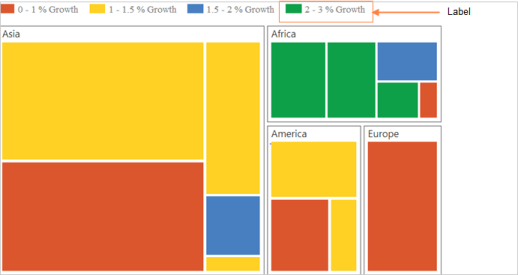
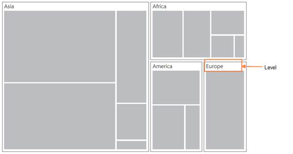
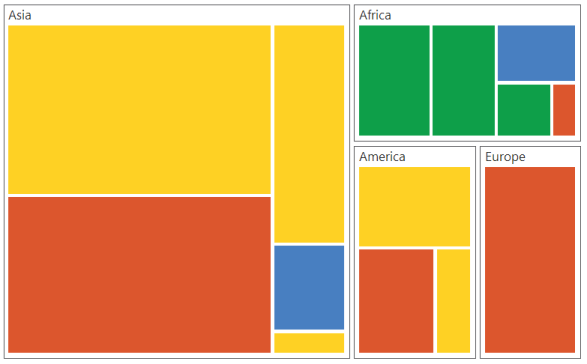

# Getting Started

This section explains briefly about how to create a TreeMap in your application with ASP.NET.

## Create your First TreeMap in ASP.NET

This section explains briefly on how to create a TreeMap in your application.

### Configure a TreeMap

You can configure ASP.NET TreeMap in simple steps. This manual provides instructions on how to configure TreeMap with grouping of populated datum based on population growth in population in each continent.  It also provides a walk-through on some of the customization feature available in TreeMap control.

### Create a simple ASP.Net Application

You can create a new ASP.NET project application by adding the necessary dll's and scripts.

#### Add Data

You can populate the TreeMap data inside the TreeMap .For example, you can populate data of few countries from the following location.

TreeMap/ TreeMap.aspx.cs



public class TreeMapPopulationData

{

    public string Continent { get; set; }

    public string Country { get; set; }

    public int Growth { get; set; }

    public long Population { get; set; }

    public static List<TreeMapPopulationData> GetData()

    {

        List<TreeMapPopulationData> pop = new List<TreeMapPopulationData>();

        pop.Add(new TreeMapPopulationData() { Continent = "Asia", Country = "Indonesia", Growth = 3, Population = 237641326 });

        pop.Add(new TreeMapPopulationData() { Continent = "Asia", Country = "Russia", Growth = 2, Population = 152518015 });

        pop.Add(new TreeMapPopulationData() { Continent = "Asia", Country = "Mal", Growth = 1, Population = 29672000 });

        pop.Add(new TreeMapPopulationData() { Continent = " America", Country = "United States", Growth = 4, Population = 315645000 });

        pop.Add(new TreeMapPopulationData() { Continent = " America", Country = "Mexico", Growth = 2, Population = 112336538 });

        pop.Add(new TreeMapPopulationData() { Continent = " America", Country = "Canada", Growth = 1, Population = 39056064 });

        pop.Add(new TreeMapPopulationData() { Continent = " America", Country = "Colombia", Growth = 1, Population = 47000000 });

        pop.Add(new TreeMapPopulationData() { Continent = " America", Country = "Brazil", Growth = 3, Population = 193946886 });

        pop.Add(new TreeMapPopulationData() { Continent = "Africa", Country = "Nigeria", Growth = 2, Population = 170901000 });

        pop.Add(new TreeMapPopulationData() { Continent = "Africa", Country = "Egypt", Growth = 1, Population = 83661000 });

        pop.Add(new TreeMapPopulationData() { Continent = "Europe", Country = "Germany", Growth = 1, Population = 81993000 });

        pop.Add(new TreeMapPopulationData() { Continent = "Europe", Country = "France", Growth = 1, Population = 65605000 });

        pop.Add(new TreeMapPopulationData() { Continent = "Europe", Country = "UK", Growth = 1, Population = 63181775 });

        return pop;

    }

}



N> Population data is referred from [List of continents by population](http://en.wikipedia.org/wiki/List_of_continents_by_population).

### Initialize TreeMap

1. Create an HTML file and add necessary script and CSS files in Head tag as illustrated in the following code example.

   ~~~ html

        <html xmlns="http://www.w3.org/1999/xhtml">

         <head>

            <title> Getting Started with Maps </title>    

                    <!--  jquery script  -->

                    

                    <!-- Essential JS UI widget -->

                   

                   <!-- JS Render widget -->

                      

          </head>

          <body>
          </body>
       
       </html>

   ~~~

2. Create a &lt;div&gt; tag and set the height and width to determine the TreeMap size to be rendered in “TreeMap.aspx” file in body tag.

   ~~~ html

		<html>   

			  <body> 

					

				    
 

			  </body>      

		</html>

   ~~~

3. Add the following code in “TreeMap.aspx” file to initialize the TreeMap.

   ~~~ html

		<html>   

			  <body> 

				 

					 <ej:Treemap ID="treemap" runat="server">     

						</ej:Treemap>

				  
 

			  </body>      

		</html>

   ~~~

4. Add the DataSource in “TreeMap.aspx.cs” as illustrated in the following code sample.

   ~~~ cs

		protected void Page_Load(object sender, EventArgs e)

        {

            this.treemap.DataSource = TreeMapPopulationData.GetData();           

        }

   ~~~

### DataSource

The DataSource property accepts the collection values as input. For example, you can provide the list of objects as input.

#### Weight Value Path 

You can calculate the size of the object using WeightValuePath of TreeMap.

1. Populate the TreeMap with using the above properties.

   ~~~ cs

	 protected void Page_Load(object sender, EventArgs e)

     {

         this.treemap.DataSource = TreeMapPopulationData.GetData();

     }

   ~~~

   ~~~ html

		

		<ej:Treemap ID="treemap" runat="server" WeightValuePath = "Population">

		</ej:Treemap>

		

   ~~~

The following image displays a TreeMap with default properties using the above code. 

 

### GroupTreeMap Items using Levels

You can group TreeMapItems using levels in TreeMap.

#### Group Path

You can use GroupPath property for every flat level of the TreeMap control. It is a path to a field on the source object that serves as the “Group” for the level specified. You can group the data based on the GroupPath in the TreeMap control. When the GroupPath is not specified, then the items are not grouped and the data is displayed in the order specified in the DataSource.

#### Group Gap

You can use GroupGap property to separate the items from every flat level and to differentiate the levels mentioned in the TreeMap control.

The following code sample explains how to group TreeMap Items using ‘Levels’.



protected void Page_Load(object sender, EventArgs e)

{

    this.treemap.DataSource = TreeMapPopulationData.GetData();

}





    <ej:Treemap ID="treemap" runat="server" WeightValuePath = "Population">

        <Levels>

               <ej:TreeMapLevel GroupPath = "Continent" GroupGap = "5" HeaderHeight = "25">

               </ej:TreeMapLevel>

        </Levels>

    </ej:Treemap>

        



The following screenshot displays grouping of TreeMapItems using Levels

 

### Customizing TreeMap Appearance by Range

You can differentiate the nodes based on its value and color ranges using Range color. You can also define the color value range using From and To properties. 

#### Color Value Path

The ColorValuePath of TreeMap is a path to a field on the source object. You can determine the color for the object using ColorValuePath of TreeMap.

The following code sample explains how to customize TreeMap Appearance by Range.




protected void Page_Load(object sender, EventArgs e)

{

    this.treemap.DataSource = TreeMapPopulationData.GetData();

}





<ej:Treemap ID="treemap" runat="server" WeightValuePath = "Population" ColorValuePath = "Growth">

    <TreeMapRangeColorMappings>

             <ej:TreeMapRangeColorMapping Color = "#77D8D8" Legendlabel = "1% Growth" From = "0" To = "1"></ej:TreeMapRangeColorMapping>

             <ej:TreeMapRangeColorMapping Color = "#AED960" Legendlabel = "2% Growth" From = "0" To = "2"></ej:TreeMapRangeColorMapping>

             <ej:TreeMapRangeColorMapping Color = "#FFAF51" Legendlabel = "3% Growth" From = "0" To = "3"></ej:TreeMapRangeColorMapping>

             <ej:TreeMapRangeColorMapping Color = "#F3D240" Legendlabel = "4% Growth" From = "0" To = "4"></ej:TreeMapRangeColorMapping>

    </TreeMapRangeColorMappings>

    <Levels>

       <ej:TreeMapLevel GroupPath = "Continent" GroupGap = "5" HeaderHeight = "25">

       </ej:TreeMapLevel>

    </Levels>

</ej:Treemap>




The following screenshot displays customized TreeMap Appearance by Range.

 

### Enable Tooltip

You can enable the tooltip by setting ShowTooltip to ‘True’. By default, it takes the property of the bound object that is referred in the WeightValuePath and displays its content when the corresponding node is hovered. You can customize the template for tooltip using TooltipTemplate property.

#### Leaf Item Settings

You can customize the Leaf level TreeMap items using LeafItemSettings. The Label and tooltip values take the property of bound object that is referred in the LabelPath when defined.

The following code sample displays how the tooltip is enabled.




protected void Page_Load(object sender, EventArgs e)

{
    this.treemap.DataSource = TreeMapPopulationData.GetData();
}





<ej:Treemap ID="treemap" runat="server" WeightValuePath = "Population" ColorValuePath = "Growth">

<LeafItemSettings LabelPath = "Country">

</LeafItemSettings>

<TreeMapRangeColorMappings>

             <ej:TreeMapRangeColorMapping Color = "#77D8D8" Legendlabel = "1% Growth" From = "0" To = "1"></ej:TreeMapRangeColorMapping>

             <ej:TreeMapRangeColorMapping Color = "#AED960" Legendlabel = "2% Growth" From = "0" To = "2"></ej:TreeMapRangeColorMapping>

             <ej:TreeMapRangeColorMapping Color = "#FFAF51" Legendlabel = "3% Growth" From = "0" To = "3"></ej:TreeMapRangeColorMapping>

             <ej:TreeMapRangeColorMapping Color = "#F3D240" Legendlabel = "4% Growth" From = "0" To = "4"></ej:TreeMapRangeColorMapping>

</TreeMapRangeColorMappings>

<Levels>

       <ej:TreeMapLevel GroupPath = "Continent" GroupGap = "5" HeaderHeight = "25">

       </ej:TreeMapLevel>

</Levels>

</ej:Treemap>




The following screenshot displays the TreeMap when the Tooltip is enabled.

 

TreeMap with tooltip option
{:.caption}

### Legend

You can set the color value of leaf nodes using TreeMapLegend. This legend is appropriate only for the TreeMap whose leaf nodes are colored using RangeColorMapping.

You can set ShowLegend property value to ‘True’ to make a Legend visible.

#### Label for Legend

You can customize the labels of the legend item using LegendLabel property of RangeColorMapping. 

The following code sample displays how to add labels for legend in a TreeMap.




protected void Page_Load(object sender, EventArgs e)

{
    this.treemap.DataSource = TreeMapPopulationData.GetData();
}





<ej:Treemap ID="treemap" runat="server" WeightValuePath = "Population" ColorValuePath = "Growth" ShowLegend = "true">

    <LeafItemSettings LabelPath = "Country"></LeafItemSettings>

    <TreeMapLegend IconHeight = "17" IconWidth = "17"></TreeMapLegend>

    <TreeMapRangeColorMappings>

                 <ej:TreeMapRangeColorMapping Color = "#77D8D8" Legendlabel = "1% Growth" From = "0" To = "1"></ej:TreeMapRangeColorMapping>

                 <ej:TreeMapRangeColorMapping Color = "#AED960" Legendlabel = "2% Growth" From = "0" To = "2"></ej:TreeMapRangeColorMapping>

                 <ej:TreeMapRangeColorMapping Color = "#FFAF51" Legendlabel = "3% Growth" From = "0" To = "3"></ej:TreeMapRangeColorMapping>

                 <ej:TreeMapRangeColorMapping Color = "#F3D240" Legendlabel = "4% Growth" From = "0" To = "4"></ej:TreeMapRangeColorMapping>

    </TreeMapRangeColorMappings>

    <Levels>

           <ej:TreeMapLevel GroupPath = "Continent" GroupGap = "5" HeaderHeight = "25">

           </ej:TreeMapLevel>

    </Levels>

</ej:Treemap>




The following screenshot displays the TreeMap when Legends are enabled.

 